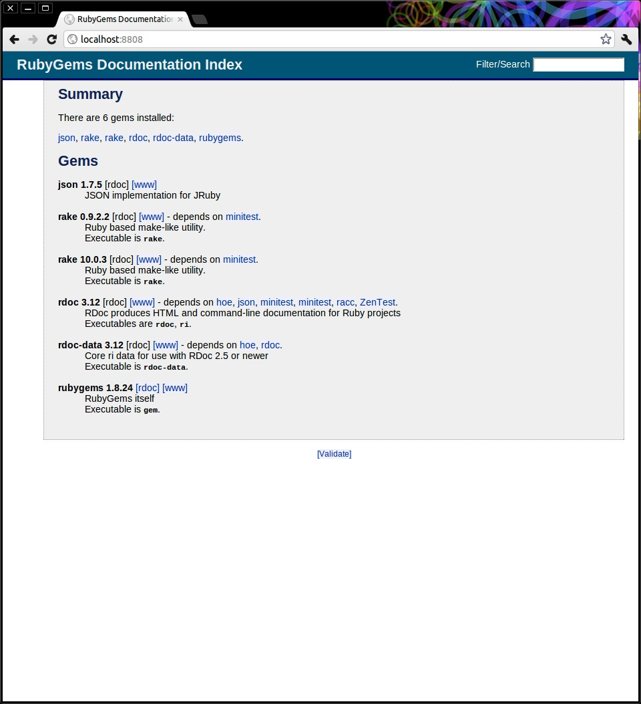

IiU -- JRuby 1.7.11, Ruby on Rails 4
====================================
Installation in Ubuntu — khkoether[at]kahweb[dot]de

:icons:
:Author Initials: KHK
:creativecommons-url: http://creativecommons.org/licenses/by-sa/3.0/de/
:ubuntu-url: http://www.ubuntu.com/
:asciidoctor-url: http://asciidoctor.org/
:asciidoctordocs-url: http://asciidoctor.org/docs/
:ruby-url: https://www.ruby-lang.org/de/
:ruby-download-url: https://www.ruby-lang.org/de/downloads/
:rubyonrails-url: http://www.rubyonrails.org
:java-url: http://www.oracle.com/technetwork/java/javase/downloads/index.html
:jruby-url: http://jruby.org/
:jruby-download-url: http://jruby.org/download

:jdk-url: link:jdk.html
:jruby-version: 1.7.11
:jruby_1st-url: link:jruby_1st.html

Version 2.2.0, März 2014

Abstract
--------
Dieser Artikel ist eine Schritt-für-Schritt Anleitung zur Installation 
von {jruby-url}[JRuby 1.7.11] unter GNU/Linux.
 
Die Programmiersprache {ruby-url}[JRuby] ist die Implementation 
von {ruby-url}[Ruby] in Java, die wiederum die Grundlage für das 
WebApplication Framework {rubyonrails-url}[Ruby on Rails] bildet. 

Der Artikel ist in {asciidoctordocs-url}[AsciiDoc] geschrieben 
und mit _Asciidoctor 1.5.0.preview3_ erstellt worden.

[CAUTION]
====
Zu beachten ist, dass so ein Dokument zum Einen nie abschliessend 
sein kann, und zum Anderen bestimmte Konfigurationen anders, oder 
auf einem anderem Weg durchgeführt werden können. 
Gerne nehme ich Verbesserungsvorschläge entgegen.

Es gilt wie immer: Verwendung der Anleitung auf eigene Gefahr.
====

Vorraussetzungen
----------------
Die Installation wird für {ubuntu-url}[Ubuntu 12.04 LTS (Precise Pangolin)] 
beschrieben. Gleichwohl sind die einzelnen Schritte auch für 
andere Distributionen übertragbar.

[TIP]
====
Ubuntu 12.04 LTS (Precise Pangolin) enthält das Paket _jruby_1.5.6-2_all_. 
====

Download
--------
* {jruby-download-url}[JRuby 1.7.11] +    
  +jruby-1.7.11-bin.tar.gz+  (ca. 19M) +
  2014-02-25 (Release date) -- Expect a new release about every 3 weeks 

[NOTE] 
====
Die neue _JRuby-Version 1.7_ wird seit 18 Monaten mit bestimmten Zielen entwickelt:

. JDK-Version 6 ist (mindestens) notwendig 
. Unterstützung der JDK-Version 7
. JRuby wird als im Modus _Ruby 1.9.3_ ausgeführt (neuer Default)
. JRuby unterstützt das neue Java-Feature 'invokedynamic' +
  (auch wenn es für den Moment ausgeschaltet ist - "due to JVM issues" ) +
  &rarr; http://www.jruby.org/2012/10/22/jruby-1-7-0.html[JRuby 1.7.0 Released]
  
Mein Bauchgefühl sagt:
. JRuby 1.6.x -> JDK 6
. JRuby 1.7.x -> JDK 7

Andere mögliche Kombinationen erhöhen einfach den Beschreibungs-Aufwand
für Support.     
====

[NOTE] 
====
Die Installation des _OpenJDK_ (_Oracle JDK_) wurde vom Benutzer 'root' für 
das System durchgeführt &rarr; {jdk-url}[JDK]. +
Während die anschließende Installation von _JRuby_ und _Ruby on Rails_ für 
den Benutzer 'sid' ausgeführt wird. 
----
$ ls -l 
-rw-rw-r-- 1 sid sid 19813308 Mär  3 16:06 jruby-bin-1.7.11.tar.gz
----
====

Installation: JRuby {jruby-version}
-----------------------------------
Zusätzliche Software-Pakete  
sollten im Verzeichnis +/opt+ (Optional) installiert werden. 

*Step 1:* Installation im Verzeichnis +/opt/JRuby/sid+ (mit Benutzer 'sid')
----
$ mkdir -p /opt/JRuby/sid && chown sid.sid /opt/JRuby/sid
----

----
$ cd /opt/JRuby/sid

$ tar xvzf jruby-bin-1.7.11.tar.gz
[...]

$ ln -s jruby-1.7.11 current
$ ls -l
lrwxrwxrwx 1 khk khk   12 Mär  3 16:13 current -> jruby-1.7.11
-rw-r--r-- 1 khk khk  433 Mär  3 16:14 java.jruby.path.sh
drwxr-xr-x 7 khk khk 4096 Feb 24 18:34 jruby-1.7.11
-rw-r--r-- 1 khk khk  131 Mär  3 16:13 jruby.path.sh
----

Das Programm 'tree' ist ein wunderbares Hilfsmittel zur Darstellung von Verzeichnissen.
----
$ tree -d -L 2 current
current   <1>
├── bin
├── docs
│   ├── jvyaml
│   └── man
├── lib
│   ├── jni
│   └── ruby
├── samples
│   ├── ext
│   ├── ffi
│   ├── jnlp
│   └── jrubyc_java
└── tool
    └── nailgun

14 directories
---- 
<1> JRuby 1.7.11

Die zu diesem Zeitpunkt in JRuby enthaltenen RubyGems.
----
$ tree -d -L 3 current/lib/ruby/gems/
current/lib/ruby/gems/
└── shared
    └── gems
        ├── rake-10.1.0
        └── rdoc-4.0.1

6 directories   
----

*Step 2:* JRuby-Pfad setzen (von au&szlig;en)
Erstellen Sie eine Datei +jruby.path.sh+ (siehe <<_anhang,[Anhang]>>). 

[CAUTION]
====
In der Datei können Sie ebenfalls entscheiden auf welche der zu diesem
Zeitpunkt verfügbaren Java-Versionen Sie sich beziehen.

Wenn Sie die für das System installierte _JDK_-Version verwenden ... bedeutet 
das ... kein Eintrag. Haben Sie zusätzlich eine _JDK_-Version installiert
sollten Sie die hierfür notwendigen Umgebungsvariablen ebenfalls in dieser 
Datei setzen.
==== 

[NOTE] 
=========================================================
Achtung: Ausführen der Datei mit dem Punkt-Operator!
----
$ . jruby.path.sh   <1>
---- 
<1> Oder mit dem Bash-Builtin Kommando: _source jruby.path.sh_
=========================================================

*Step 3:* Installation verifizieren
----
$ which jruby
/opt/JRuby/sid/current/bin/jruby

$ java -version
java version "1.7.0_51"
OpenJDK Runtime Environment (IcedTea 2.4.4) (7u51-2.4.4-0ubuntu0.12.04.2)
OpenJDK 64-Bit Server VM (build 24.45-b08, mixed mode)

$ jruby --version   
jruby 1.7.11 (1.9.3p392) 2014-02-24 86339bb on OpenJDK 64-Bit Server VM 1.7.0_51-b00 [linux-amd64]

$ jruby -v --1.8   <1>
jruby 1.7.11 (ruby-1.8.7p370) 2014-02-24 86339bb on OpenJDK 64-Bit Server VM 1.7.0_51-b00 [linux-amd64]

$ jruby -v --2.0   <2>
jruby 1.7.11 (2.0.0p195) 2014-02-24 86339bb on OpenJDK 64-Bit Server VM 1.7.0_51-b00 [linux-amd64]
----
<1> Weitere Möglichkeit: + 
    +$ JRUBY_OPTS=--1.8 jruby --version+
<2> Zu diesem Zeitpunkt als Experimentell gekennzeichnet.    

.Interactive Ruby: _irb_, _jirb_
----
$ jirb
irb(main):001:0> RUBY_VERSION
=> "1.9.3"
irb(main):002:0> RUBY_PATCHLEVEL
=> 392
irb(main):003:0> Time.now.to_s
=> "2014-03-03 16:25:49 +0100"
irb(main):004:0> Time.now.sunday?
=> false
irb(main):005:0> Time.now.monday?
=> true
irb(main):006:0> exit
----

.RubyGems: _gem_, _jgem_
----
$ gem -v   
2.1.9
----

----
$ gem list --local

*** LOCAL GEMS *** 

bouncy-castle-java (1.5.0147)
jruby-openssl (0.9.3)
json (1.8.0 java)
krypt (0.0.1)
krypt-core (0.0.1 universal-java)
krypt-provider-jdk (0.0.1)
rake (10.1.0)
rdoc (4.0.1)
----

[NOTE]
====
Der Schalter _-S_ führt dazu, daß für das Script zuerst  
das Verzeichnis +JRUBY_HOME/bin+ geprüft wird - und
erst im Anschluß der gesetzte +PATH+. 
----
$ jruby -S gem list --local
----

Mit der Umgebungsvariablen _JRUBY_OPTS_ kann der ausgeführte Ruby-Modus 
(_1.8_ oder _1.9_ oder _2.0_) gesteuert werden.

----
$ export JRUBY_OPTS=--1.9
----
 
Mit der JRuby-Version 1.7.x ist der Wert _--1.9_ der Standard!
====

.Ein Test auf Vollständigkeit
----
$ jruby -ropenssl -rzlib -rreadline -e "puts 'Happy new JRuby'"   <1>
Happy new JRuby
----
<1> Die Bibliothek _openssl_ ist in JRuby 1.7 bereits enthalten. +
    Eine vorher notwendige zusätzliche Installation entfällt. +
    &rarr; link:http://jruby.org/openssl[JRuby Builtin OpenSSL Support] 

Rubygems Aktualisierung
-----------------------
_RubyGems_ (oder kurz Gems) ist das offizielle Paketsystem für die 
Programmiersprache Ruby. Mit ihm hat der Anwender die Möglichkeit, 
mehrere (zum Beispiel ältere oder jüngere) Versionen eines Programmes, 
Programmteiles oder einer Bibliothek gesteuert nach Bedarf einzurichten, 
zu verwalten oder auch wieder zu entfernen. +
&rarr; link:http://de.wikipedia.org/wiki/RubyGems[Wikipedia: RubyGems]

[NOTE]
====
Vorraussetzung für die nächsten Befehle ist ein 
funktionierender +PATH+-Eintrag für den Benutzer 'sid' 
auf die _JRuby 1.7.11_-Installation:

----
$ jruby -v
jruby 1.7.11 (1.9.3p392) 2014-02-24 86339bb on OpenJDK 64-Bit Server VM 1.7.0_51-b00 [linux-amd64]

$ which jruby
/opt/JRuby/sid/current/bin/jruby

$ which gem
/opt/JRuby/sid/current/bin/gem

$ which jgem
/opt/JRuby/sid/current/bin/jgem
----
====

*Step 1:* Das Programm '(j)gem' aktualisieren
----
$ jgem update --system   <1>  
Updating rubygems-update
Fetching: rubygems-update-2.2.2.gem (100%)
Successfully installed rubygems-update-2.2.2
Installing RubyGems 2.2.2
RubyGems 2.2.2 installed

[...]

 -----------------------------------------------------------------------------

RubyGems installed the following executables:
	/opt/JRuby/sid/jruby-1.7.11/bin/jgem

RubyGems system software updated
----

[NOTE]
====
.(j)gem  
An sich können beide Programme benutzt werden, wobei sowohl der Aufruf
und auch deren Ergebnisse identisch sind.
Sie sind ausschließlich aus Bequemlichkeit
für eine 'private' Sichtweise alternativ vorhanden. 

Das *gem* betont die Verbundenheit zu Ruby, während *jgem*
wiederum auf die Umsetzung in Java hinweist.

Praktisch sollen die Programme _etwas?_ differieren ... und 
das Angebot *jgem* ist _mehr?_ up-to-date ... 

Persönlich favorisiere ich *jruby -S gem ...* -- aber *jgem ...* äh *gem ...* ist kürzer ;-)
====

*Step 2:* Die bereits installierten RubyGems aktualisieren (update)
----
$ gem update
Updating installed gems
Updating jruby-openssl
Fetching: jruby-openssl-0.9.4.gem (100%)
Successfully installed jruby-openssl-0.9.4
Updating json
Fetching: json-1.8.1-java.gem (100%)
Successfully installed json-1.8.1-java
Updating rake
Fetching: rake-10.1.1.gem (100%)
Successfully installed rake-10.1.1
Updating rdoc
Fetching: rdoc-4.1.1.gem (100%)
Depending on your version of ruby, you may need to install ruby rdoc/ri data:

<= 1.8.6 : unsupported
 = 1.8.7 : gem install rdoc-data; rdoc-data --install
 = 1.9.1 : gem install rdoc-data; rdoc-data --install
>= 1.9.2 : nothing to do! Yay!
Successfully installed rdoc-4.1.1
Gems updated: jruby-openssl json rake rdoc
----

----
$ gem list --local

*** LOCAL GEMS ***

bouncy-castle-java (1.5.0147)
jruby-openssl (0.9.4, 0.9.3)
json (1.8.1 java, 1.8.0 java)
krypt (0.0.1)
krypt-core (0.0.1 universal-java)
krypt-provider-jdk (0.0.1)
rake (10.1.1, 10.1.0)   <1>
rdoc (4.1.1, 4.0.1)
rubygems-update (2.2.2)
----
<1> Für alle die sich über die hohe Versions-Nummer wundern ;-) +
    &rarr; link:https://github.com/jimweirich/rake/blob/next-major-release/doc/release_notes/rake-10.0.0.rdoc[Rake 10.0 Released]

*Step 3:* Die _Ruby-Documentation_ installieren
----
$ gem install rdoc-data
Fetching: rdoc-data-4.0.1.gem (100%)
rdoc-data is only required for C ruby 1.8.7 or 1.9.1.

rdoc-data is required for JRuby.

To install ri data for RDoc 4.0+ run:

  rdoc-data --install

Successfully installed rdoc-data-4.0.1
1 gem installed
----

----
$ which rdoc-data
/opt/JRuby/sid/current/bin/rdoc-data

$ rdoc-data --install
----

----
$ ri Array#each
= Array#each

(from ruby core)
 -----------------------------------------------------------------------------
  ary.each {|item| block }   -> ary
  ary.each                   -> an_enumerator

 -----------------------------------------------------------------------------

Calls block once for each element in self, passing that element as a
parameter.

If no block is given, an enumerator is returned instead.

  a = [ "a", "b", "c" ]
  a.each {|x| print x, " -- " }

produces:

  a -- b -- c --
----

----
$ gem list --local

*** LOCAL GEMS ***

bouncy-castle-java (1.5.0147)
jruby-openssl (0.9.4, 0.9.3)
json (1.8.1 java, 1.8.0 java)
krypt (0.0.1)
krypt-core (0.0.1 universal-java)
krypt-provider-jdk (0.0.1)
rake (10.1.1, 10.1.0)
rdoc (4.1.1, 4.0.1)
rdoc-data (4.0.1)
rubygems-update (2.2.2)
----

Auf die installierte Dokumentation zugreifen.
----
$ gem server
Server started at http://[0:0:0:0:0:0:0:0]:8808
----

----
Browser> http://localhost:8808/
         RubyGems Documentation Index   
----

Installation: Ruby on Rails 4.0.3
---------------------------------

*Step 0:*  
----
$ gem search ^rails --remote   <1>

*** REMOTE GEMS ***

rails (4.0.3)
rails-3-settings (0.1.1)
rails-action-args (0.1.1)
rails-admin (0.0.0)
[...]
railswhere (0.2)
railsy_backbone (0.0.5)
----
<1> Für die Suche wird die Schreibweise nicht berücksichtigt. +
    Zum aktuellen Zeitpunkt (27.11.2013) enthält das Suchergebnis _602 RubyGems_!

----
$ gem search ^rails$ --remote

*** REMOTE GEMS ***

rails (4.0.3)
----

*Step 1:* Grundinstallation von 'Ruby on Rails'
----
$ gem install rails --no-rdoc --no-ri   
Fetching: atomic-1.1.15-java.gem (100%)
Successfully installed atomic-1.1.15-java
[...]
Fetching: rails-4.0.3.gem (100%)
Successfully installed rails-4.0.3
29 gems installed   <1>
----
<1> Für das Framework _Ruby on Rails_ wurden 29 RubyGems installiert. +
    Hinweis: Weitere RubyGems müssen installiert werden (Datenbank-Treiber, Erweiterungen). 

[NOTE]
====
Alternativ kann Rails mit der Angabe einer Version installiert werden.
----
$ gem install rails --version 4.0.3

$ gem install rails --version '~> 4.0.3'   <1>
----
<1> Twiddle Wakka: '~> 4.0.3' bedeutet, das die höchste Gem-Version von Rails
    im Bereich von >= 4.0.3 und < 4.1 installiert wird. 
====

*Step 2:* Datenbankzugriff (via JDBC)
----
$ gem install activerecord-jdbc-adapter --no-rdoc --no-ri
Fetching: activerecord-jdbc-adapter-1.3.6.gem (100%)
Successfully installed activerecord-jdbc-adapter-1.3.6
1 gem installed
----

----
$ gem install activerecord-jdbcmysql-adapter activerecord-jdbcsqlite3-adapter --no-rdoc --no-ri   <1>   
Fetching: jdbc-mysql-5.1.28.gem (100%)
Successfully installed jdbc-mysql-5.1.28
Fetching: activerecord-jdbcmysql-adapter-1.3.6.gem (100%)
Successfully installed activerecord-jdbcmysql-adapter-1.3.6
Fetching: jdbc-sqlite3-3.7.15.SNAPSHOT.gem (100%)
Successfully installed jdbc-sqlite3-3.7.15.SNAPSHOT
Fetching: activerecord-jdbcsqlite3-adapter-1.3.6.gem (100%)
Successfully installed activerecord-jdbcsqlite3-adapter-1.3.6
4 gems installed
----
<1> DBMS: _MySQL_, _SQLite3_

*Step 3:* WAR (WAR ist ein Dateiformat und steht für Web Application Archive) 
----
$ gem install warbler --no-rdoc --no-ri
Fetching: jruby-jars-1.7.11.gem (100%)
Successfully installed jruby-jars-1.7.11
Fetching: jruby-rack-1.1.14.gem (100%)
Successfully installed jruby-rack-1.1.14
Fetching: rubyzip-1.0.0.gem (100%)
Successfully installed rubyzip-1.0.0
Fetching: warbler-1.4.1.gem (100%)
Successfully installed warbler-1.4.1
4 gems installed
----

*Step 4:* Erweiterungen
----
$ gem install sinatra --no-rdoc --no-ri   <1>
Fetching: rack-protection-1.5.2.gem (100%)
Successfully installed rack-protection-1.5.2
Fetching: sinatra-1.4.4.gem (100%)
Successfully installed sinatra-1.4.4
2 gems installed
----
<1> Sinatra ist eine freie und open source Webapplikationsbibliothek und 
    eine in Ruby geschriebene domänenspezifische Sprache. +
    &rarr; link:http://de.wikipedia.org/wiki/Sinatra_%28Software%29[Wikipedia: Sinatra (Software)]

http://rubygems.org/gems/asciidoctor/versions/1.5.0.preview3[Download: *asciidoctor* &middot; 1.5.0.preview3] (03.03.2014)
----
-rw-r--r-- 1 sid  sid  266240 Mär  3 15:05 asciidoctor-1.5.0.preview3.gem
----

----
# gem install asciidoctor-1.5.0.preview3.gem        <1>
Successfully installed asciidoctor-1.5.0.preview3
1 gem installed
----
<1> *Asciidoctor* is an open source Ruby processor for converting AsciiDoc markup 
    into HTML 5, DocBook 4.5 and other formats.
    
*Step 5:* Liste der installierte RubyGems
----
$ gem list --local

*** LOCAL GEMS ***

actionmailer (4.0.3)
actionpack (4.0.3)
activemodel (4.0.3)
activerecord (4.0.3)
activerecord-deprecated_finders (1.0.3)
activerecord-jdbc-adapter (1.3.6)
activerecord-jdbcmysql-adapter (1.3.6)
activerecord-jdbcsqlite3-adapter (1.3.6)
activesupport (4.0.3)
arel (4.0.2)
asciidoctor (1.5.0.preview3)
atomic (1.1.15 java)
bouncy-castle-java (1.5.0147)
builder (3.1.4)
bundler (1.6.0.rc)
erubis (2.7.0)
hike (1.2.3)
i18n (0.6.9)
jdbc-mysql (5.1.28)
jdbc-sqlite3 (3.7.15.SNAPSHOT)
jruby-jars (1.7.11)
jruby-openssl (0.9.4, 0.9.3)
jruby-rack (1.1.14)
json (1.8.1 java, 1.8.0 java)
krypt (0.0.1)
krypt-core (0.0.1 universal-java)
krypt-provider-jdk (0.0.1)
mail (2.5.4)
mime-types (1.25.1)
minitest (4.7.5)
multi_json (1.8.4)
polyglot (0.3.4)
rack (1.5.2)
rack-protection (1.5.2)
rack-test (0.6.2)
rails (4.0.3)
railties (4.0.3)
rake (10.1.1, 10.1.0)
rdoc (4.1.1, 4.0.1)
rdoc-data (4.0.1)
rubygems-update (2.2.2)
rubyzip (1.0.0)
sinatra (1.4.4)
sprockets (2.11.0)
sprockets-rails (2.0.1)
thor (0.18.1)
thread_safe (0.2.0 java)
tilt (1.4.1)
treetop (1.4.15)
tzinfo (0.3.38)
warbler (1.4.1)
----

Beispiel
--------
{jruby_1st-url}[Rails 4: Erste Schritte &hellip; mit JRuby]

Anhang
------
Scripte zum Setzen der Umgebung von *JRuby* (ohne weitere Erläuterung)

.JRuby (mit System-JDK )
----
JRUBY_HOME=/opt/JRuby/sid/current
#JRUBY_OPTS=--1.8   <1>

PATH=$JRUBY_HOME/bin:$PATH

export JRUBY_HOME
#export JRUBY_OPTS

export PATH
----
<1> JRuby wird im Modus _Ruby 1.8.7_ ausgeführt.

.JRuby (mit separatem JDK)
----
JAVA_BINDIR=/opt/Java/current/bin   <1>
JAVA_HOME=/opt/Java/current
JDK_HOME=/opt/Java/current
JRE_HOME=/opt/Java/current

JRUBY_HOME=/opt/JRuby/sid/current
#JRUBY_OPTS=--1.8   <2>

# Tomcat
#CATALINA_OPTS='-server -Xms512m -Xmx1024m -XX:PermSize=256m -XX:MaxPermSize=512m'

PATH=$JAVA_BINDIR:$JRUBY_HOME/bin:$PATH

export JAVA_BINDIR
export JAVA_HOME
export JDK_HOME
export JRE_HOME

export JRUBY_HOME
#export JRUBY_OPTS

#export CATALINA_OPTS

export PATH
----
<1> Eine von Hand installierte _JDK_-Version 
<2> JRuby wird im Modus _Ruby 1.8.7_ ausgeführt.
