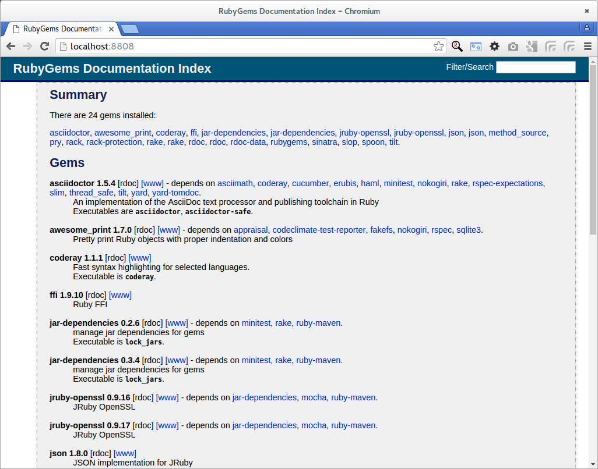

IiU -- JRuby 1.7.20.1, rails-4.2.1
==================================
Installation in Ubuntu — khkoether[at]kahweb[dot]de

:icons:
:Author Initials: KHK
:creativecommons-url: http://creativecommons.org/licenses/by/4.0/deed.de
:mit-url:             http://opensource.org/licenses/mit-license.php  
:ubuntu-url:          http://www.ubuntu.com/
:asciidoctor-url:     http://asciidoctor.org/
:asciidoctordocs-url: http://asciidoctor.org/docs/
:git-url:             http://git-scm.com/
:git-download-url:    https://www.kernel.org/pub/software/scm/git/

:java-url:            http://www.oracle.com/technetwork/java/javase/downloads/index.html
:jruby-url:           http://jruby.org/
:jruby-download-url:  http://jruby.org/download

:jdk-url:             link:jdk.html
:jruby-version:       1.7.20.1
:jruby_1st-url:       link:jruby_1st.html

Version 3.3.0, Juni 2015 

Abstract
--------
Dieser Artikel ist eine Schritt-für-Schritt Anleitung zur Installation 
von {jruby-url}[JRuby 1.7.20.1] unter GNU/Linux.
 
Die Programmiersprache {jruby-url}[JRuby] ist die Implementation 
von {ruby-url}[Ruby] in Java, die wiederum die Grundlage für das 
WebApplication Framework {rubyonrails-url}[Ruby on Rails] bildet. 

Der Artikel ist in {asciidoctordocs-url}[AsciiDoc] geschrieben 
und mit _Asciidoctor {asciidoctor-version}_ erstellt worden.

[CAUTION]
====
Zu beachten ist, dass so ein Dokument zum Einen nie abschliessend 
sein kann, und zum Anderen bestimmte Konfigurationen anders, oder 
auf einem anderem Weg durchgeführt werden können. 
Gerne nehme ich Verbesserungsvorschläge entgegen.

Es gilt wie immer: Verwendung der Anleitung auf eigene Gefahr.
====

Vorraussetzungen
----------------
Die Installation wird für {ubuntu-url}[Ubuntu 14.04 LTS (Trusty Tahr)] 
beschrieben. +
Gleichwohl sind die einzelnen Schritte auch für 
andere Debian-basierte GNU/Linux Distributionen übertragbar.

[TIP]
====
Ubuntu 14.04 LTS (Trusty Tahr) enthält das Paket _jruby_1.5.6-7_all_. 

Nicht installieren!
====

Download
--------
* {jruby-download-url}[JRuby 1.7.20.1] +    
  `jruby-bin-1.7.20.1.tar.gz`  (ca. 33M) +
  *2015-06-10 (Release date)* + 
  JRuby 1.7.20.1 is our twenty-fourth update release since JRuby 1.7.0. 
  The primary goal of 1.7 point releases is to fill out any missing 
  compatibility issues with Ruby 1.9.3. +
  This security release only updated Rubygems to version 2.4.8. 
  Rubygems 2.4.8 addresses CVE-2015-1855 to resolve some problems 
  with wildcard matching of hostnames. +
  See -> https://www.ruby-lang.org/en/news/2015/04/13/ruby-openssl-hostname-matching-vulnerability/[ruby-lang.org’s] 
  description for more info. All users are recommended to upgrade.
  
[NOTE] 
====
Die neue _JRuby-Version 1.7_ wird seit 18 Monaten mit bestimmten Zielen entwickelt:

. JDK-Version 6 ist (mindestens) notwendig 
. Unterstützung der JDK-Version 7
. JRuby wird als im Modus _Ruby 1.9.3_ ausgeführt (neuer Default)
. JRuby unterstützt das neue Java-Feature 'invokedynamic' +
  (auch wenn es für den Moment ausgeschaltet ist - "due to JVM issues" ) +
  &rarr; http://www.jruby.org/2012/10/22/jruby-1-7-0.html[JRuby 1.7.0 Released]
  
.Mein Bauchgefühl sagt:
. JRuby 1.6.x -> JDK 6
. JRuby 1.7.x -> JDK 7

Andere mögliche Kombinationen erhöhen einfach den Beschreibungs-Aufwand für Support.     
====

[NOTE] 
====
Die Installation des _OpenJDK_ (_Oracle JDK_) wurde vom Benutzer 'root' 
systemweit durchgeführt +
&rarr; {jdk-url}[JDK]. +
Die Installation von _JRuby_ und _Ruby on Rails_ wird vom 
Benutzer 'sid' lokal durchgeführt. 
----
$ ls -l 
-rw-rw-r-- 1 sid sid 33893026 Jun 12 21:47 jruby-bin-1.7.20.1.tar.gz
----
====

Installation: JRuby {jruby-version}
-----------------------------------
Zusätzliche Software-Pakete  
sollten im Verzeichnis `/opt` (Optional) installiert werden. 

[CAUTION]
====
Installation im Verzeichnis `/opt/JRuby/sid` (mit dem Benutzer 'sid')
====

*Step 1*: Auspacken des Source-Code
----
$ tar xvzf jruby-bin-1.7.20.1.tar.gz
[...]
----

*Step 2*: Ziel-Verzeichnis anlegen, JRuby-Verzeichnis verschieben
----
$ sudo mkdir -p /opt/JRuby/sid 
$ sudo chown sid.sid /opt/JRuby/sid
----

----
$ mv jruby-1.7.20.1/ /opt/JRuby/sid
----

*Step 3*: Installation verifizieren
----
$ cd /opt/JRuby/sid/jruby-1.7.20.1
$ ls -l 
drwxr-xr-x 2 sid sid   4096 Jun 12 21:55 bin
-rw-r--r-- 1 sid sid 137174 Jun 12 21:55 COPYING
drwxrwxr-x 4 sid sid   4096 Jun 12 21:55 docs
drwxr-xr-x 4 sid sid   4096 Jun 12 21:55 lib
-rw-r--r-- 1 sid sid   2572 Jun 12 21:55 LICENSE.RUBY
drwxrwxr-x 6 sid sid   4096 Jun 12 21:55 samples
drwxrwxr-x 3 sid sid   4096 Jun 12 21:55 tool
----

----
$ ls -l bin
-rwxr-xr-x 1 sid sid   5670 Jun 12 21:55 ast       <1>
-rw-r--r-- 1 sid sid     40 Jun 12 21:55 ast.bat   <2>
-rwxr-xr-x 1 sid sid    123 Jun 12 21:55 gem
-rw-r--r-- 1 sid sid     40 Jun 12 21:55 gem.bat
-rwxr-xr-x 1 sid sid    323 Jun 12 21:55 irb
-rw-r--r-- 1 sid sid     40 Jun 12 21:55 irb.bat
-rwxr-xr-x 1 sid sid    547 Jun 12 21:55 jgem
-rw-r--r-- 1 sid sid     41 Jun 12 21:55 jgem.bat
-rwxr-xr-x 1 sid sid    390 Jun 12 21:55 jirb
-rw-r--r-- 1 sid sid     41 Jun 12 21:55 jirb.bat
-rwxr-xr-x 1 sid sid   1935 Jun 12 21:55 jirb_swing
-rw-r--r-- 1 sid sid     47 Jun 12 21:55 jirb_swing.bat
-rwxr-xr-x 1 sid sid  11474 Jun 12 21:55 jruby
-rwxr-xr-x 1 sid sid  11474 Jun 12 21:55 jruby.bash
-rw-r--r-- 1 sid sid    125 Jun 12 21:55 jruby.bat
-rwxr-xr-x 1 sid sid    188 Jun 12 21:55 jrubyc
-rw-r--r-- 1 sid sid     43 Jun 12 21:55 jrubyc.bat
-rw-r--r-- 1 sid sid    245 Jun 12 21:55 jrubyd.bat
-rw-r--r-- 1 sid sid 742400 Jun 12 21:55 jruby.dll
-rw-r--r-- 1 sid sid 680448 Jun 12 21:55 jruby.exe
-rwxr-xr-x 1 sid sid   8979 Jun 12 21:55 jruby.sh
-rw-r--r-- 1 sid sid 682496 Jun 12 21:55 jrubyw.exe
-rwxr-xr-x 1 sid sid    451 Jun 12 21:55 rake
-rw-r--r-- 1 sid sid     41 Jun 12 21:55 rake.bat
-rwxr-xr-x 1 sid sid    451 Jun 12 21:55 rdoc
-rw-r--r-- 1 sid sid     41 Jun 12 21:55 rdoc.bat
-rwxr-xr-x 1 sid sid    449 Jun 12 21:55 ri
-rw-r--r-- 1 sid sid     39 Jun 12 21:55 ri.bat
-rwxr-xr-x 1 sid sid    152 Jun 12 21:55 testrb
-rw-r--r-- 1 sid sid     43 Jun 12 21:55 testrb.bat
----
<1> Kommando #ast# für ein _GNU/Linux-System_
<2> Kommando #ast.bat# für ein _MS Windows-System_

*Step 4:* Der Pfad zum Verzeichnis `/opt/JRuby/sid/jruby-1.7.20.1` muß gesetzt werden.
----
$ cd /opt/JRuby/sid
$ ln -s jruby-1.7.20.1 current201

$ ls -lv
lrwxrwxrwx 1 sid sid   15 Dez  5 16:53 current -> jruby-1.7.16.1/     <1>
lrwxrwxrwx 1 sid sid   15 Dez  5 16:53 current16 -> jruby-1.7.16.1/   <1>
lrwxrwxrwx 1 sid sid   12 Dez 23 18:03 current18 -> jruby-1.7.18
lrwxrwxrwx 1 sid sid   12 Feb  8 14:01 current19 -> jruby-1.7.19
lrwxrwxrwx 1 sid sid   12 Mai 22 22:32 current20 -> jruby-1.7.20
lrwxrwxrwx 1 sid sid   15 Jun 12 21:58 current201 -> jruby-1.7.20.1/
-rw-r--r-- 1 sid sid  131 Dez  5 16:52 jruby.path.sh
-rw-r--r-- 1 sid sid  133 Dez  5 16:52 jruby16.path.sh
-rw-r--r-- 1 sid sid  133 Dez 23 18:07 jruby18.path.sh   
-rw-r--r-- 1 sid sid  133 Feb  8 14:14 jruby19.path.sh
-rw-r--r-- 1 sid sid  133 Mai 22 22:12 jruby20.path.sh       
-rw-r--r-- 1 sid sid  133 Jun 12 22:00 jruby201.path.sh   <2>
drwxr-xr-x 8 sid sid 4096 Dez  5 16:51 jruby-1.7.16.1
drwxr-xr-x 7 sid sid 4096 Dez 23 18:07 jruby-1.7.18
drwxr-xr-x 7 sid sid 4096 Feb  8 14:09 jruby-1.7.19
drwxr-xr-x 7 sid sid 4096 Mai  5 00:04 jruby-1.7.20
drwxr-xr-x 7 sid sid 4096 Jun 12 21:55 jruby-1.7.20.1
----
<1> Die symbolischen links 'current' und 'current16' zeigen auf die gleiche
    JRuby-Installation: +
    'jruby-1.7.16.1' -- meine 'default'-Installation.
<2> Erstellen Sie eine Datei `jruby201.path.sh` (siehe <<_anhang,[Anhang]>>). 

[CAUTION]
====
In der Datei können Sie ebenfalls entscheiden auf welche der zu diesem
Zeitpunkt verfügbaren Java-Versionen Sie sich beziehen.

Wenn Sie die für das System installierte _OpenJDK_-Version verwenden ... bedeutet 
das ... kein Eintrag. Haben Sie zusätzlich eine _JDK_-Version installiert
sollten Sie die hierfür notwendigen Umgebungsvariablen ebenfalls in dieser 
Datei setzen.
==== 

[NOTE] 
=========================================================
Achtung: Ausführen der Datei mit dem Punkt-Operator!
----
$ . jruby201.path.sh   <1>
---- 
<1> Oder mit dem Bash-Builtin Kommando: #source &nbsp; jruby201.path.sh#
=========================================================

*Step 5:* Check

.Die Java-Version
----
$ java -version
java version "1.7.0_79"
OpenJDK Runtime Environment (IcedTea 2.5.5) (7u79-2.5.5-0ubuntu0.14.04.2)
OpenJDK 64-Bit Server VM (build 24.79-b02, mixed mode)
----

.Die JRuby-Version ...
[options="nowrap"]
----
$ which jruby
/opt/JRuby/sid/current201/bin/jruby

$ jruby --version
jruby 1.7.20.1 (1.9.3p551) 2015-06-10 d7c8c27 on OpenJDK 64-Bit Server VM 1.7.0_79-b14 +jit [linux-amd64]

$ jruby --version --1.8   <1>
jruby 1.7.20.1 (ruby-1.8.7p376) 2015-06-10 d7c8c27 on OpenJDK 64-Bit Server VM 1.7.0_79-b14 +jit [linux-amd64]

$ jruby --version --2.0   <2>
jruby 1.7.20.1 (2.0.0p598) 2015-06-10 d7c8c27 on OpenJDK 64-Bit Server VM 1.7.0_79-b14 +jit [linux-amd64]
----
<1> Weitere Möglichkeit: + 
    #JRUBY_OPTS=--1.8 &nbsp; jruby --version#
<2> Zu diesem Zeitpunkt als Experimentell gekennzeichnet.    

.Vollständigkeit
----
$ jruby -ropenssl -rzlib -rreadline -e "puts 'Happy new JRuby'"   <1>
Happy new JRuby
----
<1> Die Bibliothek _openssl_ ist in JRuby 1.7 bereits enthalten. +
    Eine vorher notwendige zusätzliche Installation entfällt. +
    &rarr; http://jruby.org/openssl[JRuby Builtin OpenSSL Support] 

.JRuby 1.7.20.1: _irb_, _jirb_
----
$ jirb   <1>
irb(main):001:0> RUBY_VERSION
=> "1.9.3"
irb(main):002:0> RUBY_PATCHLEVEL
=> 551
irb(main):003:0> Time.now.to_s
=> "2015-06-12 22:06:56 +0200"
irb(main):004:0> Time.now.tuesday?
=> false
irb(main):005:0> Time.now.friday?
=> true
irb(main):006:0> exit
----
<1> Verwendet: Ruby 1.9.3p551 (default)

[NOTE]
====
Der Schalter #-S# führt dazu, daß für das Script zuerst  
das Verzeichnis `${JRUBY_HOME}/bin` geprüft wird -- und
erst im Anschluß der gesetzte +PATH+. 
----
$ jruby -S ...
----

Mit der Umgebungsvariablen _JRUBY_OPTS_ kann der ausgeführte Ruby-Modus 
(_1.8_ oder _1.9_ oder _2.0_) gesteuert werden.

----
$ export JRUBY_OPTS=--1.9   <1>
----
<1> Mit der JRuby-Version 1.7.x ist der Wert _--1.9_ der Standard!
====

Rubygems
--------
_RubyGems_ (oder kurz Gems) ist das offizielle Paketsystem für die 
Programmiersprache Ruby. Mit ihm hat der Anwender die Möglichkeit, 
mehrere (zum Beispiel ältere oder jüngere) Versionen eines Programmes, 
Programmteiles oder einer Bibliothek gesteuert nach Bedarf einzurichten, 
zu verwalten oder auch wieder zu entfernen. +
&rarr; http://de.wikipedia.org/wiki/RubyGems[Wikipedia: RubyGems]

[NOTE]
====
Die Aktualisierung der JRuby-Installation wird mit dem Benutzer 'sid' durchgeführt.
====

*Step 0:* Vorraussetzung für die nächsten Befehle ist ein 
funktionierender +PATH+-Eintrag für den Benutzer 'sid' 
auf die _JRuby 1.7.20_-Installation:

[options="nowrap"]
----
$ which gem
/opt/JRuby/sid/current201/bin/gem

$ which jgem
/opt/JRuby/sid/current201/bin/jgem
----

Dann gehen auch die folgenden Befehle

----
$ gem -v
2.4.8

$ gem list --local

*** LOCAL GEMS ***

axiom-types (0.1.1)
coercible (1.0.0)
descendants_tracker (0.0.4)
equalizer (0.0.11)
ice_nine (0.11.1)
jar-dependencies (0.1.13)
jruby-openssl (0.9.7 java)
json (1.8.0 java)
maven-tools (1.0.9)
rake (10.1.0)
rdoc (4.1.2)
ruby-maven (3.1.1.0.8)
ruby-maven-libs (3.1.1)
thread_safe (0.3.5 java)
virtus (1.0.5)
----

update
~~~~~~
*Step 1:* Das Programm `(j)gem` aktualisieren (als Benutzer 'sid')
----
$ gem update --system
Latest version currently installed. Aborting.   <1>
----
<1> Stand: 2015-06-12 -- Keine _neue_ Version vorhanden (Ausführung dauerte über 30s)!

[TIP]
.gem command reference
====
*GEM UPDATE*

----
$ gem help update
Usage: gem update REGEXP [REGEXP ...] [options]

  Options:
        --system [VERSION]           Update the RubyGems system software
        --platform PLATFORM          Specify the platform of gem to update
        --[no-]prerelease            Allow prerelease versions of a gem
                                     as update targets
...
----                                     

-> http://guides.rubygems.org/command-reference/[RubyGems Guides: COMMAND REFERENCE]
====

----
$ gem -v
2.4.8 

$ jgem -v
2.4.8
----

[NOTE]
====
.(j)gem  
An sich können beide Programme benutzt werden, wobei sowohl der Aufruf
und auch deren Ergebnisse identisch sind.
Sie sind ausschließlich aus Bequemlichkeit
für eine 'private' Sichtweise alternativ vorhanden. 

Das *gem* betont die Verbundenheit zu Ruby, während *jgem*
wiederum auf die Umsetzung in Java hinweist.

Praktisch sollen die Programme _etwas?_ differieren ... und 
das Angebot *jgem* ist _mehr?_ up-to-date ... 

Persönlich favorisiere ich *jruby -S gem ...* -- aber *jgem ...* äh *gem ...* ist kürzer ;-)
====

*Step 2:* Installierte RubyGems aktualisieren
----
$ gem update
Updating installed gems
Updating jar-dependencies
Fetching: jar-dependencies-0.1.14.gem (100%)
Successfully installed jar-dependencies-0.1.14
Updating json
Fetching: json-1.8.3-java.gem (100%)
Successfully installed json-1.8.3-java
Updating rake
Fetching: rake-10.4.2.gem (100%)
Successfully installed rake-10.4.2
Updating rdoc
Fetching: rdoc-4.2.0.gem (100%)
Depending on your version of ruby, you may need to install ruby rdoc/ri data:

<= 1.8.6 : unsupported
 = 1.8.7 : gem install rdoc-data; rdoc-data --install
 = 1.9.1 : gem install rdoc-data; rdoc-data --install
>= 1.9.2 : nothing to do! Yay!
Successfully installed rdoc-4.2.0
Updating ruby-maven
Fetching: ruby-maven-libs-3.3.3.gem (100%)
Successfully installed ruby-maven-libs-3.3.3
Fetching: ruby-maven-3.3.2.gem (100%)
Successfully installed ruby-maven-3.3.2
Gems updated: jar-dependencies json rake rdoc ruby-maven ruby-maven-libs   <1>
----
<1> Sechs _Gems_ aktualisiert! 
   
----
$ gem list --local

*** LOCAL GEMS ***

axiom-types (0.1.1)
coercible (1.0.0)
descendants_tracker (0.0.4)
equalizer (0.0.11)
ice_nine (0.11.1)
jar-dependencies (0.1.14, 0.1.13)
jruby-openssl (0.9.7 java)
json (1.8.3 java, 1.8.0 java)
maven-tools (1.0.9)
rake (10.4.2, 10.1.0)
rdoc (4.2.0, 4.1.2)
ruby-maven (3.3.2, 3.1.1.0.8)
ruby-maven-libs (3.3.3, 3.1.1)
thread_safe (0.3.5 java)
virtus (1.0.5)
----

*Step 3:* Die _Ruby-Documentation_ installieren
----
$ gem install rdoc-data
Fetching: rdoc-data-4.0.1.gem (100%)
rdoc-data is only required for C ruby 1.8.7 or 1.9.1.

rdoc-data is required for JRuby.   <1>

To install ri data for RDoc 4.0+ run:

  rdoc-data --install

Successfully installed rdoc-data-4.0.1
1 gem installed
----
<1> Notwendig für _JRuby_!

[options="nowrap"]
----
$ which rdoc-data
/opt/JRuby/sid/current201/bin/rdoc-data

$ rdoc-data --install   <1>
----
<1> Installs updated ruby 1.9.3 system ri data (core + stdlib)

----
$ ri Array#each
= Array#each

(from ruby core)
 -----------------------------------------------------------------------------
  ary.each {|item| block }   -> ary
  ary.each                   -> an_enumerator

 -----------------------------------------------------------------------------

Calls block once for each element in self, passing that element as a
parameter.

If no block is given, an enumerator is returned instead.

  a = [ "a", "b", "c" ]
  a.each {|x| print x, " -- " }

produces:

  a -- b -- c --
----

Installation: Ruby on rails-4.2.1
~~~~~~~~~~~~~~~~~~~~~~~~~~~~~~~~~
*Step 0* 
----
# gem search ^rails$ --remote

*** REMOTE GEMS ***

rails (4.2.1)   <1>
----
<1> Seit dem 19.03.2015 ist das die neueste Version des RubyGem _rails_. 

[TIP]
====
Eine mögliche Installation von zusätzlicher Dokumentation oder aktualisieren 
der vorhandenen wird nicht durchgeführt. 
----
$ gem env
RubyGems Environment:
  - RUBYGEMS VERSION: 2.4.8
  - RUBY VERSION: 1.9.3 (2015-06-10 patchlevel 551) [java]
  - INSTALLATION DIRECTORY: /opt/JRuby/sid/jruby-1.7.20.1/lib/ruby/gems/shared
  - RUBY EXECUTABLE: /opt/JRuby/sid/jruby-1.7.20.1/bin/jruby
  - EXECUTABLE DIRECTORY: /opt/JRuby/sid/jruby-1.7.20.1/bin
  - SPEC CACHE DIRECTORY: /home/sid/.gem/specs
  - SYSTEM CONFIGURATION DIRECTORY: /opt/JRuby/sid/jruby-1.7.20.1/etc
  - RUBYGEMS PLATFORMS:
    - ruby
    - universal-java-1.7
  - GEM PATHS:
     - /opt/JRuby/sid/jruby-1.7.20.1/lib/ruby/gems/shared
     - /home/sid/.gem/jruby/1.9
  - GEM CONFIGURATION:
     - :update_sources => true
     - :verbose => true
     - :backtrace => false
     - :bulk_threshold => 1000
     - "install" => "--no-rdoc --no-ri --env-shebang"   <1>
     - "update" => "--no-rdoc --no-ri --env-shebang"    <1>
  - REMOTE SOURCES:
     - https://rubygems.org/
  - SHELL PATH:
     - /opt/JRuby/sid/current201/bin
     - /usr/local/bin
     - /usr/bin
     - /bin
     - /usr/local/games
     - /usr/games
---- 
<1> In der Regel wird die offizielle Dokumentation im Internet genutzt: +
    -> http://rubygems.org/ +
    -> http://guides.rubyonrails.org/ 
====

Mit #gem install ...# werden auch alle Abhängigkeiten zu anderen RubyGems aufgelöst. 

----
$ gem install rails   
Fetching: minitest-5.7.0.gem (100%)
Successfully installed minitest-5.7.0
...
Fetching: rails-4.2.1.gem (100%)
Successfully installed rails-4.2.1
29 gems installed   <1>
----
<1> Mit dem RubyGem _rails-4.2.1_ wurden insgesamt 29 Gems installiert. +
    Hinweis: Weitere RubyGems müssen für das Framework *Ruby on Rails* installiert werden.

[NOTE]
====
Alternativ kann _Rails_ mit der Angabe einer Version installiert werden.
----
# gem install rails --version 4.2.1

# gem install rails --version '~> 4.2.1'   <1>
----
<1> Twiddle Wakka: '~> 4.2.1' bedeutet, das die höchste Gem-Version von Rails +
    im Bereich von >= 4.2.1 und < 4.3 installiert wird. 
====

asciidoctor
~~~~~~~~~~~ 
----
$ gem install asciidoctor   <1> 
Fetching: asciidoctor-1.5.2.gem (100%)
Successfully installed asciidoctor-1.5.2
1 gem installed

$ gem install coderay   <2>  
Fetching: coderay-1.1.0.gem (100%)
Successfully installed coderay-1.1.0
1 gem installed
----
<1> *Asciidoctor* is an open source Ruby processor for converting _AsciiDoc_ markup +
    into HTML 5, DocBook 4.5 and other formats.
<2> *CodeRay* is a fast and easy syntax highlighting for selected languages, written in Ruby. +
    Comes with RedCloth integration and LOC counter.

awesome_print
~~~~~~~~~~~~~
----
$ gem install awesome_print   <1>
Fetching: awesome_print-1.6.1.gem (100%)
Successfully installed awesome_print-1.6.1
1 gem installed
----
<1> Great Ruby dubugging companion: pretty print Ruby objects to visualize 
    their structure. Supports custom object formatting via plugins

pry
~~~~
----
$ gem install pry   <1>
Fetching: ffi-1.9.8-java.gem (100%)
Successfully installed ffi-1.9.8-java
Fetching: spoon-0.0.4.gem (100%)
Successfully installed spoon-0.0.4
Fetching: method_source-0.8.2.gem (100%)
Successfully installed method_source-0.8.2
Fetching: slop-3.6.0.gem (100%)
Successfully installed slop-3.6.0
Fetching: pry-0.10.1-java.gem (100%)
Successfully installed pry-0.10.1-java
5 gems installed
----
<1> An IRB alternative and runtime developer console.

sinatra
~~~~~~~ 
----
# gem install sinatra   <1>
Fetching: rack-protection-1.5.3.gem (100%)
Successfully installed rack-protection-1.5.3
Fetching: tilt-2.0.1.gem (100%)
Successfully installed tilt-2.0.1
Fetching: sinatra-1.4.6.gem (100%)
Successfully installed sinatra-1.4.6
3 gems installed
----
<1> *Sinatra* ist eine _freie_ und _open source Webapplikationsbibliothek_ und + 
    eine in Ruby geschriebene _domänenspezifische_ Sprache. +
    *Sinatra* setzt das Rack Webserver-Interface voraus. +
    &rarr; http://de.wikipedia.org/wiki/Sinatra_%28Software%29[Wikipedia: Sinatra (Software)]

    
gem list --local
~~~~~~~~~~~~~~~~ 
*Step 5:* Liste der installierten RubyGems
----
$ gem list --local

*** LOCAL GEMS ***

actionmailer (4.2.1)
actionpack (4.2.1)
actionview (4.2.1)
activejob (4.2.1)
activemodel (4.2.1)
activerecord (4.2.1)
activesupport (4.2.1)
arel (6.0.0)
asciidoctor (1.5.2)
awesome_print (1.6.1)
axiom-types (0.1.1)
builder (3.2.2)
bundler (1.10.3)
coderay (1.1.0)
coercible (1.0.0)
descendants_tracker (0.0.4)
equalizer (0.0.11)
erubis (2.7.0)
ffi (1.9.8 java)
globalid (0.3.5)
i18n (0.7.0)
ice_nine (0.11.1)
jar-dependencies (0.1.14, 0.1.13)
jruby-openssl (0.9.7 java)
json (1.8.3 java, 1.8.0 java)
loofah (2.0.2)
mail (2.6.3)
maven-tools (1.0.9)
method_source (0.8.2)
mime-types (2.6.1)
minitest (5.7.0)
nokogiri (1.6.6.2 java)
pry (0.10.1 java)
rack (1.6.1)
rack-protection (1.5.3)
rack-test (0.6.3)
rails (4.2.1)
rails-deprecated_sanitizer (1.0.3)
rails-dom-testing (1.0.6)
rails-html-sanitizer (1.0.2)
railties (4.2.1)
rake (10.4.2, 10.1.0)
rdoc (4.2.0, 4.1.2)
rdoc-data (4.0.1)
ruby-maven (3.3.2, 3.1.1.0.8)
ruby-maven-libs (3.3.3, 3.1.1)
sinatra (1.4.6)
slop (3.6.0)
spoon (0.0.4)
sprockets (3.2.0)
sprockets-rails (2.3.1)
thor (0.19.1)
thread_safe (0.3.5 java)
tilt (2.0.1)
tzinfo (1.2.2)
virtus (1.0.5)
----

----
$ ls -lrt /opt/JRuby/sid/jruby-1.7.20.1/bin
-rw-r--r-- 1 sid sid     43 Jun 12 21:55 testrb.bat
-rw-r--r-- 1 sid sid     39 Jun 12 21:55 ri.bat
-rw-r--r-- 1 sid sid     41 Jun 12 21:55 rake.bat
-rwxr-xr-x 1 sid sid   8979 Jun 12 21:55 jruby.sh
-rw-r--r-- 1 sid sid    245 Jun 12 21:55 jrubyd.bat
-rw-r--r-- 1 sid sid     43 Jun 12 21:55 jrubyc.bat
-rwxr-xr-x 1 sid sid  11474 Jun 12 21:55 jruby
-rwxr-xr-x 1 sid sid   1935 Jun 12 21:55 jirb_swing
-rw-r--r-- 1 sid sid     41 Jun 12 21:55 jgem.bat
-rwxr-xr-x 1 sid sid    547 Jun 12 21:55 jgem
-rw-r--r-- 1 sid sid     40 Jun 12 21:55 irb.bat
-rwxr-xr-x 1 sid sid    323 Jun 12 21:55 irb
-rw-r--r-- 1 sid sid     40 Jun 12 21:55 gem.bat
-rw-r--r-- 1 sid sid     40 Jun 12 21:55 ast.bat
-rwxr-xr-x 1 sid sid   5670 Jun 12 21:55 ast
-rwxr-xr-x 1 sid sid    152 Jun 12 21:55 testrb
-rw-r--r-- 1 sid sid     41 Jun 12 21:55 rdoc.bat
-rw-r--r-- 1 sid sid 682496 Jun 12 21:55 jrubyw.exe
-rw-r--r-- 1 sid sid 680448 Jun 12 21:55 jruby.exe
-rwxr-xr-x 1 sid sid    188 Jun 12 21:55 jrubyc
-rw-r--r-- 1 sid sid     41 Jun 12 21:55 jirb.bat
-rw-r--r-- 1 sid sid 742400 Jun 12 21:55 jruby.dll
-rw-r--r-- 1 sid sid    125 Jun 12 21:55 jruby.bat
-rwxr-xr-x 1 sid sid  11474 Jun 12 21:55 jruby.bash
-rw-r--r-- 1 sid sid     47 Jun 12 21:55 jirb_swing.bat
-rwxr-xr-x 1 sid sid    390 Jun 12 21:55 jirb
-rwxr-xr-x 1 sid sid    123 Jun 12 21:55 gem
-rwxr-xr-x 1 sid sid    486 Jun 12 22:20 rake
-rwxr-xr-x 1 sid sid    486 Jun 12 22:20 rdoc
-rwxr-xr-x 1 sid sid    484 Jun 12 22:20 ri
-rwxr-xr-x 1 sid sid    504 Jun 12 22:21 rmvn
-rwxr-xr-x 1 sid sid    567 Jun 12 22:25 rdoc-data
-rwxr-xr-x 1 sid sid    502 Jun 12 22:30 nokogiri    <1>
-rwxr-xr-x 1 sid sid    494 Jun 12 22:30 erubis
-rwxr-xr-x 1 sid sid    488 Jun 12 22:30 rackup
-rwxr-xr-x 1 sid sid    506 Jun 12 22:30 sprockets
-rwxr-xr-x 1 sid sid    497 Jun 12 22:30 bundle
-rwxr-xr-x 1 sid sid    498 Jun 12 22:30 bundler
-rwxr-xr-x 1 sid sid    486 Jun 12 22:30 thor
-rwxr-xr-x 1 sid sid    499 Jun 12 22:30 rails              <1>
-rwxr-xr-x 1 sid sid    519 Jun 12 22:33 asciidoctor-safe
-rwxr-xr-x 1 sid sid    514 Jun 12 22:33 asciidoctor
-rwxr-xr-x 1 sid sid    498 Jun 12 22:33 coderay
-rwxr-xr-x 1 sid sid    482 Jun 12 22:34 pry
-rwxr-xr-x 1 sid sid    486 Jun 12 22:34 tilt
----
<1> Die Kommandos #nokigiri, ..., thor# und natürlich auch #rails# wurden durch +
    #gem install rails# installiert.

RubyGems Documentation Index
----------------------------
Auf die installierte Dokumentation zugreifen.
----
$ gem server
Server started at http://[0:0:0:0:0:0:0:0]:8808
----

----
Browser> http://localhost:8808/
         RubyGems Documentation Index   
----

JRuby on Rails 4.2: Erste Schritte &hellip;
-------------------------------------------
{jruby_1st-url}[JRuby on Rails 4.2: Erste Schritte &hellip;]

Anhang
------
Scripte zum Setzen der Umgebung von *JRuby* (ohne weitere Erläuterung)

[TIP]
====
Die Konfiguration für _Tomcat_ kann ebenfalls hier vorgenommen werden!

----
# Tomcat   
CATALINA_OPTS='-server -Xms512m -Xmx1024m -XX:PermSize=256m -XX:MaxPermSize=512m'

export CATALINA_OPTS
----
====

.JRuby (mit System-JDK )
----
JRUBY_HOME=/opt/JRuby/sid/current201
#JRUBY_OPTS=--1.8   <1>

PATH=$JRUBY_HOME/bin:$PATH

export JRUBY_HOME
#export JRUBY_OPTS

export PATH
----
<1> JRuby wird im Modus _Ruby 1.8.7_ ausgeführt.

.JRuby (mit separatem JDK)
----
JAVA_BINDIR=/opt/Java/current/bin   <1>
JAVA_HOME=/opt/Java/current
JDK_HOME=/opt/Java/current
JRE_HOME=/opt/Java/current

JRUBY_HOME=/opt/JRuby/sid/current201
#JRUBY_OPTS=--1.8   <2>

PATH=$JAVA_BINDIR:$JRUBY_HOME/bin:$PATH

export JAVA_BINDIR
export JAVA_HOME
export JDK_HOME
export JRE_HOME

export JRUBY_HOME
#export JRUBY_OPTS

export PATH
----
<1> Eine von Hand installierte _JDK_-Version 
<2> JRuby wird im Modus _Ruby 1.8.7_ ausgeführt.

'''
 
+++
<a href="#top" title="zum Seitenanfang">
  &#8679; 
</a>
+++
[small]#&middot; Document generated with Asciidoctor {asciidoctor-version}.#

