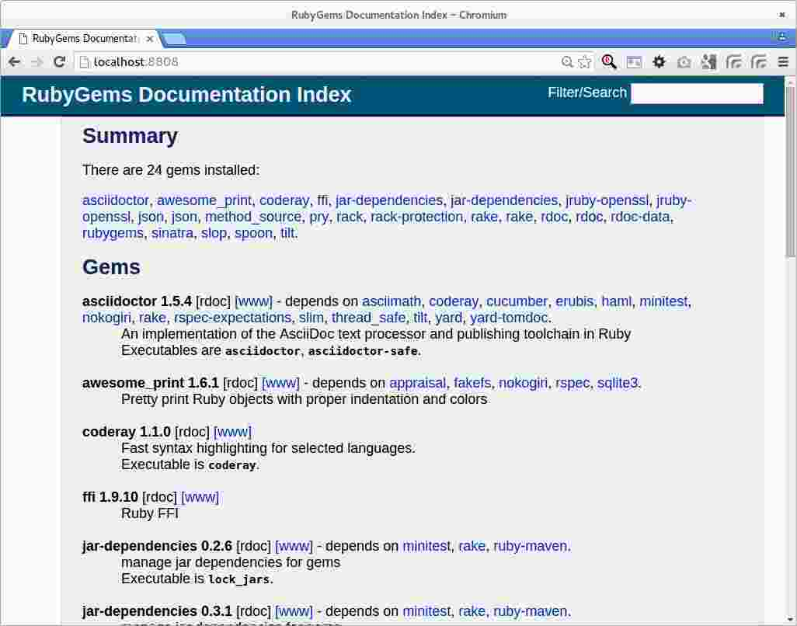

IiU -- JRuby 1.7.23
===================
Installation in Ubuntu — khkoether[at]kahweb[dot]de

:icons:
:Author Initials: KHK
:creativecommons-url:    http://creativecommons.org/licenses/by/4.0/deed.de
:mit-url:                http://opensource.org/licenses/mit-license.php  
:ubuntu-url:             http://www.ubuntu.com/
:asciidoctor-url:        http://asciidoctor.org/
:asciidoctordocs-url:    http://asciidoctor.org/docs/
:git-url:                http://git-scm.com/
:git-download-url:       https://www.kernel.org/pub/software/scm/git/

:ruby-url:              https://www.ruby-lang.org/de/
:ruby-download-url:     https://www.ruby-lang.org/de/downloads/
:rubyonrails-url:       http://www.rubyonrails.org

:java-url:               http://www.oracle.com/technetwork/java/javase/downloads/index.html
:jruby-url:              http://jruby.org/
:jruby-download-url:     http://jruby.org/download

:jdk-url:                link:jdk.html
:jruby-version:          1.7.23
:jruby23-url:            link:jruby.html
:jruby_on_rails42-url:   link:jruby_on_rails42.html

Version 4.0.0, Januar 2016 

Abstract
--------
Dieser Artikel ist eine Schritt-für-Schritt Anleitung zur Installation 
von {jruby-url}[JRuby 1.7.23] unter GNU/Linux.
 
Die Programmiersprache {jruby-url}[JRuby] ist die Implementation 
von {ruby-url}[Ruby] in Java, die wiederum die Grundlage für das 
WebApplication Framework {rubyonrails-url}[Ruby on Rails] bildet. 

Der Artikel ist in {asciidoctordocs-url}[Asciidoctor] geschrieben 
und mit _Asciidoctor {asciidoctor-version}_ erstellt worden.

[CAUTION]
====
Zu beachten ist, dass so ein Dokument zum Einen nie abschliessend 
sein kann, und zum Anderen bestimmte Konfigurationen anders, oder 
auf einem anderem Weg durchgeführt werden können. 
Gerne nehme ich Verbesserungsvorschläge entgegen.

Es gilt wie immer: Verwendung der Anleitung auf eigene Gefahr.
====

Vorraussetzungen
----------------
Die Installation wird für {ubuntu-url}[Ubuntu 14.04 LTS (Trusty Tahr)] 
beschrieben. +
Gleichwohl sind die einzelnen Schritte auch für 
andere Debian-basierte GNU/Linux Distributionen übertragbar.

[TIP]
====
Ubuntu 14.04 LTS (Trusty Tahr) enthält das Paket _jruby_1.5.6-7_all_. 

Nicht installieren!
====

Download
--------
* {jruby-download-url}[JRuby 1.7.23] +    
  `jruby-bin-1.7.23.tar.gz`  (ca. 33M) +
  *2015-11-24 (Release date)* + 
JRuby 1.7.23 is our twenty-seventh update release since JRuby 1.7.0. 
The primary goal of 1.7 point releases is to fill out any missing 
compatibility issues with Ruby 1.9.3.
  
[NOTE] 
====
Die neue _JRuby-Version 1.7_ wird seit 18 Monaten mit bestimmten Zielen entwickelt:

. JDK-Version 6 ist (mindestens) notwendig 
. Unterstützung der JDK-Version 7
. JRuby wird als im Modus _Ruby 1.9.3_ ausgeführt (neuer Default)
. JRuby unterstützt das neue Java-Feature 'invokedynamic' +
  (auch wenn es für den Moment ausgeschaltet ist - "due to JVM issues" ) +
  &rarr; http://www.jruby.org/2012/10/22/jruby-1-7-0.html[JRuby 1.7.0 Released]
  
.Mein Bauchgefühl sagt:
. JRuby 1.6.x -> JDK 6
. JRuby 1.7.x -> JDK 7

Andere mögliche Kombinationen erhöhen einfach den Beschreibungs-Aufwand für Support.     
====

[NOTE] 
====
Die Installation des _OpenJDK_ (_Oracle JDK_) wurde vom Benutzer 'root' 
systemweit durchgeführt +
&rarr; {jdk-url}[JDK]. +
Die Installation von _JRuby_ und _Ruby on Rails_ wird vom 
Benutzer 'sid' lokal durchgeführt. 
----
$ ls -l 
-rw-rw-r-- 1 sid sid 21630974 Jan  6 11:25 jruby-bin-1.7.23.tar.gz
----
====

Installation: JRuby {jruby-version}
-----------------------------------
Zusätzliche Software-Pakete  
sollten im Verzeichnis `/opt` (Optional) installiert werden. 

[CAUTION]
====
Installation im Verzeichnis `/opt/JRuby/sid` (mit dem Benutzer 'sid')
====

*Step 1*: Auspacken des Source-Code
----
$ tar xvzf jruby-bin-1.7.23.tar.gz
...
----

*Step 2*: Ziel-Verzeichnis anlegen, JRuby-Verzeichnis verschieben
----
$ sudo mkdir -p /opt/JRuby/sid 
$ sudo chown sid.sid /opt/JRuby/sid
----

----
$ mv jruby-1.7.23/ /opt/JRuby/sid
----

*Step 3*: Installation verifizieren
----
$ cd /opt/JRuby/sid/jruby-1.7.23
$ ls -l 
drwxr-xr-x 2 sid sid   4096 Jan  6 11:28 bin
-rw-r--r-- 1 sid sid 137174 Nov 24 16:18 COPYING
drwxrwxr-x 4 sid sid   4096 Jan  6 11:28 docs
drwxr-xr-x 4 sid sid   4096 Jan  6 11:28 lib
-rw-r--r-- 1 sid sid   2572 Nov 24 16:18 LICENSE.RUBY
drwxrwxr-x 6 sid sid   4096 Jan  6 11:28 samples
drwxrwxr-x 3 sid sid   4096 Jan  6 11:28 tool
----

----
$ ls -l bin
-rwxr-xr-x 1 sid sid   5670 Nov 24 16:23 ast       <1>
-rw-r--r-- 1 sid sid     40 Nov 24 16:23 ast.bat   <2>
-rwxr-xr-x 1 sid sid    123 Nov 24 16:23 gem
-rw-r--r-- 1 sid sid     40 Nov 24 16:23 gem.bat
-rwxr-xr-x 1 sid sid    323 Nov 24 16:23 irb
-rw-r--r-- 1 sid sid     40 Nov 24 16:23 irb.bat
-rwxr-xr-x 1 sid sid    547 Nov 24 16:23 jgem
-rw-r--r-- 1 sid sid     41 Nov 24 16:23 jgem.bat
-rwxr-xr-x 1 sid sid    390 Nov 24 16:23 jirb
-rw-r--r-- 1 sid sid     41 Nov 24 16:23 jirb.bat
-rwxr-xr-x 1 sid sid   1935 Nov 24 16:23 jirb_swing
-rw-r--r-- 1 sid sid     47 Nov 24 16:23 jirb_swing.bat
-rwxr-xr-x 1 sid sid  11474 Nov 24 16:23 jruby
-rwxr-xr-x 1 sid sid  11474 Nov 24 16:23 jruby.bash
-rw-r--r-- 1 sid sid    125 Nov 24 16:23 jruby.bat
-rwxr-xr-x 1 sid sid    188 Nov 24 16:23 jrubyc
-rw-r--r-- 1 sid sid     43 Nov 24 16:23 jrubyc.bat
-rw-r--r-- 1 sid sid    245 Nov 24 16:23 jrubyd.bat
-rw-r--r-- 1 sid sid 742400 Nov 24 16:23 jruby.dll
-rw-r--r-- 1 sid sid 680448 Nov 24 16:23 jruby.exe
-rwxr-xr-x 1 sid sid   8979 Nov 24 16:23 jruby.sh
-rw-r--r-- 1 sid sid 682496 Nov 24 16:23 jrubyw.exe
-rwxr-xr-x 1 sid sid    486 Nov 24 16:23 rake
-rw-r--r-- 1 sid sid     41 Nov 24 16:23 rake.bat
-rwxr-xr-x 1 sid sid    486 Nov 24 16:23 rdoc
-rw-r--r-- 1 sid sid     41 Nov 24 16:23 rdoc.bat
-rwxr-xr-x 1 sid sid    484 Nov 24 16:23 ri
-rw-r--r-- 1 sid sid     39 Nov 24 16:23 ri.bat
-rwxr-xr-x 1 sid sid    152 Nov 24 16:23 testrb
-rw-r--r-- 1 sid sid     43 Nov 24 16:23 testrb.bat
----
<1> Kommando #ast# für ein _GNU/Linux-System_
<2> Kommando #ast.bat# für ein _MS Windows-System_

*Step 4:* Der Pfad zum Verzeichnis `/opt/JRuby/sid/jruby-1.7.23` muß gesetzt werden.
----
$ cd /opt/JRuby/sid
$ ln -s jruby-1.7.23 current23

$ ls -lv
lrwxrwxrwx 1 sid sid   12 Jan  6 11:34 current -> jruby-1.7.23     <1>
lrwxrwxrwx 1 sid sid   12 Jan  6 11:31 current23 -> jruby-1.7.23   <1>
-rw-r--r-- 1 sid sid  131 Jan  6 11:33 jruby.path.sh
-rw-r--r-- 1 sid sid  134 Jan  6 11:32 jruby23.path.sh   <2>
drwxr-xr-x 7 sid sid 4096 Nov 24 16:25 jruby-1.7.23   
----
<1> Die symbolischen links 'current' und 'current23' zeigen auf die gleiche
    JRuby-Installation: +
    'jruby-1.7.23' -- meine 'default'-Installation.
<2> Erstellen Sie eine Datei `jruby23.path.sh` (siehe <<_anhang,[Anhang]>>). 

[CAUTION]
====
In der Datei können Sie ebenfalls entscheiden auf welche der zu diesem
Zeitpunkt verfügbaren Java-Versionen Sie sich beziehen.

Wenn Sie die für das System installierte _OpenJDK_-Version verwenden ... bedeutet 
das ... kein Eintrag. Haben Sie zusätzlich eine _JDK_-Version installiert
sollten Sie die hierfür notwendigen Umgebungsvariablen ebenfalls in dieser 
Datei setzen.
==== 

[NOTE] 
=========================================================
Achtung: Ausführen der Datei mit dem Punkt-Operator!
----
$ . jruby23.path.sh   <1>
---- 
<1> Oder mit dem Bash-Builtin Kommando: #source &nbsp; jruby23.path.sh#
=========================================================

*Step 5:* Check

.Die Java-Version
----
$ java -version
java version "1.7.0_91"
OpenJDK Runtime Environment (IcedTea 2.6.3) (7u91-2.6.3-0ubuntu0.14.04.1)
OpenJDK 64-Bit Server VM (build 24.91-b01, mixed mode)
----

.Die JRuby-Version ...
[options="nowrap"]
----
$ which jruby
/opt/JRuby/sid/current23/bin/jruby

$ jruby --version
jruby 1.7.23 (1.9.3p551) 2015-11-24 f496dd5 on OpenJDK 64-Bit Server VM 1.7.0_91-b02 +jit [linux-amd64]

$ jruby --version --1.8   <1>
jruby 1.7.23 (ruby-1.8.7p376) 2015-11-24 f496dd5 on OpenJDK 64-Bit Server VM 1.7.0_91-b02 +jit [linux-amd64]

$ jruby --version --2.0   <2>
jruby 1.7.23 (2.0.0p598) 2015-11-24 f496dd5 on OpenJDK 64-Bit Server VM 1.7.0_91-b02 +jit [linux-amd64]
----
<1> Weitere Möglichkeit: + 
    #JRUBY_OPTS=--1.8 &nbsp; jruby --version#
<2> Zu diesem Zeitpunkt als Experimentell gekennzeichnet.    

.Vollständigkeit
----
$ jruby -ropenssl -rzlib -rreadline -e "puts 'Happy new JRuby'"   <1>
Happy new JRuby
----
<1> Die Bibliothek _openssl_ ist in JRuby 1.7 bereits enthalten. +
    Eine vorher notwendige zusätzliche Installation entfällt. +
    &rarr; http://jruby.org/openssl[JRuby Builtin OpenSSL Support] 

.JRuby 1.7.23: _irb_, _jirb_
----
$ jirb   <1>
irb(main):001:0> RUBY_VERSION
=> "1.9.3"
irb(main):002:0> RUBY_PATCHLEVEL
=> 551
irb(main):003:0> Time.now.to_s
=> "2016-01-06 11:39:51 +0100"
irb(main):004:0> Time.now.monday?
=> false
irb(main):005:0> Time.now.wednesday?
=> true
irb(main):006:0> exit
----
<1> Verwendet: Ruby 1.9.3p551 (default)

[NOTE]
====
Der Schalter #-S# führt dazu, daß für das Script zuerst  
das Verzeichnis `${JRUBY_HOME}/bin` geprüft wird -- und
erst im Anschluß der gesetzte +PATH+. 
----
$ jruby -S ...
----

Mit der Umgebungsvariablen _JRUBY_OPTS_ kann der ausgeführte Ruby-Modus 
(_1.8_ oder _1.9_ oder _2.0_) gesteuert werden.

----
$ export JRUBY_OPTS=--1.9   <1>
----
<1> Mit der JRuby-Version 1.7.x ist der Wert _--1.9_ der Standard!
====

Rubygems
--------
_RubyGems_ (oder kurz Gems) ist das offizielle Paketsystem für die 
Programmiersprache Ruby. Mit ihm hat der Anwender die Möglichkeit, 
mehrere (zum Beispiel ältere oder jüngere) Versionen eines Programmes, 
Programmteiles oder einer Bibliothek gesteuert nach Bedarf einzurichten, 
zu verwalten oder auch wieder zu entfernen. +
&rarr; http://de.wikipedia.org/wiki/RubyGems[Wikipedia: RubyGems]

[NOTE]
====
Die Aktualisierung der JRuby-Installation wird mit dem Benutzer 'sid' durchgeführt.
====

*Step 0:* Vorraussetzung für die nächsten Befehle ist ein 
funktionierender +PATH+-Eintrag für den Benutzer 'sid' 
auf die _JRuby 1.7.20_-Installation:

[options="nowrap"]
----
$ which gem
/opt/JRuby/sid/current201/bin/gem

$ which jgem
/opt/JRuby/sid/current201/bin/jgem
----

Dann gehen auch die folgenden Befehle

----
$ gem -v
2.4.8

$ gem list --local

*** LOCAL GEMS ***

jar-dependencies (0.2.6)
jruby-openssl (0.9.11 java)
json (1.8.0 java)
rake (10.1.0)
rdoc (4.1.2)
----

update
~~~~~~
[CAUTION]
====
Das standardmäßig an dieser Stelle von mir durchgeführte UPDATE 
von *gem* führt im Nachhinein zu einem Fehler.

Das Programm *gem v2.5.1* kann für einzelne Gems die Platform _java_ 
nicht erkennen - und lädt stattdessen die C-Variante herunter, die
wiederum zu einem offensichtlichem Kompilierfehler führt.

Bleiben Sie bei dem mitgelieferten *gem v2.4.8*!

*Step 1:* Das Programm `(j)gem` aktualisieren (als Benutzer 'sid')
----
$ gem update --system   <1>
...
----
<1> Nicht ausführen!
====

[TIP]
.gem command reference
====
*GEM UPDATE*

----
$ gem help update
Usage: gem update REGEXP [REGEXP ...] [options]

  Options:
        --system [VERSION]           Update the RubyGems system software
        --platform PLATFORM          Specify the platform of gem to update
        --[no-]prerelease            Allow prerelease versions of a gem
                                     as update targets
...
----                                     

-> http://guides.rubygems.org/command-reference/[RubyGems Guides: COMMAND REFERENCE]
====

[NOTE]
====
.(j)gem  
An sich können beide Programme benutzt werden, wobei sowohl der Aufruf
und auch deren Ergebnisse identisch sind.
Sie sind ausschließlich aus Bequemlichkeit
für eine 'private' Sichtweise alternativ vorhanden. 

Das *gem* betont die Verbundenheit zu Ruby, während *jgem*
wiederum auf die Umsetzung in Java hinweist.

Praktisch sollen die Programme _etwas?_ differieren ... und 
das Angebot *jgem* ist _mehr?_ up-to-date ... 

Persönlich favorisiere ich *jruby -S gem ...* -- aber *jgem ...* äh *gem ...* ist kürzer ;-)
====

*Step 2:* Installierte RubyGems aktualisieren
CAUTION: Das aktualisieren des RubyGem _json-1.8.0-java_ muß von Hand ausgeführt werden.

Download: https://rubygems.org/gems/json/versions/1.8.3-java

----
$ gem update
Updating installed gems
Updating jar-dependencies
Fetching: jar-dependencies-0.3.1.gem (100%)

if you want to use the executable lock_jars then install ruby-maven gem before using lock_jars 

   $ gem install ruby-maven -v '~> 3.3.3'

or add it as deveopment dependency to your Gemfile

   gem 'ruby-maven', '~> 3.3.3'

Successfully installed jar-dependencies-0.3.1
Updating jruby-openssl
Fetching: jruby-openssl-0.9.13-java.gem (100%)
Successfully installed jruby-openssl-0.9.13-java
Updating json
Successfully installed json-1.8.3-java
Updating rake
Fetching: rake-10.4.2.gem (100%)
Successfully installed rake-10.4.2
Updating rdoc
Fetching: rdoc-4.2.1.gem (100%)
Depending on your version of ruby, you may need to install ruby rdoc/ri data:

<= 1.8.6 : unsupported
 = 1.8.7 : gem install rdoc-data; rdoc-data --install
 = 1.9.1 : gem install rdoc-data; rdoc-data --install
>= 1.9.2 : nothing to do! Yay!
Successfully installed rdoc-4.2.1
Gems updated: jar-dependencies jruby-openssl json rake rdoc   <1>
----
<1> _Fünf_ Gems aktualisiert! 
   
----
$ gem list --local

*** LOCAL GEMS ***

jruby-openssl (0.9.13 java, 0.9.11 java)
json (1.8.3 java, 1.8.0 java)
rake (10.4.2, 10.1.0)
rdoc (4.2.1, 4.1.2)
----

*Step 3:* Die _Ruby-Documentation_ installieren
----
$ gem install rdoc-data
Fetching: rdoc-data-4.1.0.gem (100%)
rdoc-data is only required for C ruby 1.8.7 or 1.9.1.

rdoc-data is required for JRuby.   <1>

To install ri data for RDoc 4.0+ run:

  rdoc-data --install

Successfully installed rdoc-data-4.0.1
1 gem installed
----
<1> Notwendig für _JRuby_!

[options="nowrap"]
----
$ which rdoc-data
/opt/JRuby/sid/current201/bin/rdoc-data

$ rdoc-data --install   <1>
jruby: no Ruby script found in input (LoadError)
----
<1> Fehlermeldung! +
    Den Grund hierfür habe ich nicht herausgefunden. +
    Das Script ist unverändert! Schaade. +
    Unter *Windows 7* gab es an dieser Stelle keinen Fehler!

.Leider funktioniert damit der nächste Befehl nicht... Keine lokale Dokumentation!
----
$ ri Array#each
= Array#each

(from ruby core)
 -----------------------------------------------------------------------------
  ary.each {|item| block }   -> ary
  ary.each                   -> an_enumerator

 -----------------------------------------------------------------------------

Calls block once for each element in self, passing that element as a
parameter.

If no block is given, an enumerator is returned instead.

  a = [ "a", "b", "c" ]
  a.each {|x| print x, " -- " }

produces:

  a -- b -- c --
----

asciidoctor
~~~~~~~~~~~ 
----
$ gem install asciidoctor coderay --no-rdoc --no-ri  <1> <2> <3> 
Fetching: asciidoctor-1.5.4.gem (100%)
Successfully installed asciidoctor-1.5.4
Fetching: coderay-1.1.0.gem (100%)
Successfully installed coderay-1.1.0
2 gems installed
----
<1> *Asciidoctor* is an open source Ruby processor for converting _AsciiDoc_ markup +
    into HTML 5, DocBook 4.5 and other formats.
<2> *CodeRay* is a fast and easy syntax highlighting for selected languages, written in Ruby. +
    Comes with RedCloth integration and LOC counter.
<3> Die Parameter #--no-rdoc --no-ri# können entfallen. +
    Die Einstellungen für das Programm *gem* sind entsprechend gesetzt, siehe: #gem env#

awesome_print
~~~~~~~~~~~~~
----
$ gem install awesome_print   <1> 
Fetching: awesome_print-1.6.1.gem (100%)
Successfully installed awesome_print-1.6.1
1 gem installed
----
<1> Great Ruby dubugging companion: pretty print Ruby objects to visualize 
    their structure. Supports custom object formatting via plugins

pry
~~~~
----
$ gem install pry   <1>
Fetching: method_source-0.8.2.gem (100%)
Successfully installed method_source-0.8.2
Fetching: slop-3.6.0.gem (100%)
Successfully installed slop-3.6.0
Fetching: ffi-1.9.10-java.gem (100%)
Successfully installed ffi-1.9.10-java
Fetching: spoon-0.0.4.gem (100%)
Successfully installed spoon-0.0.4
Fetching: pry-0.10.3-java.gem (100%)
Successfully installed pry-0.10.3-java
5 gems installed
----
<1> An IRB alternative and runtime developer console.

sinatra
~~~~~~~ 
----
# gem install sinatra   <1>
Fetching: rack-1.6.4.gem (100%)
Successfully installed rack-1.6.4
Fetching: rack-protection-1.5.3.gem (100%)
Successfully installed rack-protection-1.5.3
Fetching: tilt-2.0.2.gem (100%)
Successfully installed tilt-2.0.2
Fetching: sinatra-1.4.6.gem (100%)
Successfully installed sinatra-1.4.6
4 gems installed
----
<1> *Sinatra* ist eine _freie_ und _open source Webapplikationsbibliothek_ und + 
    eine in Ruby geschriebene _domänenspezifische_ Sprache. +
    *Sinatra* setzt das Rack Webserver-Interface voraus. +
    &rarr; http://de.wikipedia.org/wiki/Sinatra_%28Software%29[Wikipedia: Sinatra (Software)]

    
gem list --local
~~~~~~~~~~~~~~~~ 
*Step 5:* Liste der installierten RubyGems
----
$ gem list --local

*** LOCAL GEMS ***

asciidoctor (1.5.4)
awesome_print (1.6.1)
coderay (1.1.0)
ffi (1.9.10 java)
jar-dependencies (0.3.1, 0.2.6)
jruby-openssl (0.9.13 java, 0.9.11 java)
json (1.8.3 java, 1.8.0 java)
method_source (0.8.2)
pry (0.10.3 java)
rack (1.6.4)
rack-protection (1.5.3)
rake (10.4.2, 10.1.0)
rdoc (4.2.1, 4.1.2)
rdoc-data (4.1.0)
sinatra (1.4.6)
slop (3.6.0)
spoon (0.0.4)
tilt (2.0.2)
----

----
$ ls -lrt /opt/JRuby/sid/jruby-1.7.23/bin
-rw-r--r-- 1 sid sid     43 Nov 24 16:23 testrb.bat
-rwxr-xr-x 1 sid sid    152 Nov 24 16:23 testrb
-rw-r--r-- 1 sid sid     39 Nov 24 16:23 ri.bat
-rw-r--r-- 1 sid sid     41 Nov 24 16:23 rdoc.bat
-rw-r--r-- 1 sid sid     41 Nov 24 16:23 rake.bat
-rw-r--r-- 1 sid sid 682496 Nov 24 16:23 jrubyw.exe
-rwxr-xr-x 1 sid sid   8979 Nov 24 16:23 jruby.sh
-rw-r--r-- 1 sid sid 680448 Nov 24 16:23 jruby.exe
-rw-r--r-- 1 sid sid 742400 Nov 24 16:23 jruby.dll
-rw-r--r-- 1 sid sid    245 Nov 24 16:23 jrubyd.bat
-rw-r--r-- 1 sid sid     43 Nov 24 16:23 jrubyc.bat
-rwxr-xr-x 1 sid sid    188 Nov 24 16:23 jrubyc
-rw-r--r-- 1 sid sid    125 Nov 24 16:23 jruby.bat
-rwxr-xr-x 1 sid sid  11474 Nov 24 16:23 jruby.bash
-rw-r--r-- 1 sid sid     47 Nov 24 16:23 jirb_swing.bat
-rwxr-xr-x 1 sid sid   1935 Nov 24 16:23 jirb_swing
-rw-r--r-- 1 sid sid     41 Nov 24 16:23 jirb.bat
-rwxr-xr-x 1 sid sid    390 Nov 24 16:23 jirb
-rw-r--r-- 1 sid sid     41 Nov 24 16:23 jgem.bat
-rwxr-xr-x 1 sid sid    547 Nov 24 16:23 jgem
-rw-r--r-- 1 sid sid     40 Nov 24 16:23 irb.bat
-rwxr-xr-x 1 sid sid    323 Nov 24 16:23 irb
-rw-r--r-- 1 sid sid     40 Nov 24 16:23 gem.bat
-rwxr-xr-x 1 sid sid    123 Nov 24 16:23 gem
-rw-r--r-- 1 sid sid     40 Nov 24 16:23 ast.bat
-rwxr-xr-x 1 sid sid   5670 Nov 24 16:23 ast
-rwxr-xr-x 1 sid sid  11474 Nov 24 16:23 jruby
-rwxr-xr-x 1 sid sid    527 Jan  8 10:25 lock_jars   <1>
-rwxr-xr-x 1 sid sid    486 Jan  8 10:25 rake
-rwxr-xr-x 1 sid sid    486 Jan  8 10:25 rdoc
-rwxr-xr-x 1 sid sid    484 Jan  8 10:25 ri
-rwxr-xr-x 1 sid sid    565 Jan  8 10:32 rdoc-data
-rwxr-xr-x 1 sid sid    514 Jan  8 14:22 asciidoctor
-rwxr-xr-x 1 sid sid    519 Jan  8 14:22 asciidoctor-safe
-rwxr-xr-x 1 sid sid    498 Jan  8 14:22 coderay
-rwxr-xr-x 1 sid sid    482 Jan  8 14:25 pry
-rwxr-xr-x 1 sid sid    488 Jan  8 14:27 rackup
-rwxr-xr-x 1 sid sid    486 Jan  8 14:27 tilt
----
<1> Die Kommandos #lock_jars, ..., tilt# wurden durch 
    die zusätzlich installierten _RubyGems_ installiert.

RubyGems Documentation Index
----------------------------
Auf die installierte Dokumentation zugreifen.
----
$ gem server
Server started at http://[0:0:0:0:0:0:0:0]:8808
----

----
Browser> http://localhost:8808/
         RubyGems Documentation Index   
----

Anhang
------
Scripte zum Setzen der Umgebung von *JRuby* (ohne weitere Erläuterung)

[TIP]
====
Die Konfiguration für _Tomcat_ kann ebenfalls hier vorgenommen werden!

----
# Tomcat   
CATALINA_OPTS='-server -Xms512m -Xmx1024m -XX:PermSize=256m -XX:MaxPermSize=512m'

export CATALINA_OPTS
----
====

.JRuby (mit System-JDK )
----
JRUBY_HOME=/opt/JRuby/sid/current23   <1>
#JRUBY_OPTS=--1.8   <2>

PATH=$JRUBY_HOME/bin:$PATH

export JRUBY_HOME
#export JRUBY_OPTS

export PATH
----
<1> Installation von JRuby für den Benutzer _sid_. +
    Default-Installation wird mit `current` gesetzt.
<2> JRuby wird im Modus _Ruby 1.8.7_ ausgeführt.

.JRuby (mit separatem JDK)
----
JAVA_BINDIR=/opt/Java/current/bin   <1>
JAVA_HOME=/opt/Java/current
JDK_HOME=/opt/Java/current
JRE_HOME=/opt/Java/current

JRUBY_HOME=/opt/JRuby/sid/current23
#JRUBY_OPTS=--1.8   <2>

PATH=$JAVA_BINDIR:$JRUBY_HOME/bin:$PATH

export JAVA_BINDIR
export JAVA_HOME
export JDK_HOME
export JRE_HOME

export JRUBY_HOME
#export JRUBY_OPTS

export PATH
----
<1> Eine von Hand installierte _JDK_-Version 
<2> JRuby wird im Modus _Ruby 1.8.7_ ausgeführt.

'''
 
+++
<a href="#top" title="zum Seitenanfang">
  &#8679; 
</a>
+++
[small]#&middot; Document generated with Asciidoctor {asciidoctor-version}.#

