IiU -- NetBeans IDE 7.4: Erste Schritte &hellip; 
================================================
Installation in Ubuntu — khkoether[at]kahweb[dot]de

:icons:
:Author Initials: khk
:creativecommons-url: http://creativecommons.org/licenses/by/4.0/deed.de
:mit-url:             http://opensource.org/licenses/mit-license.php  
:ubuntu-url:          http://www.ubuntu.com/
:asciidoctor-url:     http://asciidoctor.org/
:asciidoctordocs-url: http://asciidoctor.org/docs/
:git-url:             http://git-scm.com/
:git-download-url:    https://www.kernel.org/pub/software/scm/git/

:java-url:            http://www.oracle.com/technetwork/java/javase/downloads/index.html
:jruby-url:           http://jruby.org/
:jruby-download-url:  http://jruby.org/download

:jdk-url:             link:jdk.html
:jruby-version:       1.7.18
:jruby_1st-url:       link:jruby_1st.html

:netbeans7-url:        link:netbeans7.html
:netbeans7_1st-url:    link:netbeans7_1st.html
:netbeans-ide-url:                       http://netbeans.org/
:netbeans-ide-download-url:              http://netbeans.org/downloads/
:netbeans-ide-plugin-url:                http://plugins.netbeans.org/PluginPortal/
:netbeans-ide-plugin-ruby-and-rails-url: http://plugins.netbeans.org/plugin/38549/ruby-and-rails

Version 3.0.4, Dezember 2014 (*unverändert*)

[CAUTION]
====
Ich werde diese Seite für *NetBeans IDE 7.4* nicht weiter aktualisieren. + 
Sie hat im Hinblick auf die Veröffentlichung der *NetBeans IDE 8.0/ 8.1* keine Bedeutung mehr.
====

Abstract
--------
Die folgenden Schritte stellen die Funktionsfähigkeit der Installation 
von _NetBeans IDE 7.4_ (kurz: _NetBeans_) sicher. 

Der Artikel ist in {asciidoctordocs-url}[AsciiDoc] geschrieben 
und mit _Asciidoctor {asciidoctor-version}_ erstellt worden.

[CAUTION]
====
Zu beachten ist, dass so ein Dokument zum Einen nie abschliessend 
sein kann, und zum Anderen bestimmte Konfigurationen anders, oder 
auf einem anderem Weg durchgeführt werden können. 
Gerne nehme ich Verbesserungsvorschläge entgegen.

Es gilt wie immer: Verwendung der Anleitung auf eigene Gefahr.
====

Vorraussetzungen
----------------
Die _NetBeans IDE_ ist wie in

* {netbeans7-url}[IiU -- NetBeans IDE 7.4]
 
beschrieben durchgeführt worden.

Erste Schritte &hellip;
-----------------------
Die notwendigen Schritte werden in der _NetBeans IDE 7.4_ durchgeführt.

.Vorgehensweise
- NetBeans IDE 7.4 &middot; New Project 
  * 1. Choose Project 
  * 2. Name and Location
  * 3. Database Configuration 
  * 4. Install Rails
- Create Database
- Run Project
- Aufruf der Webanwendung im Browser

NetBeans IDE 7.4 &middot; New Project
-------------------------------------
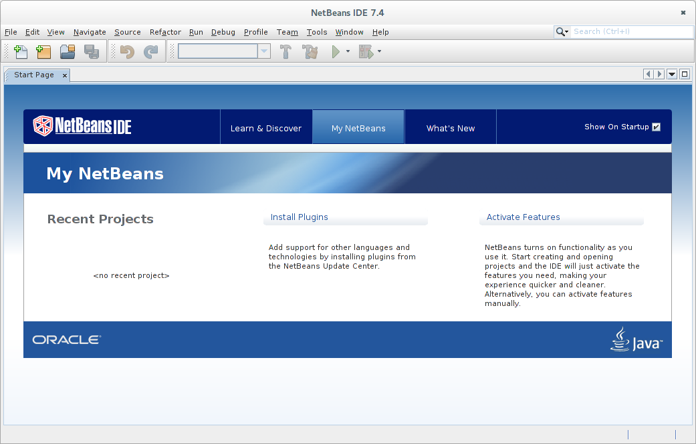 

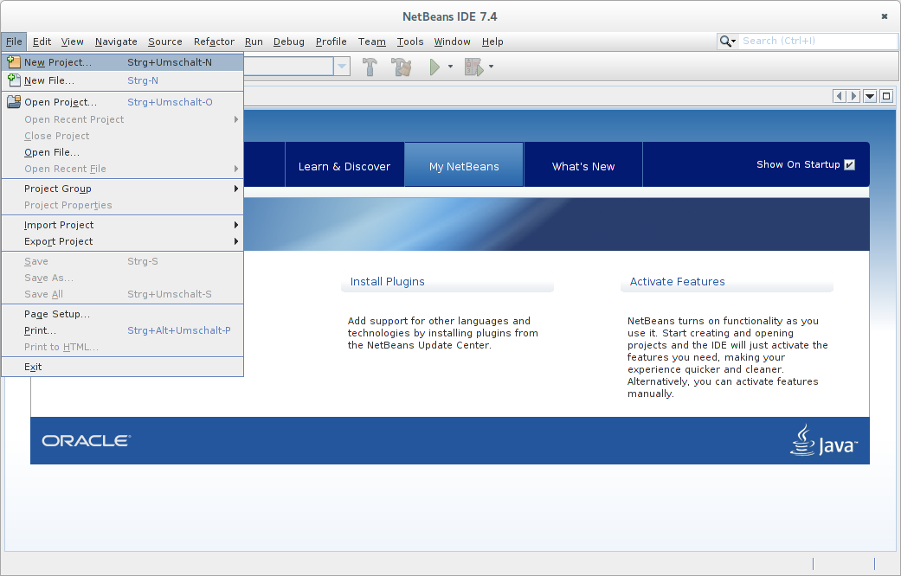
 

1. Choose Project
-----------------
image::images/netbeans7/ror03_New_Project.png[Categories &middot; Projects (Next)]
 

2. Name and Location
--------------------
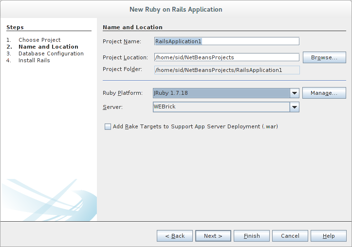 

3. Database Configuration
-------------------------
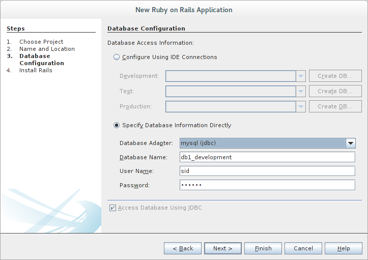

  
4. Install Rails
----------------
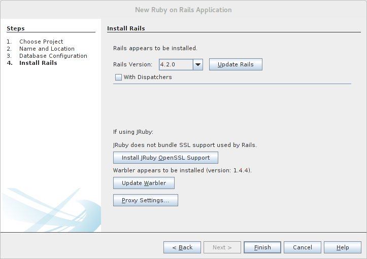 

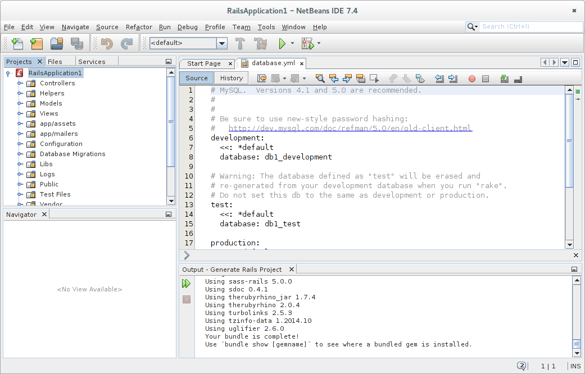

[NOTE]
====
Die Datei `config/database.yml` ist nicht vollständig erstellt worden. +
Es fehlt der `default`-Block:

.Datei: `config/database.yml
[source,yaml]
----
default: &default
  adapter: mysql
  username: sid
  password: g3h3im
  host: localhost

development:
  <<: *default
  database: db1_development

test:
  <<: *default
  database: db1_test

production:
  <<: *default
  database: db1_production
----
====

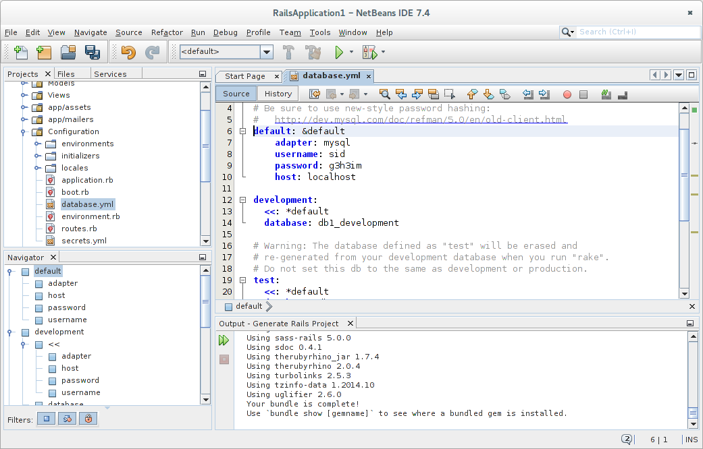

Create Database
---------------
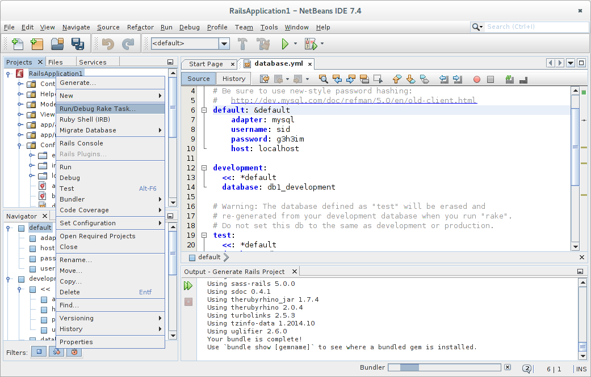

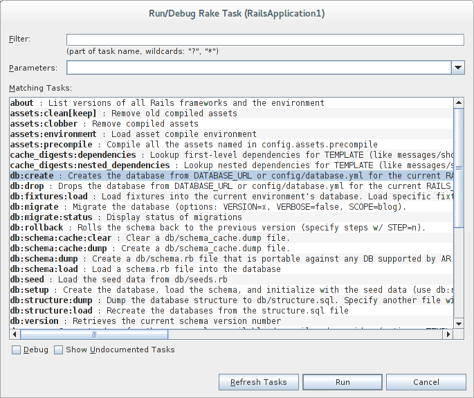

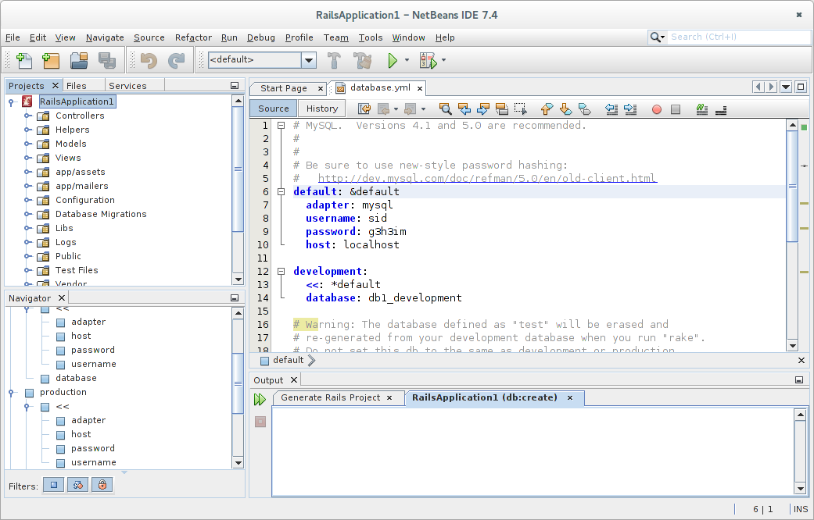

Run Project
-----------
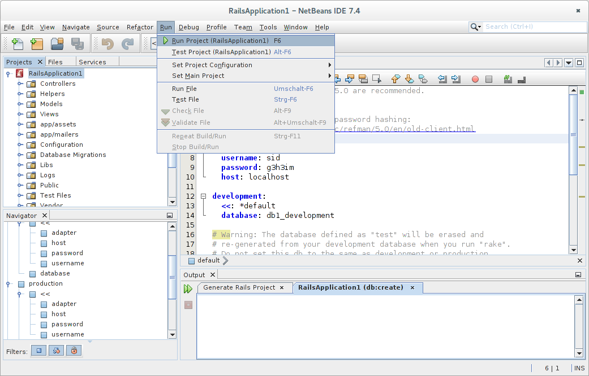

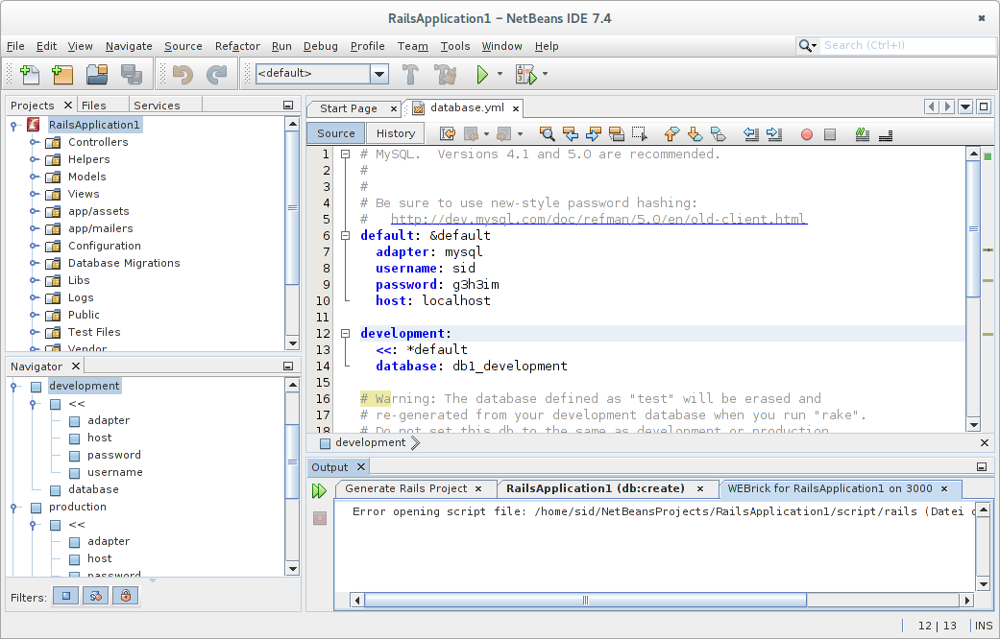

[NOTE]
====
Die Erweiterung für die _NetBeans IDE 7.4_ sind noch nicht für  
_Rails&nbsp;4_ angepasst: +
Das Verzeichnis +script+ wird nicht mehr für den _rails_-Aufruf verwendet. 
====

.Kein Problem. Dann wird die Anwendung auf der Kommando-Zeile gestartet:
---- 
$ cd ~/NetBeansProjects/RailsApplication1
----

----
$ rails s
=> Booting WEBrick
=> Rails 4.2.0 application starting in development on http://localhost:3000
=> Run `rails server -h` for more startup options
=> Ctrl-C to shutdown server
[2014-12-23 20:00:09] INFO  WEBrick 1.3.1
[2014-12-23 20:00:09] INFO  ruby 1.9.3 (2014-12-22) [java]
[2014-12-23 20:00:09] INFO  WEBrick::HTTPServer#start: pid=9329 port=3000
...
----

Aufruf der Webanwendung im Browser
----------------------------------
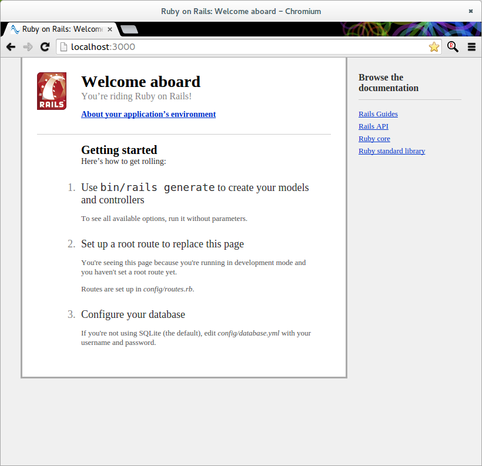

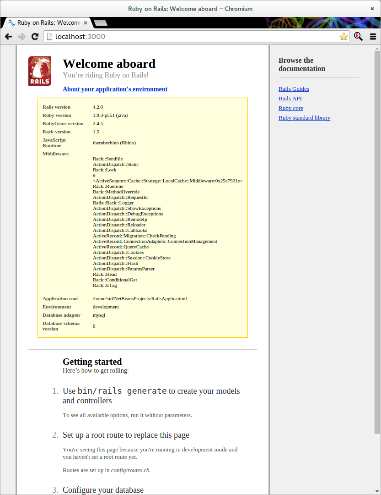

'''
 
+++
<a href="#top" title="zum Seitenanfang">
  &#8679; 
</a>
+++
[small]#&middot; Document generated with Asciidoctor {asciidoctor-version}.#

