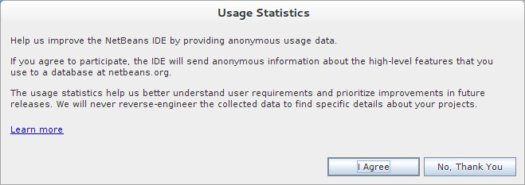
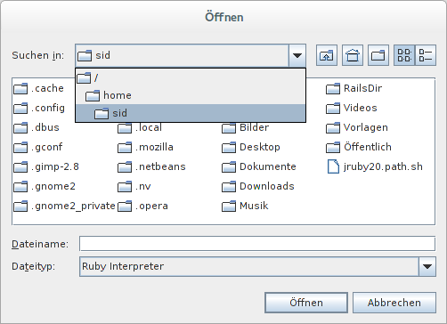

IiU -- NetBeans IDE 8.0 
=======================
Installation in Ubuntu — khkoether[at]kahweb[dot]de

:icons:
:Author Initials: KHK
:creativecommons-url: http://creativecommons.org/licenses/by/4.0/deed.de
:mit-url:             http://opensource.org/licenses/mit-license.php  
:ubuntu-url:          http://www.ubuntu.com/
:asciidoctor-url:     http://asciidoctor.org/
:asciidoctordocs-url: http://asciidoctor.org/docs/
:git-url:             http://git-scm.com/
:git-download-url:    https://www.kernel.org/pub/software/scm/git/

:java-url:            http://www.oracle.com/technetwork/java/javase/downloads/index.html
:jruby-url:           http://jruby.org/
:jruby-download-url:  http://jruby.org/download

:jdk-url:             link:jdk.html
:jruby-version:       1.7.20.1
:jruby_1st-url:       link:jruby_1st.html

:netbeans8-url:        link:netbeans8.html
:netbeans8_1st-url:    link:netbeans8_1st.html

:netbeans-ide-url:                       http://netbeans.org/
:netbeans-ide-download-url:              http://netbeans.org/downloads/
:netbeans-ide-plugin-url:                http://plugins.netbeans.org/PluginPortal/
:netbeans-ide-plugin-ruby-and-rails-url: http://plugins.netbeans.org/plugin/38549/ruby-and-rails

Version 3.3.0, Juni 2015

Abstract
--------
Dieser Artikel ist eine Schritt-für-Schritt Anleitung zur Installation 
der {netbeans-ide-url}[NetBeans IDE 8.0] unter GNU/Linux.
 
Die {netbeans-ide-url}[NetBeans IDE 8.0] bietet eine Unterstützung für verschiedene 
Programmiersprachen und -techniken. 
Wobei die Java-basierten Lösungen ausgezeichnet unterstützt werden. 

Der Artikel ist in {asciidoctordocs-url}[AsciiDoc] geschrieben 
und mit _Asciidoctor {asciidoctor-version}_ erstellt worden.

[CAUTION]
====
Zu beachten ist, dass so ein Dokument zum Einen nie abschliessend 
sein kann, und zum Anderen bestimmte Konfigurationen anders, oder 
auf einem anderem Weg durchgeführt werden können. 
Gerne nehme ich Verbesserungsvorschläge entgegen.

Es gilt wie immer: Verwendung der Anleitung auf eigene Gefahr.
====

Vorraussetzungen
----------------
Die Installation wird für {ubuntu-url}[Ubuntu 14.04 LTS (Trusty Tahr)] 
beschrieben. +
Gleichwohl sind die einzelnen Schritte auch für 
andere Debian-basierte GNU/Linux Distributionen übertragbar.

[TIP]
====
Ubuntu 14.04 LTS (Trusty Tahr) enthält das Paket _netbeans_7.0.1+dfsg1-5ubuntu2_.
====

Download
--------
* {netbeans-ide-download-url}[NetBeans 8.0] +    
  `netbeans-8.0.2-linux.sh` (ca. 198 MB) (IDE-Sprache: Englisch) (All) +
  2014-11-27 (Release date)
* {netbeans-ide-plugin-ruby-and-rails-url}[NetBeans: Plugin Ruby on Rails] + 
  `1398345010_updates.zip` (ca. 40 MB) +
  2014-04-24 (Release date)
  

Anmerkungen I
~~~~~~~~~~~~~
* Die Installation des _OpenJDK 7_ (_Oracle JDK 7_) wurde vom 
  Benutzer 'root' für das System durchgeführt &rarr; {jdk-url}[JDK]. 
* Die Installation von _JRuby_ und _Ruby on Rails_ wurde vom
  Benutzer 'sid' durchgeführt &rarr; {jruby-url}[JRuby].  
* Die Installation der _NetBeans IDE 8.0_ wird ebenfalls mit dem 
  Benutzer 'sid' durchgeführt. 
* Ich verwende das _OpenJDK 7_!

[options="nowrap"]  
----
$ java -version
java version "1.7.0_79"
OpenJDK Runtime Environment (IcedTea 2.5.5) (7u79-2.5.5-0ubuntu0.14.04.2)
OpenJDK 64-Bit Server VM (build 24.79-b02, mixed mode)

$ jruby -v
jruby 1.7.20.1 (1.9.3p551) 2015-06-10 d7c8c27 on OpenJDK 64-Bit Server VM 1.7.0_79-b14 +jit [linux-amd64]
---- 

Anmerkungen II
~~~~~~~~~~~~~~
Die _NetBeans IDE 8.0_ wird nach der Installation um das Plugin 
 _Ruby on Rails_ erweitert.
----
$ ls -l 
-rw-rw-r-- 1 sid sid     40949000 Mai 22 19:20 1398345010_archive.zip    <1>
-rw-rw-r-- 1 sid sid    207093760 Mai 22 15:24 netbeans-8.0.2-linux.sh
----
<1> NetBeans IDE Plugin: _Ruby on Rails_  

----
$ unzip 1398345010_archive.zip
[...]

$ mv archive 1398345010_archive
----

----
$ ls -l
drwxrwsr-x 3 sid sid         4096 Apr 24  2014 1398345010_archive
-rw-rw-r-- 1 sid sid     40949000 Mai 22 19:20 1398345010_archive.zip
-rw-rw-r-- 1 sid sid    207093760 Mai 22 15:24 netbeans-8.0.2-linux.sh  
----

----
$ tree 1398345010_archive
1398345010_archive
└── build
    └── updates        <1>
        ├── licenses
        │   └── CF174EE3.license
        ├── org-jruby-distro.nbm
        ├── org-jruby-jruby.jar
        ├── org-kxml2.nbm
        ├── org-netbeans-libs-jrubyparser.nbm
        ├── org-netbeans-libs-yydebug.nbm
        ├── org-netbeans-modules-jellytools-ruby.nbm
        ├── org-netbeans-modules-ruby-codecoverage.nbm
        ├── org-netbeans-modules-ruby-debugger.nbm
        ├── org-netbeans-modules-ruby-extrahints.nbm
        ├── org-netbeans-modules-ruby-help.nbm
        ├── org-netbeans-modules-ruby-hints.nbm
        ├── org-netbeans-modules-ruby-javaint.nbm
        ├── org-netbeans-modules-ruby-kit.nbm
        ├── org-netbeans-modules-ruby.nbm
        ├── org-netbeans-modules-ruby-platform.nbm
        ├── org-netbeans-modules-ruby-project.nbm
        ├── org-netbeans-modules-ruby-railsprojects.nbm
        ├── org-netbeans-modules-ruby-rakeproject.nbm
        ├── org-netbeans-modules-ruby-refactoring.nbm
        ├── org-netbeans-modules-ruby-rhtml.nbm
        ├── org-netbeans-modules-ruby-samples-depot.nbm
        ├── org-netbeans-modules-spellchecker-bindings-ruby.nbm
        ├── org-rubyforge-debugcommons.nbm
        └── updates.xml

3 directories, 25 files
----
<1> Für das installieren des Plugins _Ruby on Rails_ wird
    genau dieses Verzeichnis angegeben!

[CAUTION]
====
Am 27.01.2011 wurde der offizielle Support für Ruby on Rails aus  
der in der Entwicklung befindlichen NetBeans IDE 7.0 gestrichen. +

http://wiki.netbeans.org/RubySupport[NetBeans-Wiki: RubySupport] 

http://www.heise.de/developer/meldung/NetBeans-7-Rails-Unterstuetzung-faellt-raus-1179098.html[heise Developer: NetBeans 7: Rails-Unterstützung fällt raus]

Knapp drei Wochen später wurde die Übernahme des Supports durch die 
Community von Thomas Enebro (und Freunden und Kollegen) angekündigt. 

http://it-republik.de/jaxenter/news/Rettung-naht-Ruby-auf-NetBeans-geht-weiter-058404.html[it republik: Rettung naht: Ruby auf NetBeans geht weiter]

http://java.dzone.com/news/ruby-netbeans-lives[DZone: Ruby On NetBeans Lives!]
====

Installation
------------
Zusätzliche (große) Software-Pakete  
sollten im Verzeichnis `/opt` &nbsp; (Optional) installiert werden. 

NetBeans IDE 8.0: Graphical Installer
~~~~~~~~~~~~~~~~~~~~~~~~~~~~~~~~~~~~~
.Installations-Verzeichnisse anlegen (für den Benutzer _sid_)
----
$ sudo mkdir -p /opt/NetBeans/sid && chown sid.sid /opt/NetBeans/sid   <1>

$ sudo mkdir -p /opt/Tomcat/sid   && chown sid.sid /opt/Tomcat/sid     <2>
----
<1> Das 'Anlegen' der Verzeichnisse in `/opt` muß der Benutzer 'root' durchführen.
<2> Falls das Software-Paket _Tomcat_ ebenfalls installiert werden soll.

OpenJDK
^^^^^^^
----
$ cd /opt/NetBeans/sid

$ sh netbeans-8.0.2-linux.sh   <1>
Konfiguriere Installation...
Suche verfügbare JVM auf dem System...
Extrahiere Installationsdaten...
Starte Installationassistent...
----
<1> Verwendet wird das von _Ubuntu 14.04 LTS_ bereitgestellte _OpenJDK 7_ +
    _openjdk-7-jdk (7u79-2.5.5-0ubuntu0.14.04.2) [universe]_

Oracle JDK
^^^^^^^^^^
----
$ cd /opt/NetBeans/sid

$ sh netbeans-8.0.2-linux.sh --javahome /opt/Java/current/   <1>
Konfiguriere Installation...
Suche verfügbare JVM auf dem System...
Extrahiere Installationsdaten...
Starte Installationassistent...
----
<1> Verwendet wird das zusätzlich installierte _Oracle JDK 7_ +
    `jdk-7u79-linux-x64.tar.gz`

NetBeans IDE 8.0: Installation
~~~~~~~~~~~~~~~~~~~~~~~~~~~~~~
Installationsschritte (in Textform)

.*Customize* (Anpassen)
- Basis IDE/ Base IDE
- Java SE
- HTML5
- Funktionen bei Bedarf + 
  Features on Demand
- Apache Tomcat 8.0.15                  (Optional)
Installationsgröße: 357,6MB

.Lizenzvereinbarung/ License Agreement
- Ich akzeptiere die Bedingungen des Lizenzabkommens +
  I accept the terms in the license agreement

.JUnit-Lizenzvereinbarung/ JUnit License Agreement
- Ich akzeptiere die Bedingungen des Lizenzvereinbarung JUnit installieren +
  I accept the terms in the license agreement. Install JUnit

.NetBeans-IDE 8.0 Installation
- `/opt/NetBeans/sid/netbeans-8.0.2`
- `/usr/lib/jvm/java-7-openjdk-amd64`   <- _OpenJDK_ +
  `/opt/Java/current`                   <- _Oracle JDK_

.Apache Tomcat 8.0.15 Installation
- `/opt/Tomcat/sid/apache-tomcat-8.0.15`   (Optional)

.Zusammenfassung
- NetBeans-Installationsverzeichnis/ NetBeans IDE Installation Folder: +
  `/opt/NetBeans/sid/netbeans-8.0.2`
- Apache Tomcat 8.0.15 Installationsverzeichnis/ Apache Tomcat 7.0.34 Installation Folder: +
  `/opt/Tomcat/sid/apache-tomcat-8.0.15`
- JUnit wird beim ersten Start der NetBeans IDE heruntergeladen und installiert. +
  JUnit library will be downloaded and installed during installation of NetBeans IDE.
- Check for Updates  
- Installationsgröße (gesamt)/ Total Installation Size: +
  357,6MB

.Einrichtung vollständig/ Setup Complete
Zum Ende der Installation werden Sie gebeten 'Anonyme Nutzungsdaten' freizugeben.

NetBeans IDE 8.0: ~/.nbi
~~~~~~~~~~~~~~~~~~~~~~~~
Das _NetBeans Installer_-Verzeichnis enthält Informationen zur durchgeführten Installation. 

.`~/.nbi` 
----
$ ls -l ~/.nbi
drwxrwxr-x 2 sid sid  4096 Dez  7 21:12 downloads
drwxrwxr-x 2 sid sid  4096 Dez  7 21:12 log
drwxrwxr-x 8 sid sid  4096 Dez  7 21:19 product-cache
-rw-rw-r-- 1 sid sid 39320 Dez  7 22:02 registry.xml
drwxrwxr-x 2 sid sid  4096 Dez  7 22:02 tmp
drwxrwxr-x 2 sid sid  4096 Dez  7 21:12 wd
----

Start und Konfiguration
-----------------------

NetBeans IDE 8.0
~~~~~~~~~~~~~~~~
*Step 1:* _netbeans_ ausführen ...
----
$ /opt/NetBeans/sid/netbeans-8.0.2/bin/netbeans
----

NetBeans IDE 8.0: Plugins
~~~~~~~~~~~~~~~~~~~~~~~~~
*Step 2:* NB IDE -> Tools -> Plugins

&nbsp; +
*Step 3:* Plugins 'Updates' -> 'Update' 

&nbsp; +
*Step 4:* NB IDE → Tools → Plugins -> 'Downloaded' -> Add Plugins...

&nbsp; +
*Step 5:* Add Plugins 'updates' -> 'Alle Dateien' markieren -> &Ouml;ffnen

[NOTE]
====
* Das Verzeichnis &nbsp; `updates` &nbsp; befindet sich 
  sich in dem entpackten Archiv &nbsp; `1398345010_archive.zip`.
* Um _alle_ Dateien markieren zu können muß im Dialog 'Dateityp: Alle Dateien' 
  ausgewählt sein!
====     

&nbsp; +
*Step 6:* Plugins 'Downloaded (23)' -> Install +

&nbsp;

image::images/netbeans8/nb07_NetBeans_IDE_Installer.png[NetBeans IDE 8.0: NetBeans IDE Installer (Next)]

image::images/netbeans8/nb10_Validation_Warning.png[NetBeans IDE 8.0: Validation Warning (Continue)]

image::images/netbeans8/nb11_NetBeans_IDE_Installer.png[NetBeans IDE 8.0: NetBeans IDE Installer (Finish)]

NetBeans IDE 8.0: Neustart
~~~~~~~~~~~~~~~~~~~~~~~~~~
*Step 7:* 'My NetBeans' 

Falls Sie während der Installation dem Punkt _Statistics_ nicht zugestimmt haben
werden Sie jetzt erneut (ein letztes Mal) gebeten zuzustimmen: _Ihre Entscheidung_!

image::images/netbeans8/nb13_NetBeans_8.0.png[NetBeans IDE 8.0: My NetBeans]

NetBeans IDE 8.0: Ruby Platforms
~~~~~~~~~~~~~~~~~~~~~~~~~~~~~~~~
*Step 8:* NB IDE -> Tools -> Ruby Platforms

&nbsp; +
*Step 9:* 'Ruby Platform Manager'

.Platforms
* Der Eintrag 'Built-in JRuby 1.7.3' ist Teil der Installation
  des Plugins 'Ruby on Rails'.
* Der Eintrag 'Ruby 1.8.7-p484' ist die in _Ubuntu 14.04_
  standardmäßig installierte C-Ruby-Version. + 

[NOTE]
====
Die +PATH+-Variable wird während der Installation ausgewertet und 
vorhandene Ruby-Installationen automatisch in der 
_NetBeans IDE 8.0_ eingetragen.

Im +PATH+ war zum Zeitpunkt der Installation kein Verweis auf die 
von mir zusätzlich installierte Versionen von _JRuby 1.7.20_, 
und der C-Version _Ruby 2.2.2_!
==== 

&nbsp; +
*Step 10:* 'Ruby Platform Manager' -> Add Platform -> *JRuby 1.7.20* 

image::images/netbeans8/nb18_Ruby_Platform_Manager.png[NetBeans IDE 8.0: Ruby Platform Manager]

NetBeans IDE 8.0: JRuby 1.7.20 Gems
~~~~~~~~~~~~~~~~~~~~~~~~~~~~~~~~~~~
*Step 11:* 'Ruby Platform Manager' -> Gem Manager

NetBeans IDE 8.0: ~/.netbeans
~~~~~~~~~~~~~~~~~~~~~~~~~~~~~
Das _NetBeans_-Verzeichnis enthält Informationen zur aktuellen Konfiguration. 

.~/.netbeans
----
$ ls -la ~/.netbeans/
drwxrwxr-x  3 sid sid 4096 Mai 23 11:20 .
drwxr-xr-x 28 sid sid 4096 Mai 23 14:15 ..
drwxrwxr-x 10 sid sid 4096 Mai 23 14:17 8.0.2
-rw-rw-r--  1 sid sid   36 Mai 23 11:20 .superId
----

----
$ ls -la ../.netbeans/8.0.2/ 
drwxrwxr-x 10 sid sid 4096 Mai 23 14:17 .
drwxrwxr-x  3 sid sid 4096 Mai 23 11:20 ..
-rw-rw-r--  1 sid sid 1048 Mai 23 14:11 build.properties
drwxrwxr-x  7 sid sid 4096 Mai 23 13:55 config
drwxrwxr-x  7 sid sid 4096 Mai 23 13:55 jruby
-rw-rw-r--  1 sid sid    0 Mai 23 13:55 .lastModified
drwxrwxr-x  2 sid sid 4096 Mai 23 11:20 .metadata
drwxrwxr-x  4 sid sid 4096 Mai 23 13:55 modules
-rw-rw-r--  1 sid sid 1406 Mai 23 13:55 platform_info.rb
-rw-rw-r--  1 sid sid 3220 Mai 23 13:55 plugin.rb
-rw-rw-r--  1 sid sid  524 Mai 23 13:55 rake
drwxrwxr-x  3 sid sid 4096 Mai 23 13:55 ruby
drwxrwxr-x  3 sid sid 4096 Mai 23 13:55 rubystubs
-rw-rw-r--  1 sid sid  220 Mai 23 13:55 sync-stdio.rb
drwxrwxr-x  2 sid sid 4096 Mai 23 13:55 update_tracking
drwxrwxr-x  3 sid sid 4096 Mai 23 11:20 var
-rw-rw-r--  1 sid sid   41 Mai 23 13:55 VERSION.txt
----

NetBeans IDE: Erste Schritte &hellip;
-------------------------------------
{netbeans8_1st-url}[NetBeans IDE 8.0: Erste Schritte &hellip;]

'''
 
+++
<a href="#top" title="zum Seitenanfang">
  &#8679; 
</a>
+++
[small]#&middot; Document generated with Asciidoctor {asciidoctor-version}.#

