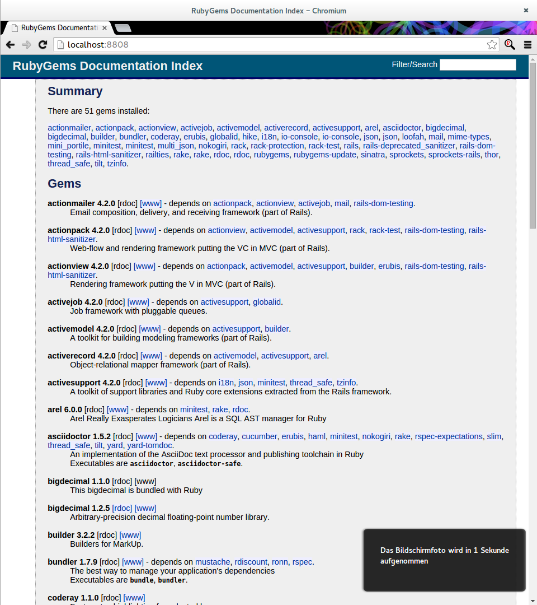

IiU -- Ruby 1.9.3, rails-4.2.0.rc1
==================================
Installation in Ubuntu — khkoether[at]kahweb[dot]de

:icons:
:Author Initials: khk
:creativecommons-url: http://creativecommons.org/licenses/by/4.0/deed.de
:mit-url:             http://opensource.org/licenses/mit-license.php  
:ubuntu-url:          http://www.ubuntu.com/
:asciidoctor-url:     http://asciidoctor.org/
:asciidoctordocs-url: http://asciidoctor.org/docs/
:git-url:             http://git-scm.com/
:git-download-url:    https://www.kernel.org/pub/software/scm/git/

:ruby-url:            https://www.ruby-lang.org/de/
:ruby-download-url:   https://www.ruby-lang.org/de/downloads/
:rubyonrails-url:     http://www.rubyonrails.org

:ruby-version:        1.9.3-p551
:ruby21_1st-url:      link:ruby21_1st.html

Version 3.0.2, Dezember 2014

Abstract
--------
Dieser Artikel ist eine Schritt-für-Schritt Anleitung zur Installation 
von {ruby-url}[Ruby 1.9.3] aus dem QuellCode.
 
Die Programmiersprache {ruby-url}[Ruby] ist die Grundlage für das 
Framework {rubyonrails-url}[Ruby on Rails].

Der Artikel ist in {asciidoctordocs-url}[AsciiDoc] geschrieben 
und mit _Asciidoctor {asciidoctor-version}_ erstellt worden.

[CAUTION]
====
Zu beachten ist, dass so ein Dokument zum Einen nie abschliessend 
sein kann, und zum Anderen bestimmte Konfigurationen anders, oder 
auf einem anderem Weg durchgeführt werden können. 
Gerne nehme ich Verbesserungsvorschläge entgegen.

Es gilt wie immer: Verwendung der Anleitung auf eigene Gefahr.
====

Vorraussetzung
--------------
Die Installation wird für {ubuntu-url}[Ubuntu 14.04 LTS (Trusty Tahr)] 
beschrieben. +
Gleichwohl sind die einzelnen Schritte auch für 
andere Debian-basierte GNU/Linux Distributionen übertragbar.

[TIP]
====
Ubuntu 14.04 LTS (Trusty Tahr) enthält das Paket _ruby_1.9.3.4_all.deb_ +
(entspricht: Ruby 1.9.3p484 -- 2013-11-22). 
====

Download
--------
* {ruby-download-url}[Ruby 1.9.3] +    
  `ruby-1.9.3-p551.tar.gz`  (ca. 12M) +
  2014-11-13 (Release date)

[CAUTION]
====
https://www.ruby-lang.org/de/news/2014/01/10/ruby-1-9-3-will-end-on-2015/[Unterstützung für Ruby 1.9.3 endet am 23. Februar 2015]

Es wird nachdrücklich empfohlen, so schnell wie möglich auf Ruby 2.1 oder 2.0 zu aktualisieren.
====

[NOTE] 
====
Das Kompilieren der Programmiersprache Ruby wird vom Benutzer 'sid' durchgeführt. +
Die eigentliche Installation von Ruby und Ruby on Rails wird vom 
Benutzer 'root' für das System durchgeführt.
----
$ ls -l 
-rw-rw-r-- 1 sid sid 12605119 Nov 22 15:00 ruby-1.9.3-p551.tar.gz
----
====

[NOTE] 
====
Vor der eigentlichen Installation müssen die fehlenden 
Programm-Pakete installiert sind.
----
$ sudo apt-get install ...
               build-essential libc6-dev  g++  make  dpkg-dev  
               libssl-dev libmysqlclient-dev libsqlite3-dev    
               libreadline-dev libyaml-dev zlib1g-dev
               libltdl-dev libtool
----
====

Installation: Ruby {ruby-version}
---------------------------------
Zusätzliche Software-Pakete  
sollten im Verzeichnis `/opt` (Optional) installiert werden. 

[IMPORTANT]
====
Ohne die Angabe eines Verzeichnisses wird `/usr/local/...` automatisch verwendet. +
Eine bereits vorhandene Ruby-Installation wird überschrieben.   

Beispiel für die Änderung des Installations-Verzeichnisses: +
#./configure --prefix=/opt/wo_auch_immer#
====

*Step 1:* Auspacken des Source-Code
----
$ tar xvzf ruby-1.9.3-p551.tar.gz
$ cd ruby-1.9.3-p551
----

*Step 2:* Ziel-Verzeichnis anlegen, Konfiguration erstellen und kompilieren
----
$ sudo mkdir -p /opt/Ruby/ruby-1.9.3-p551
----

----
$ ./configure --prefix=/opt/Ruby/ruby-1.9.3-p551 | tee ../log.ruby_configure
checking build system type... x86_64-unknown-linux-gnu
checking host system type... x86_64-unknown-linux-gnu
checking target system type... x86_64-unknown-linux-gnu
checking for gcc... gcc
...
.ext/include/x86_64-linux/ruby/config.h updated
ruby library version = 1.9.1   <1>
configure: creating ./config.status
config.status: creating Makefile
config.status: creating ruby-1.9.pc
----
<1> Kein Fehler.

----
$ make all | tee ../log.ruby_make-all
        CC = gcc
        LD = ld
        LDSHARED = gcc -shared
        CFLAGS = -O3 -ggdb 
                 -Wall -Wextra -Wno-unused-parameter -Wno-parentheses -Wno-long-long 
                 -Wno-missing-field-initializers -Wpointer-arith -Wwrite-strings 
                 -Wdeclaration-after-statement -Wimplicit-function-declaration 
        XCFLAGS = -include ruby/config.h -include ruby/missing.h -fvisibility=hidden -DRUBY_EXPORT
        CPPFLAGS =   -I. -I.ext/include/x86_64-linux -I./include -I.
        DLDFLAGS =  
        SOLIBS = 
compiling main.c
compiling dmydln.c
compiling dmyencoding.c
compiling version.c
compiling dmyversion.c
compiling miniprelude.c
compiling array.c
compiling bignum.c
bignum.c: In function ‘big_rshift’:
bignum.c:3532:20: warning: variable ‘save_x’ set but not used [-Wunused-but-set-variable]
     volatile VALUE save_x;     <1>
                    ^
...
Generating RDoc documentation   <2> 
lib/irb/inspector.rb:36:36: Couldn't find INSPECTORS. Assuming it's a module
lib/mkmf.rb:1130:29: Couldn't find STRING_OR_FAILED_FORMAT. Assuming it's a module
Enclosing class/module 'mDigest' for class MD5 not known
Enclosing class/module 'mDigest' for class RMD160 not known
Enclosing class/module 'mDigest' for class SHA1 not known
Enclosing class/module "cASN1ObjectId" for alias short_name sn not known
Enclosing class/module "cASN1ObjectId" for alias long_name ln not known

Generating RI format into /yggdrasil/TrustyTahr/Ruby19/ruby-1.9.3-p551/.ext/rdoc...

Files:        773

Classes:     1374 ( 708 undocumented)
Modules:      305 ( 151 undocumented)
Constants:   2256 ( 826 undocumented)
Attributes:  1020 ( 440 undocumented)
Methods:    10481 (3102 undocumented)

Total:      15436 (5227 undocumented)
 66.14% documented

Elapsed: 113.9s
----
<1> Beim Kompilieren des Sourcecode werden Warnungen angezeigt.
<2> Beim Erzeugen der _Ruby Documentation (RDoc)_ kommt es zu Fehlern!

----
$ make test | tee ../log.ruby_make-test
sample/test.rb:assignment ......................viele...   <1>
sample/test.rb:condition ..
sample/test.rb:if/unless ...
sample/test.rb:case .....
...
test_thread.rb ..................................................
PASS all 951 tests
./miniruby -I./lib -I. -I.ext/common  ./tool/runruby.rb --extout=.ext  -- 
                       --disable-gems "./bootstraptest/runner.rb" 
                       --ruby="ruby"  ./KNOWNBUGS.rb
2014-12-03 14:53:15 +0100
Driver is ruby 1.9.3p551 (2014-11-13 revision 48407) [x86_64-linux]
Target is ruby 1.9.3p551 (2014-11-13 revision 48407) [x86_64-linux]

KNOWNBUGS.rb           <2>
No tests, no problem
----
<1> Jeder ausgegebene _._ (Punkt) ist ein ausgeführter Test.
<2> Wortwörtlich: Das sind _known_bugs_ ;-) -- aktuell, keiner.

[NOTE]
====
Auf die folgenden Teile des Ruby-Interpreters verzichte ich in meiner
Installation. Sollten Sie sie benötigen, müssen die entsprechenden
Entwickler-Bibliotheken (`libNAME-dev`) zusätzlich installiert werden. 
 
Führen Sie anschließend die obigen Befehle (#make ...#) erneut aus.
----
$ grep Failed ../log.ruby_make-all
Failed to configure -test-/win32/dln. It will not be installed.
Failed to configure -test-/win32/fd_setsize. It will not be installed.
Failed to configure curses. It will not be installed.
Failed to configure dbm. It will not be installed.
Failed to configure dl/win32. It will not be installed.
Failed to configure fiddle. It will not be installed.
Failed to configure gdbm. It will not be installed.
Failed to configure tk. It will not be installed.
Failed to configure tk/tkutil. It will not be installed.
Failed to configure win32ole. It will not be installed.
----
====

*Step 3:* Installation (als Benutzer 'root') + 
(Dokumentation wird mitinstalliert: install-doc entfällt)
----
$ sudo make install | tee ../log.ruby_make-install
...
Generating RDoc documentation

No newer files.

Files:      0

Classes:    0 (0 undocumented)
Modules:    0 (0 undocumented)
Constants:  0 (0 undocumented)
Attributes: 0 (0 undocumented)
Methods:    0 (0 undocumented)

Total:      0 (0 undocumented)
  0.00% documented

Elapsed: 0.0s
./miniruby -I./lib -I. -I.ext/common  ./tool/rbinstall.rb 
           --make="make" --dest-dir="" --extout=".ext" --mflags="" --make-flags="" 
           --data-mode=0644 --prog-mode=0755 --installed-list .installed.list 
           --mantype="doc" --install=all --rdoc-output=".ext/rdoc"
installing binary commands:   /opt/Ruby/ruby-1.9.3-p551/bin
installing base libraries:    /opt/Ruby/ruby-1.9.3-p551/lib
installing arch files:        /opt/Ruby/ruby-1.9.3-p551/lib/ruby/1.9.1/x86_64-linux
installing pkgconfig data:    /opt/Ruby/ruby-1.9.3-p551/lib/pkgconfig
installing extension objects: /opt/Ruby/ruby-1.9.3-p551/lib/ruby/1.9.1/x86_64-linux
installing extension objects: /opt/Ruby/ruby-1.9.3-p551/lib/ruby/site_ruby/1.9.1/x86_64-linux
installing extension objects: /opt/Ruby/ruby-1.9.3-p551/lib/ruby/vendor_ruby/1.9.1/x86_64-linux
installing extension headers: /opt/Ruby/ruby-1.9.3-p551/include/ruby-1.9.1/x86_64-linux
installing extension scripts: /opt/Ruby/ruby-1.9.3-p551/lib/ruby/1.9.1
installing extension scripts: /opt/Ruby/ruby-1.9.3-p551/lib/ruby/site_ruby/1.9.1
installing extension scripts: /opt/Ruby/ruby-1.9.3-p551/lib/ruby/vendor_ruby/1.9.1
installing extension headers: /opt/Ruby/ruby-1.9.3-p551/include/ruby-1.9.1/ruby
installing rdoc:              /opt/Ruby/ruby-1.9.3-p551/share/ri/1.9.1/system
installing capi-docs:         /opt/Ruby/ruby-1.9.3-p551/share/doc/ruby
installing command scripts:   /opt/Ruby/ruby-1.9.3-p551/bin
installing library scripts:   /opt/Ruby/ruby-1.9.3-p551/lib/ruby/1.9.1
installing common headers:    /opt/Ruby/ruby-1.9.3-p551/include/ruby-1.9.1
installing manpages:          /opt/Ruby/ruby-1.9.3-p551/share/man/man1
installing default gems:      /opt/Ruby/ruby-1.9.3-p551/lib/ruby/gems/1.9.1 (cache, doc, gems, specifications)
                              rake 0.9.2.2
                              rdoc 3.9.5
                              minitest 2.5.1
                              json 1.5.5
                              io-console 0.3
                              bigdecimal 1.1.0
----

*Step 4:* Installation verifizieren
----
$ cd /opt/Ruby/ruby-1.9.3-p551
$ ls -l
drwxr-xr-x 2 root root 4096 Dez  3 14:54 bin
drwxr-xr-x 3 root root 4096 Dez  3 14:54 include
drwxr-xr-x 4 root root 4096 Dez  3 14:54 lib
drwxr-xr-x 5 root root 4096 Dez  3 14:54 share
----

----
$ ls -l bin
-rwxr-xr-x 1 root root     4414 Dez  3 14:54 erb
-rwxr-xr-x 1 root root      563 Dez  3 14:54 gem
-rwxr-xr-x 1 root root      335 Dez  3 14:54 irb
-rwxr-xr-x 1 root root     1248 Dez  3 14:54 rake
-rwxr-xr-x 1 root root      805 Dez  3 14:54 rdoc
-rwxr-xr-x 1 root root      205 Dez  3 14:54 ri
-rwxr-xr-x 1 root root 10610012 Dez  3 14:50 ruby
-rwxr-xr-x 1 root root      315 Dez  3 14:54 testrb
----

*Step 5:* Der Pfad zum Verzeichnis `/opt/Ruby/ruby-1.9.3/bin` muß gesetzt werden. 
----
$ cd /opt/Ruby/
$ sudo ln -s ruby-1.9.3-p551 current19

$ ls -l
lrwxrwxrwx 1 root root   15 Dez  3 14:56 current19 -> ruby-1.9.3-p551
lrwxrwxrwx 1 root root   15 Mär  2 12:36 current20 -> ruby-2.0.0-p451
drwxr-xr-x 6 root root 4096 Dez  3 14:55 ruby-1.9.3-p551
-rw-r--r-- 1 root root   47 Dez  3 12:38 ruby19.path.sh
drwxr-xr-x 6 root root 4096 Mär  2 12:30 ruby-2.0.0-p451
-rw-r--r-- 1 root root   47 Mär  2 12:38 ruby20.path.sh
----

.Lokal in der aktuellen Shell (1)
Erstellen Sie eine Datei `ruby19.path.sh`.  
----
$ sudo vim ruby19.path.sh
PATH=/opt/Ruby/current19/bin:$PATH
export PATH
----

[NOTE] 
=========================================================
Achtung: Ausführen der Datei mit dem Punkt-Operator!
----
$ . ruby19.path.sh   <1>
---- 
<1> Oder mit dem Bash-Builtin Kommando: #source ruby19.path.sh#
=========================================================

.Systemweit in der Datei `/etc/environment` (2)
----
$ sudo vim /etc/environment
PATH="/opt/Ruby/current19/bin:/usr/local/sbin:/usr/local/bin:/usr/sbin:/usr/bin:/sbin:/bin"
----

*Step 6:* Check

.Die Ruby-Version ...
----
$ which ruby
/opt/Ruby/current19/bin/ruby   <1>

$ sudo which ruby              <2>
/opt/Ruby/current19/bin/ruby

$ ruby -v                      <3>
ruby 1.9.3p551 (2014-11-13 revision 48407) [x86_64-linux]
----
<1> Das Kommando 'which' wertet den gesetzten +PATH+ für den Benutzer 'sid' aus +
<2> Das Kommando 'which' wertet den gesetzten +PATH+ für den Benuzter 'root' aus
<3> Ausgabe der Version des installierten Ruby

.Vollständigkeit ...
----
$ ruby -ropenssl -rzlib -rreadline -e "puts 'Happy new Ruby'"
Happy new Ruby
----

.Ruby 1.9: #irb#
----
$ irb
irb(main):001:0> RUBY_VERSION
=> "1.9.3"
irb(main):002:0> RUBY_PATCHLEVEL
=> 551
irb(main):003:0> Time.now.to_s
=> "2014-12-03 15:00:06 +0100"
irb(main):004:0> Time.now.sunday?
=> false
irb(main):005:0> Time.now.wednesday?
=> true
irb(main):006:0> exit
----

.ri - Ruby Interactive (Test der installierten Dokumentation)
----
$ ri Array#each
----

----
= Array#each

(from ruby core)
 -----------------------------------------------------------------------------
  ary.each {|item| block }   -> ary
  ary.each                   -> an_enumerator
   

 -----------------------------------------------------------------------------

Calls block once for each element in self, passing that element as a
parameter.

If no block is given, an enumerator is returned instead.

  a = [ "a", "b", "c" ]
  a.each {|x| print x, " -- " }

produces:

  a -- b -- c --
----

RubyGems
--------
_RubyGems_ (oder kurz Gems) ist das offizielle Paketsystem für die 
Programmiersprache Ruby. Mit ihm hat der Anwender die Möglichkeit, 
mehrere (zum Beispiel ältere oder jüngere) Versionen eines Programmes, 
Programmteiles oder einer Bibliothek gesteuert nach Bedarf einzurichten, 
zu verwalten oder auch wieder zu entfernen. +
&rarr; http://de.wikipedia.org/wiki/RubyGems[Wikipedia: RubyGems]

[NOTE]
====
Die Aktualisierung der Ruby1.9-Installation wird mit dem 
Benutzer 'root' durchgeführt.
====

*Step 0:* Vorraussetzung für die nächsten Befehle ist ein 
funktionierender +PATH+-Eintrag für alle Benutzer (einschliesslich 'root') 
auf die Ruby1.9-Installation:
----
$ which gem
/opt/Ruby/current19/bin/gem

$ sudo su -
# . /opt/Ruby/ruby19.path.sh
# which gem
/opt/Ruby/current19/bin/gem
----

Dann gehen auch die folgenden Befehle
----
$ gem -v
1.8.23.2

$ gem list --local

*** LOCAL GEMS ***

bigdecimal (1.1.0)
io-console (0.3)
json (1.5.5)
minitest (2.5.1)
rake (0.9.2.2)
rdoc (3.9.5)
----

update
~~~~~~
*Step 1:* Das Programm 'gem' aktualisieren ... (als Benutzer _root_)
----
$ sudo su -
# . /opt/Ruby/ruby19.path.sh
# gem update --system  
Updating rubygems-update
Fetching: rubygems-update-2.4.5.gem (100%)
Successfully installed rubygems-update-2.4.5
Installing RubyGems 2.4.5
RubyGems 2.4.5 installed
Installing ri documentation for rubygems-2.4.5

=== 2.4.5 / 2014-12-03

Bug fixes:

* Improved speed of requiring gems.  (Around 25% for a 60 gem test).  Pull
  request #1060 by unak.

...

 -----------------------------------------------------------------------------

RubyGems installed the following executables:
	/opt/Ruby/ruby-1.9.3-p551/bin/gem

Ruby Interactive (ri) documentation was installed. ri is kind of like man 
pages for ruby libraries. You may access it like this:
  ri Classname
  ri Classname.class_method
  ri Classname#instance_method
If you do not wish to install this documentation in the future, use the
--no-document flag, or set it as the default in your ~/.gemrc file. See
'gem help env' for details.

RubyGems system software updated
----

[TIP]
.gem command reference
====
*GEM UPDATE*

Usage
----
gem update REGEXP [REGEXP ...] [options]
----

_Options_: +

* -​-system [VERSION] - Update the RubyGems system software
* -​-platform PLATFORM - Specify the platform of gem to update
* -​-[no-]prerelease - Allow prerelease versions of a gem as update targets

-> http://guides.rubygems.org/command-reference/[RubyGems Guides: COMMAND REFERENCE]
====

---- 
# gem -v
2.4.5
----
 
*Step 2:* Installierte RubyGems aktualisieren
----
# gem update
Updating installed gems
Updating bigdecimal
Fetching: bigdecimal-1.2.5.gem (100%)
Building native extensions.  This could take a while...
Successfully installed bigdecimal-1.2.5
Installing ri documentation for bigdecimal-1.2.5
Installing darkfish documentation for bigdecimal-1.2.5
Updating io-console
Fetching: io-console-0.4.2.gem (100%)
Building native extensions.  This could take a while...
Successfully installed io-console-0.4.2
Installing ri documentation for io-console-0.4.2
Installing darkfish documentation for io-console-0.4.2
Updating json
Fetching: json-1.8.1.gem (100%)
Building native extensions.  This could take a while...
Successfully installed json-1.8.1
Installing ri documentation for json-1.8.1
Installing darkfish documentation for json-1.8.1
Updating minitest
Fetching: minitest-5.4.3.gem (100%)
Successfully installed minitest-5.4.3
Installing ri documentation for minitest-5.4.3
Installing darkfish documentation for minitest-5.4.3
Updating rake
Fetching: rake-10.4.2.gem (100%)
rake's executable "rake" conflicts with /opt/Ruby/ruby-1.9.3-p551/bin/rake
Overwrite the executable? [yN]  y   <1>
Successfully installed rake-10.4.2
Installing ri documentation for rake-10.4.2
Installing darkfish documentation for rake-10.4.2
Updating rdoc
Fetching: rdoc-4.1.2.gem (100%)
rdoc's executable "rdoc" conflicts with /opt/Ruby/ruby-1.9.3-p551/bin/rdoc
Overwrite the executable? [yN]  y   <1>
rdoc's executable "ri" conflicts with /opt/Ruby/ruby-1.9.3-p551/bin/ri
Overwrite the executable? [yN]  y   <1>
Depending on your version of ruby, you may need to install ruby rdoc/ri data:

<= 1.8.6 : unsupported
 = 1.8.7 : gem install rdoc-data; rdoc-data --install
 = 1.9.1 : gem install rdoc-data; rdoc-data --install
>= 1.9.2 : nothing to do! Yay!
Successfully installed rdoc-4.1.2
Installing ri documentation for rdoc-4.1.2
Installing darkfish documentation for rdoc-4.1.2
Gems updated: bigdecimal io-console json minitest rake rdoc   <2>
----
<1> Ich wähle die jeweils aktuellste Version: _y_
<2> Sechs _Gems_ aktualisiert! 

----
# gem list --local

*** LOCAL GEMS ***

bigdecimal (1.2.5, 1.1.0)
io-console (0.4.2, 0.3)
json (1.8.1, 1.5.5)
minitest (5.4.3, 2.5.1)
rake (10.4.2, 0.9.2.2)    <1>
rdoc (4.1.2, 3.9.5)
rubygems-update (2.4.5)   <2>
----
<1> Der gezeigte Versionssprung ist kein Fehler ;-) +
    &rarr; https://github.com/jimweirich/rake/blob/next-major-release/doc/release_notes/rake-10.0.0.rdoc[Rake 10.0 Released]
<2> Das RubyGem _rubygems_update_ ist mit #gem update --system# bereits installiert worden.

*Step 3:* Dokumentation zu den installierten RubyGems aktualisieren
[options="nowrap"]
----
# cd /opt/Ruby/current19   <1>  
# rdoc .
Parsing sources...
Couldn't find file to include 'README.txt' from lib/ruby/1.9.1/minitest/unit.rb 
unknown encoding name "<%= @options.charset %>" for lib/ruby/1.9.1/rdoc/generator/template/darkfish/classpage.rhtml, skipping
Couldn't find file to include 'README.txt' from lib/ruby/gems/1.9.1/gems/minitest-5.4.3/lib/minitest.rb
100% [21046/21046]  share/ri/1.9.1/system/fatal/cdesc-fatal.ri          
                
Generating Darkfish format into /opt/Ruby/ruby-1.9.3-p551/doc...   <2>

  Files:      21046

  Classes:     1303 ( 663 undocumented)
  Modules:      262 ( 135 undocumented)
  Constants:   1049 ( 716 undocumented)
  Attributes:  1198 ( 442 undocumented)
  Methods:     8557 (3388 undocumented)

  Total:      12369 (5344 undocumented)
   56.80% documented

  Elapsed: 1789.2s   <2>
----
<1> Entspricht: `/opt/Ruby/ruby-1.9.3-p551`
<2> _Generating Darkfish_ dauert lange...

----
# ls -l
drwxr-xr-x  2 root root  4096 Dez  3 15:09 bin
drwxr-xr-x 83 root root 16384 Dez  3 15:41 doc       <1>
drwxr-xr-x  3 root root  4096 Dez  3 14:54 include
drwxr-xr-x  4 root root  4096 Dez  3 14:54 lib
drwxr-xr-x  5 root root  4096 Dez  3 14:54 share
----
<1> Das Dokumentations-Verzeichnis enthält die Datei `index.html`. +
    Das neue Verzeichnis belegt ca. 187M Speicherplatz.

----
Browser> file:///opt/Ruby/current19/doc/index.html
----

rails-4.2.0.rc1
~~~~~~~~~~~~~~~
Die Installation wird mit dem Benutzer 'root' durchgeführt.

*Step 0* 
----
# gem search ^rails$ --remote

*** REMOTE GEMS ***

rails (4.1.8)   <1>
----
<1> Aktuell neueste Version des RubyGem _rails_. +
    Ich installiere aber die oben genannte Version *4.2.0.rc1*!

[TIP]
====
Die Installation der Dokumentation kann ausgelassen werden.
----
# gem install rails --pre --no-rdoc --no-ri   <1> <2>
---- 
<1> #--pre#  installiert die letzte nicht-offizielle Version: _rails-4.2.0.rc1_ 
<2> #--no-rdoc --no-ri# In der Regel wird die offizielle Dokumentation genutzt: +
    -> http://guides.rubyonrails.org/ 
====

Mit #gem install ...# werden auch alle Abhängigkeiten zu anderen RubyGems aufgelöst. 
---- 
# gem install rails --pre --no-rdoc --no-ri
Fetching: thread_safe-0.3.4.gem (100%)
Successfully installed thread_safe-0.3.4
...
Fetching: rails-4.2.0.rc1.gem (100%)
Successfully installed rails-4.2.0.rc1
33 gems installed   <1>
----
<1> Mit dem RubyGem _rails-4.2.0.rc1_ wurden insgesamt 33 Gems installiert. +
    Hinweis: Weitere RubyGems müssen für das Framework *Ruby on Rails* installiert werden. 

[NOTE]
====
Alternativ kann das RubyGem _rails_ mit der Angabe einer Version installiert werden.
----
# gem install rails --version 4.1.8

# gem install rails --version '~> 4.1.8'   <1>
----
<1> Twiddle Wakka: '~> 4.1.8' bedeutet, das die höchste Gem-Version von Rails +
    im Bereich von >= 4.1.8 und < 4.2 installiert wird. 
====

asciidoctor
~~~~~~~~~~~ 
----
# gem install asciidoctor       <1> <2>
Fetching: asciidoctor-1.5.2.gem (100%)
Successfully installed asciidoctor-1.5.2
Parsing documentation for asciidoctor-1.5.2
Installing ri documentation for asciidoctor-1.5.2
Done installing documentation for asciidoctor after 5 seconds
1 gem installed

# gem install coderay         <2> <3>   
Fetching: coderay-1.1.0.gem (100%)
Successfully installed coderay-1.1.0
invalid options: -SNw2
(invalid options are ignored)
Parsing documentation for coderay-1.1.0
Installing ri documentation for coderay-1.1.0
Done installing documentation for coderay after 3 seconds
1 gem installed
----
<1> *Asciidoctor* is an open source Ruby processor for converting _AsciiDoc_ markup +
    into HTML 5, DocBook 4.5 and other formats.
<2> Dokumentation wurde ebenfalls erstellt.
<3> *CodeRay* is a fast and easy syntax highlighting for selected languages, written in Ruby. +
    Comes with RedCloth integration and LOC counter.

sinatra
~~~~~~~ 
----
# gem install sinatra --no-rdoc --no-ri   <1>
Fetching: rack-1.5.2.gem (100%)
Successfully installed rack-1.5.2
Fetching: rack-protection-1.5.3.gem (100%)
Successfully installed rack-protection-1.5.3
Fetching: sinatra-1.4.5.gem (100%)
Successfully installed sinatra-1.4.5
3 gems installed
----
<1> *Sinatra* ist eine _freie_ und _open source Webapplikationsbibliothek_ und + 
    eine in Ruby geschriebene _domänenspezifische_ Sprache. +
    *Sinatra* setzt das Rack Webserver-Interface voraus. +
    &rarr; http://de.wikipedia.org/wiki/Sinatra_%28Software%29[Wikipedia: Sinatra (Software)]

    
list
~~~~
----
$ gem list --local 

*** LOCAL GEMS ***

actionmailer (4.2.0.rc1)
actionpack (4.2.0.rc1)
actionview (4.2.0.rc1)
activejob (4.2.0.rc1)
activemodel (4.2.0.rc1)
activerecord (4.2.0.rc1)
activesupport (4.2.0.rc1)
arel (6.0.0)
asciidoctor (1.5.2)
bigdecimal (1.2.5, 1.1.0)
builder (3.2.2)
bundler (1.7.7)
coderay (1.1.0)
erubis (2.7.0)
globalid (0.3.0)
hike (1.2.3)
i18n (0.7.0.beta1)
io-console (0.4.2, 0.3)
json (1.8.1, 1.5.5)
loofah (2.0.1)
mail (2.6.3)
mime-types (2.4.3)
mini_portile (0.6.1)
minitest (5.4.3, 2.5.1)
multi_json (1.10.1)
nokogiri (1.6.5)
rack (1.6.0.beta2, 1.5.2)
rack-protection (1.5.3)
rack-test (0.6.2)
rails (4.2.0.rc1)
rails-deprecated_sanitizer (1.0.3)
rails-dom-testing (1.0.5)
rails-html-sanitizer (1.0.1)
railties (4.2.0.rc1)
rake (10.4.2, 0.9.2.2)
rdoc (4.1.2, 3.9.5)
rubygems-update (2.4.5)
sinatra (1.4.5)
sprockets (2.12.3)
sprockets-rails (2.2.2)
thor (0.19.1)
thread_safe (0.3.4)
tilt (1.4.1)
tzinfo (1.2.2)
----

----
$ cd /opt/Ruby/current19
$ ls -lrt bin
-rwxr-xr-x 1 root root 10610012 Dez  3 14:50 ruby
-rwxr-xr-x 1 root root      335 Dez  3 14:54 irb
-rwxr-xr-x 1 root root     4414 Dez  3 14:54 erb
-rwxr-xr-x 1 root root      315 Dez  3 14:54 testrb
-rwxr-xr-x 1 root root      563 Dez  3 14:54 gem
-rwxr-xr-x 1 root root      511 Dez  3 15:05 update_rubygems
-rwxr-xr-x 1 root root      502 Dez  3 15:09 rake
-rwxr-xr-x 1 root root      502 Dez  3 15:09 rdoc
-rwxr-xr-x 1 root root      500 Dez  3 15:09 ri
-rwxr-xr-x 1 root root      518 Dez  3 15:57 nokogiri   <1>
-rwxr-xr-x 1 root root      510 Dez  3 15:57 erubis
-rwxr-xr-x 1 root root      502 Dez  3 15:58 tilt
-rwxr-xr-x 1 root root      522 Dez  3 15:58 sprockets
-rwxr-xr-x 1 root root      514 Dez  3 15:58 bundler
-rwxr-xr-x 1 root root      513 Dez  3 15:58 bundle
-rwxr-xr-x 1 root root      502 Dez  3 15:58 thor
-rwxr-xr-x 1 root root      515 Dez  3 15:58 rails   <1>
-rwxr-xr-x 1 root root      504 Dez  3 16:20 rackup
-rwxr-xr-x 1 root root      535 Dez  3 16:21 asciidoctor-safe
-rwxr-xr-x 1 root root      530 Dez  3 16:21 asciidoctor
-rwxr-xr-x 1 root root      514 Dez  3 16:21 coderay
----
<1> Die Kommandos #nokigiri, ..., rails# wurden durch +
    #gem install rails --pre# installiert.

[NOTE]
====
Das Erstellen der Dokumentation müßte/könnte wiederholt werden... 
aber mit Rails (33 Gems) zusätzlich - ist sie für viele Partitionen (mit ca. 12GB)
 - halt zu groß ;-)
====

RubyGems Documentation Index
----------------------------
Auf die installierte Dokumentation zugreifen.
----
# gem server
Server started at http://0.0.0.0:8808
----

----
Browser> http://localhost:8808/
         RubyGems Documentation Index   
----

Ruby on Rails 4.2: Erste Schritte &hellip;
------------------------------------------
{ruby21_1st-url}[Ruby on Rails 4.2: Erste Schritte &hellip;]

Anhang
------
Script zum Installieren von Ruby {ruby-version} (ohne weitere Erläuterung).

.Datei: +ruby19-install.sh+
----
#!/bin/bash
#
ME=make_ruby_1.9.3
NAME=ruby-1.9.3-p551
TARGET=/opt/Ruby/${NAME}

if [ ! -e $TARGET ] 
then
  echo "Ziel-Verzeichnis '$TARGET' existiert nicht."
  echo "Abbruch."
  exit 1
fi
echo "Ziel-Verzeichnis:"
ls -l $TARGET

echo "Ruby 1.9.3-Installation fortsetzen (j/n)"
read dummy
case $dummy in
  j|J|y|Y) echo "Installation wird fortgesetzt."
           ;;
  *) echo "Installation wird abgebrochen."
     exit 1
     ;;
esac

echo 
echo "Source auspacken ..."
tar xvzf ${NAME}.tar.gz
cd ${NAME}

echo 
echo "Source übersetzen ..."
./configure --prefix=$TARGET --enable-shared | tee ../log.ruby_configure
make all  | tee ../log.ruby_make-all 
make test | tee ../log.ruby_make-test

echo
echo "Ruby 1.9.3 installieren"
sudo make install | tee ../log.ruby_make-install

echo
ls -l $TARGET

echo 
echo "$ME: Ende."
----

'''
 
+++
<a href="#top" title="zum Seitenanfang">
  &#8679; 
</a>
+++
[small]#&middot; Document generated with Asciidoctor {asciidoctor-version}.#

