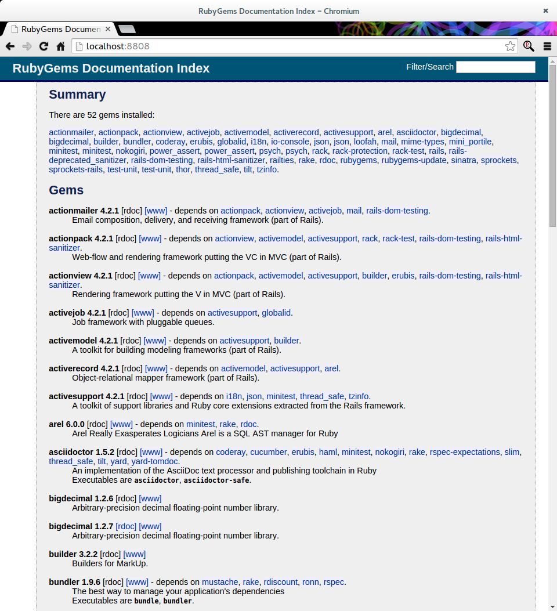

IiU -- Ruby 2.2.2, rails-4.2.1
==============================
Installation in Ubuntu — khkoether[at]kahweb[dot]de

:icons:
:Author Initials: khk
:creativecommons-url: http://creativecommons.org/licenses/by/4.0/deed.de
:mit-url:             http://opensource.org/licenses/mit-license.php  
:ubuntu-url:          http://www.ubuntu.com/
:asciidoctor-url:     http://asciidoctor.org/
:asciidoctordocs-url: http://asciidoctor.org/docs/
:git-url:             http://git-scm.com/
:git-download-url:    https://www.kernel.org/pub/software/scm/git/

:ruby-url:            https://www.ruby-lang.org/de/
:ruby-download-url:   https://www.ruby-lang.org/de/downloads/
:rubyonrails-url:     http://www.rubyonrails.org

:ruby-version:        2.2.2
:ruby22_1st-url:      link:ruby22_1st.html

Version 3.2.0, Mai 2015

Abstract
--------
Dieser Artikel ist eine Schritt-für-Schritt Anleitung zur Installation 
von {ruby-url}[Ruby 2.2.2] aus dem QuellCode.
 
Die Programmiersprache {ruby-url}[Ruby] ist die Grundlage für das 
Framework {rubyonrails-url}[Ruby on Rails].

Der Artikel ist in {asciidoctordocs-url}[AsciiDoc] geschrieben 
und mit _Asciidoctor {asciidoctor-version}_ erstellt worden.

[CAUTION]
====
Zu beachten ist, dass so ein Dokument zum Einen nie abschliessend 
sein kann, und zum Anderen bestimmte Konfigurationen anders, oder 
auf einem anderem Weg durchgeführt werden können. 
Gerne nehme ich Verbesserungsvorschläge entgegen.

Es gilt wie immer: Verwendung der Anleitung auf eigene Gefahr.
====

Vorraussetzung
--------------
Die Installation wird für {ubuntu-url}[Ubuntu 14.04 LTS (Trusty Tahr)] 
beschrieben. +
Gleichwohl sind die einzelnen Schritte auch für 
andere Debian-basierte GNU/Linux Distributionen übertragbar.

[TIP]
====
Ubuntu 14.04 LTS (Trusty Tahr) enthält kein Paket zu _Ruby 2.2_!
====

Download
--------
* {ruby-download-url}[Ruby 2.2.2] +    
  `ruby-{ruby-version}.tar.gz`  (ca. 16M) +
  2015-04-13 (Release date)

[NOTE] 
====
Das Kompilieren der Programmiersprache Ruby wird vom Benutzer 'sid' durchgeführt. +
Die eigentliche Installation von Ruby und Ruby on Rails wird vom 
Benutzer 'root' für das System durchgeführt.
----
$ ls -lh 
-rw-rw-r-- 1 sid sid   16M Mai  6 14:55 ruby-2.2.2.tar.gz
----
====

[NOTE] 
====
Vor der eigentlichen Installation müssen die fehlenden 
Programm-Pakete installiert sind.
----
$ sudo apt-get install ...
               build-essential libc6-dev  g++  make  dpkg-dev  
               libssl-dev libmysqlclient-dev libsqlite3-dev    
               libreadline-dev libyaml-dev zlib1g-dev
               libltdl-dev libtool
----
====

Installation: Ruby {ruby-version}
---------------------------------
Zusätzliche Software-Pakete  
sollten im Verzeichnis `/opt` &nbsp; (Optional) installiert werden. 

[IMPORTANT]
====
Ohne die Angabe eines Verzeichnisses wird `/usr/local/...` &nbsp; automatisch verwendet. +
Eine bereits vorhandene Ruby-Installation wird überschrieben.   

Beispiel für die Änderung des Installations-Verzeichnisses: +
#./configure --prefix=/opt/wo_auch_immer#
====

*Step 1:* Auspacken des Source-Code
----
$ tar xvzf ruby-2.2.2.tar.gz
$ cd ruby-2.2.2
----

*Step 2:* Ziel-Verzeichnis anlegen, Konfiguration erstellen und kompilieren
----
$ sudo mkdir -p /opt/Ruby/ruby-2.2.2
----

----
$ ./configure --prefix=/opt/Ruby/ruby-2.2.2 | tee ../log.ruby_configure
checking build system type... x86_64-unknown-linux-gnu
checking host system type... x86_64-unknown-linux-gnu
checking target system type... x86_64-unknown-linux-gnu
checking for gcc... gcc
...
.ext/include/x86_64-linux/ruby/config.h updated
ruby library version = 2.2.0          <1>
configure: creating ./config.status
config.status: creating GNUmakefile
config.status: creating Makefile
config.status: creating ruby-2.2.pc
----
<1> Endlich stimmig.

[options="nowrap"]
----
$ make all | tee ../log.ruby_make-all
	CC = gcc
	LD = ld
	LDSHARED = gcc -shared
	CFLAGS = -O3 -fno-fast-math -ggdb3 
	         -Wall -Wextra -Wno-unused-parameter -Wno-parentheses -Wno-long-long 
	         -Wno-missing-field-initializers -Wunused-variable -Wpointer-arith 
	         -Wwrite-strings -Wdeclaration-after-statement -Wimplicit-function-declaration 
	         -ansi -std=iso9899:199409 
	XCFLAGS = -D_FORTIFY_SOURCE=2 -fstack-protector -fno-strict-overflow -fvisibility=hidden 
	          -DRUBY_EXPORT -fPIE
	CPPFLAGS =   -I. -I.ext/include/x86_64-linux -I./include -I.
	DLDFLAGS = -fstack-protector -pie  
	SOLIBS = 
Using built-in specs.
COLLECT_GCC=gcc
COLLECT_LTO_WRAPPER=/usr/lib/gcc/x86_64-linux-gnu/4.8/lto-wrapper
Target: x86_64-linux-gnu
Configured with: ...	
[...]
src/closures.c:488:17: warning: ignoring return value of 'ftruncate', declared with attribute warn_unused_result [-Wunused-result]   <1>
       ftruncate (execfd, offset);
                 ^
src/closures.c:500:17: warning: ignoring return value of 'ftruncate', declared with attribute warn_unused_result [-Wunused-result]
       ftruncate (execfd, offset);
                 ^
[...]
Generating RDoc documentation   
Parsing sources...
  0% [ 1/967]  /yggdrasil/TrustyTahr/Ruby22/ruby-2.2.2/doc/ChangeLog-1.8.0
  0% [ 2/967]  /yggdrasil/TrustyTahr/Ruby22/ruby-2.2.2/doc/ChangeLog-1.9.3
  0% [ 3/967]  /yggdrasil/TrustyTahr/Ruby22/ruby-2.2.2/doc/ChangeLog-2.0.0
  0% [ 4/967]  /yggdrasil/TrustyTahr/Ruby22/ruby-2.2.2/doc/ChangeLog-2.1.0
  0% [ 5/967]  /yggdrasil/TrustyTahr/Ruby22/ruby-2.2.2/doc/ChangeLog-YARV
[...]
 99% [965/967]  vm_method.c
 99% [966/967]  vm_trace.c
100% [967/967]  vsnprintf.c

Generating RI format into /yggdrasil/TrustyTahr/Ruby22/ruby-2.2.2/.ext/rdoc...

  Files:        967

  Classes:     1410 ( 581 undocumented)
  Modules:      280 ( 108 undocumented)
  Constants:   2159 ( 594 undocumented)
  Attributes:  1154 ( 253 undocumented)
  Methods:    10483 (2184 undocumented)

  Total:      15486 (3720 undocumented)
   75.98% documented

  Elapsed: 137.6s
----
<1> Beim Kompilieren des Sourcecode werden Warnungen angezeigt.

----
$ make test | tee ../log.ruby_make-test
	CC = gcc
	LD = ld
	LDSHARED = gcc -shared
  CFLAGS = ...
[...]  
Generating RDoc documentation

No newer files.

  Files:      0

  Classes:    0 (0 undocumented)
  Modules:    0 (0 undocumented)
  Constants:  0 (0 undocumented)
  Attributes: 0 (0 undocumented)
  Methods:    0 (0 undocumented)

  Total:      0 (0 undocumented)
    0.00% documented

  Elapsed: 0.0s

sample/test.rb:assignment ...................[...viele...]...OK 372   <1>
sample/test.rb:condition ..OK 2
sample/test.rb:if/unless ...OK 3
sample/test.rb:case .....OK 5
[...]
sample/test.rb:gc ....OK 4

test succeeded
PASS all 1008 tests
./miniruby -I./lib -I. -I.ext/common  ./tool/runruby.rb --extout=.ext  
                       -- --disable-gems "./bootstraptest/runner.rb" 
                          --ruby="ruby --disable-gems"   ./KNOWNBUGS.rb
2015-05-06 15:17:09 +0200
Driver is ruby 2.2.2p95 (2015-04-13 revision 50295) [x86_64-linux]
Target is ruby 2.2.2p95 (2015-04-13 revision 50295) [x86_64-linux]

KNOWNBUGS.rb  PASS 0
No tests, no problem   <2>
----
<1> Jeder ausgegebene _._ (Punkt) ist ein ausgeführter Test.
<2> Wortwörtlich: Das sind _known_bugs_ ;-) -- aktuell, keiner.

[NOTE]
====
Auf die folgenden Teile des Ruby-Interpreters verzichte ich in meiner
Installation. Sollten Sie sie benötigen, +
müssen die entsprechenden
Entwickler-Bibliotheken (`libNAME-dev`) zusätzlich installiert werden. 
 
Führen Sie anschließend die obigen Befehle (#make ...#) erneut aus.
----
$ grep Failed ../log.ruby_make-all
Failed to configure -test-/win32/console. It will not be installed.
Failed to configure -test-/win32/dln. It will not be installed.
Failed to configure -test-/win32/dln/empty. It will not be installed.
Failed to configure -test-/win32/fd_setsize. It will not be installed.
Failed to configure dbm. It will not be installed.
Failed to configure gdbm. It will not be installed.
Failed to configure tk. It will not be installed.
Failed to configure tk/tkutil. It will not be installed.
Failed to configure win32. It will not be installed.
Failed to configure win32ole. It will not be installed.
----
====

*Step 3:* Installation (als Benutzer 'root') + 
(Dokumentation wird mitinstalliert: install-doc entfällt)
[options="nowrap"]
----
$ sudo make install | tee ../log.ruby_make-install
...
Generating RDoc documentation

No newer files.

  Files:      0

  Classes:    0 (0 undocumented)
  Modules:    0 (0 undocumented)
  Constants:  0 (0 undocumented)
  Attributes: 0 (0 undocumented)
  Methods:    0 (0 undocumented)

  Total:      0 (0 undocumented)
    0.00% documented

  Elapsed: 0.0s

./miniruby -I./lib -I. -I.ext/common  ./tool/runruby.rb --extout=.ext  -- --disable-gems 
           -r./x86_64-linux-fake ./tool/rbinstall.rb --make="make" --dest-dir="" 
           --extout=".ext" --mflags="" --make-flags="" --data-mode=0644 
           --prog-mode=0755 --installed-list .installed.list --mantype="doc" 
           --install=all --rdoc-output=".ext/rdoc"
installing binary commands:   /opt/Ruby/ruby-2.2.2/bin
installing base libraries:    /opt/Ruby/ruby-2.2.2/lib
installing arch files:        /opt/Ruby/ruby-2.2.2/lib/ruby/2.2.0/x86_64-linux
installing pkgconfig data:    /opt/Ruby/ruby-2.2.2/lib/pkgconfig
installing command scripts:   /opt/Ruby/ruby-2.2.2/bin
installing library scripts:   /opt/Ruby/ruby-2.2.2/lib/ruby/2.2.0
installing common headers:    /opt/Ruby/ruby-2.2.2/include/ruby-2.2.0
installing manpages:          /opt/Ruby/ruby-2.2.2/share/man/man1
installing extension objects: /opt/Ruby/ruby-2.2.2/lib/ruby/2.2.0/x86_64-linux
installing extension objects: /opt/Ruby/ruby-2.2.2/lib/ruby/site_ruby/2.2.0/x86_64-linux
installing extension objects: /opt/Ruby/ruby-2.2.2/lib/ruby/vendor_ruby/2.2.0/x86_64-linux
installing extension headers: /opt/Ruby/ruby-2.2.2/include/ruby-2.2.0/x86_64-linux
installing extension scripts: /opt/Ruby/ruby-2.2.2/lib/ruby/2.2.0
installing extension scripts: /opt/Ruby/ruby-2.2.2/lib/ruby/site_ruby/2.2.0
installing extension scripts: /opt/Ruby/ruby-2.2.2/lib/ruby/vendor_ruby/2.2.0
installing extension headers: /opt/Ruby/ruby-2.2.2/include/ruby-2.2.0/ruby
installing default gems:      /opt/Ruby/ruby-2.2.2/lib/ruby/gems/2.2.0 (build_info, cache, doc, extensions, gems, specifications)
                              bigdecimal 1.2.6
                              io-console 0.4.3
                              json 1.8.1
                              psych 2.0.8
                              rake 10.4.2
                              rdoc 4.2.0
installing bundle gems:       /opt/Ruby/ruby-2.2.2/lib/ruby/gems/2.2.0 (build_info, cache, doc, extensions, gems, specifications)
                              test-unit-3.0.8.gem
                              power_assert-0.2.2.gem
                              minitest-5.4.3.gem
installing rdoc:              /opt/Ruby/ruby-2.2.2/share/ri/2.2.0/system
installing capi-docs:         /opt/Ruby/ruby-2.2.2/share/doc/ruby
----

*Step 4:* Installation verifizieren
----
$ cd /opt/Ruby/ruby-2.2.2
$ ls -l
drwxr-xr-x 2 root root 4096 Mai  6 15:21 bin
drwxr-xr-x 3 root root 4096 Mai  6 15:21 include
drwxr-xr-x 4 root root 4096 Mai  6 15:21 lib
drwxr-xr-x 5 root root 4096 Mai  6 15:21 share
----

----
$ ls -l bin
-rwxr-xr-x 1 root root     4854 Mai  6 15:21 erb
-rwxr-xr-x 1 root root      558 Mai  6 15:21 gem
-rwxr-xr-x 1 root root      202 Mai  6 15:21 irb
-rwxr-xr-x 1 root root     1256 Mai  6 15:21 rake
-rwxr-xr-x 1 root root      950 Mai  6 15:21 rdoc
-rwxr-xr-x 1 root root      200 Mai  6 15:21 ri
-rwxr-xr-x 1 root root 14313384 Mai  6 15:06 ruby
----

*Step 5:* Der Pfad zum Verzeichnis `/opt/Ruby/ruby-2.2.2/bin` muß gesetzt werden. 
----
$ cd /opt/Ruby/
$ sudo ln -s ruby-2.2.2 current22

$ ls -l
lrwxrwxrwx 1 root root   15 Dez  3 14:56 current19 -> ruby-1.9.3-p551
lrwxrwxrwx 1 root root   15 Mär  3  2014 current20 -> ruby-2.0.0-p451
lrwxrwxrwx 1 root root   10 Dez  5 10:03 current21 -> ruby-2.1.5
lrwxrwxrwx 1 root root   10 Mai  6 15:25 current22 -> ruby-2.2.2
drwxr-xr-x 7 root root 4096 Dez 22 18:22 ruby-1.9.3-p551
-rw-r--r-- 1 root root   47 Mär  3  2014 ruby19.path.sh
drwxr-xr-x 7 root root 4096 Mär  3  2014 ruby-2.0.0-p451
-rw-r--r-- 1 root root   47 Mär  3  2014 ruby20.path.sh
drwxr-xr-x 7 root root 4096 Dez 22 21:47 ruby-2.1.5
-rw-r--r-- 1 root root   47 Dez  5 10:05 ruby21.path.sh
drwxr-xr-x 6 root root 4096 Mai  6 15:21 ruby-2.2.2
----

.Lokal in der aktuellen Shell (1)
Erstellen Sie eine Datei `ruby22.path.sh`.  
----
$ sudo vim ruby22.path.sh
PATH=/opt/Ruby/current22/bin:$PATH
export PATH
----

[NOTE] 
=========================================================
Achtung: Ausführen der Datei mit dem Punkt-Operator!
----
$ . ruby22.path.sh   <1>
---- 
<1> Oder mit dem Bash-Builtin Kommando: #source ruby22.path.sh#
=========================================================

.Systemweit in der Datei +/etc/environment+ (2)
----
$ sudo vim /etc/environment
PATH="/opt/Ruby/current22/bin:/usr/local/sbin:/usr/local/bin:/usr/sbin:/usr/bin:/sbin:/bin"
----

*Step 6:* Check

.Die Ruby-Version ...
----
$ which ruby
/opt/Ruby/current22/bin/ruby   <1>

$ sudo which ruby              <2>
/opt/Ruby/current22/bin/ruby

$ ruby -v                      <3>
ruby 2.2.2p95 (2015-04-13 revision 50295) [x86_64-linux]
----
<1> Das Kommando 'which' wertet den gesetzten +PATH+ für den Benutzer 'sid' aus +
<2> Das Kommando 'which' wertet den gesetzten +PATH+ für den Benuzter 'root' aus
<3> Ausgabe der Version des installierten Ruby

.Vollständigkeit ...
----
$ ruby -ropenssl -rzlib -rreadline -e "puts 'Happy new Ruby'"
Happy new Ruby
----

.Ruby 2.2: #irb#
----
$ irb
irb(main):001:0> RUBY_VERSION
=> "2.2.2"
irb(main):002:0> RUBY_PATCHLEVEL
=> 95
irb(main):003:0> Time.now.to_s
=> "2015-05-07 15:41:45 +0200"
irb(main):004:0> Time.now.sunday?
=> false
irb(main):005:0> Time.now.thursday?
=> true
irb(main):006:0> exit
----

.ri - Ruby Interactive (Test der installierten Dokumentation)
----
$ ri Array#each
----

----
= Array#each

(from ruby core)
 -----------------------------------------------------------------------------
  ary.each {|item| block }   -> ary
  ary.each                   -> an_enumerator
   

 -----------------------------------------------------------------------------

Calls block once for each element in self, passing that element as a
parameter.

If no block is given, an enumerator is returned instead.

  a = [ "a", "b", "c" ]
  a.each {|x| print x, " -- " }

produces:

  a -- b -- c --
----

Rubygems
--------
_RubyGems_ (oder kurz Gems) ist das offizielle Paketsystem für die 
Programmiersprache Ruby. Mit ihm hat der Anwender die Möglichkeit, 
mehrere (zum Beispiel ältere oder jüngere) Versionen eines Programmes, 
Programmteiles oder einer Bibliothek gesteuert nach Bedarf einzurichten, 
zu verwalten oder auch wieder zu entfernen. +
&rarr; http://de.wikipedia.org/wiki/RubyGems[Wikipedia: RubyGems]

[NOTE]
====
Die Aktualisierung der Ruby2.2-Installation wird mit dem 
Benutzer 'root' durchgeführt.
====

*Step 1:* Vorraussetzung für die nächsten Befehle ist ein 
funktionierender +PATH+-Eintrag für alle Benutzer (einschliesslich 'root') 
auf die Ruby2.2-Installation:
----
$ which gem
/opt/Ruby/current22/bin/gem

$ sudo su -
# . /opt/Ruby/ruby22.path.sh
# which gem
/opt/Ruby/current22/bin/gem
----

Dann gehen auch die folgenden Befehle
----
$ gem -v
2.4.5

$ gem list --local

*** LOCAL GEMS ***

bigdecimal (1.2.6)
io-console (0.4.3)
json (1.8.1)
minitest (5.4.3)
power_assert (0.2.2)
psych (2.0.8)
rake (10.4.2)
rdoc (4.2.0)
test-unit (3.0.8)
----

update
~~~~~~
*Step 1:* Das Programm #gem# aktualisieren ...
----
$ sudo su -
# . /opt/Ruby/ruby22.path.sh
# gem update --system 
Updating rubygems-update
Fetching: rubygems-update-2.4.6.gem (100%)
Successfully installed rubygems-update-2.4.6
Parsing documentation for rubygems-update-2.4.6
Installing ri documentation for rubygems-update-2.4.6
Installing darkfish documentation for rubygems-update-2.4.6
Done installing documentation for rubygems-update after 2 seconds
Parsing documentation for rubygems-update-2.4.6
Done installing documentation for rubygems-update after 0 seconds
Installing RubyGems 2.4.6
RubyGems 2.4.6 installed
Parsing documentation for rubygems-2.4.6
Installing ri documentation for rubygems-2.4.6

=== 2.4.6 / 2014-02-05

Bug fixes:

* Fixed resolving gems with both upper and lower requirement boundaries.
  Issue #1141 by Jakub Jirutka.
  
...

 -----------------------------------------------------------------------------

RubyGems installed the following executables:
	/opt/Ruby/ruby-2.2.2/bin/gem

Ruby Interactive (ri) documentation was installed. ri is kind of like man 
pages for ruby libraries. You may access it like this:
  ri Classname
  ri Classname.class_method
  ri Classname#instance_method
If you do not wish to install this documentation in the future, use the
--no-document flag, or set it as the default in your ~/.gemrc file. See
'gem help env' for details.

RubyGems system software updated
----

[TIP]
.gem command reference
====
*GEM UPDATE*

Usage
----
gem update REGEXP [REGEXP ...] [options]
----

_Options_: +

* -​-system [VERSION] - Update the RubyGems system software
* -​-platform PLATFORM - Specify the platform of gem to update
* -​-[no-]prerelease - Allow prerelease versions of a gem as update targets

-> http://guides.rubygems.org/command-reference/[RubyGems Guides: COMMAND REFERENCE]
====

---- 
# gem -v
2.4.6
---- 

*Step 2:* Installierte RubyGems aktualisieren
----
# gem update
Updating installed gems
Updating bigdecimal
Fetching: bigdecimal-1.2.7.gem (100%)
Building native extensions.  This could take a while...
Successfully installed bigdecimal-1.2.7
Parsing documentation for bigdecimal-1.2.7
Installing ri documentation for bigdecimal-1.2.7
Installing darkfish documentation for bigdecimal-1.2.7
Done installing documentation for bigdecimal after 2 seconds
Parsing documentation for bigdecimal-1.2.7
Done installing documentation for bigdecimal after 1 seconds
Updating json
Fetching: json-1.8.2.gem (100%)
Building native extensions.  This could take a while...
Successfully installed json-1.8.2
Parsing documentation for json-1.8.2
Installing ri documentation for json-1.8.2
Installing darkfish documentation for json-1.8.2
(eval):19: warning: circular argument reference - max_nesting
(eval):41: warning: circular argument reference - quirks_mode
(eval):72: warning: circular argument reference - match_string
(eval):72: warning: circular argument reference - match_string
(eval):92: warning: circular argument reference - source
Done installing documentation for json after 2 seconds
Parsing documentation for json-1.8.2
Done installing documentation for json after 1 seconds
Updating minitest
Fetching: minitest-5.6.1.gem (100%)
Successfully installed minitest-5.6.1
Parsing documentation for minitest-5.6.1
Installing ri documentation for minitest-5.6.1
Installing darkfish documentation for minitest-5.6.1
Done installing documentation for minitest after 2 seconds
Parsing documentation for minitest-5.6.1
Done installing documentation for minitest after 0 seconds
Updating power_assert
Fetching: power_assert-0.2.3.gem (100%)
Successfully installed power_assert-0.2.3
Parsing documentation for power_assert-0.2.3
Installing ri documentation for power_assert-0.2.3
Installing darkfish documentation for power_assert-0.2.3
Done installing documentation for power_assert after 0 seconds
Parsing documentation for power_assert-0.2.3
Done installing documentation for power_assert after 0 seconds
Updating psych
Fetching: psych-2.0.13.gem (100%)
Building native extensions.  This could take a while...
Successfully installed psych-2.0.13
Parsing documentation for psych-2.0.13
Installing ri documentation for psych-2.0.13
Installing darkfish documentation for psych-2.0.13
Done installing documentation for psych after 2 seconds
Parsing documentation for psych-2.0.13
Done installing documentation for psych after 1 seconds
Updating test-unit
Fetching: test-unit-3.0.9.gem (100%)
Successfully installed test-unit-3.0.9
Parsing documentation for test-unit-3.0.9
Installing ri documentation for test-unit-3.0.9
Installing darkfish documentation for test-unit-3.0.9
Done installing documentation for test-unit after 4 seconds
Parsing documentation for test-unit-3.0.9
Done installing documentation for test-unit after 2 seconds
Gems updated: bigdecimal json minitest power_assert psych test-unit   <1>
----
<1> Sechs _Gems_ aktualisiert!

----
# gem list --local

*** LOCAL GEMS ***

bigdecimal (1.2.7, 1.2.6)
io-console (0.4.3)
json (1.8.2, 1.8.1)
minitest (5.6.1, 5.4.3)
power_assert (0.2.3, 0.2.2)
psych (2.0.13, 2.0.8)
rake (10.4.2)
rdoc (4.2.0)
rubygems-update (2.4.6)    <1>
test-unit (3.0.9, 3.0.8)
----
<1> Das RubyGem _rubygems_update_ ist mit #gem update --system# bereits installiert worden.

*Step 4:* Dokumentation zu den installierten RubyGems aktualisieren
----
# cd /opt/Ruby/current22   <1>  
# rdoc .
Parsing sources...
Couldn't find file to include 'README.txt' from lib/ruby/gems/2.2.0/gems/minitest-5.4.3/lib/minitest.rb               
Couldn't find file to include 'README.rdoc' from lib/ruby/gems/2.2.0/gems/minitest-5.6.1/lib/minitest.rb
100% [5682/5682]  share/man/man1/ruby.1                                                                          

Generating Darkfish format into /opt/Ruby/ruby-2.2.2/doc...
(eval):2: warning: regular expression has ']' without escape: /var>] [--output-file=<var>filename</
(eval):2: warning: character class has '-' without escape: /var>] [--output-file=<var>filename</
(eval):3: warning: regular expression has ']' without escape: /var>] [--embedded=<var>rubypath</
(eval):3: warning: character class has '-' without escape: /var>] [--embedded=<var>rubypath</
(eval):5: warning: regular expression has ']' without escape: /var>] [--log-file=<var>filename</
(eval):5: warning: character class has '-' without escape: /var>] [--log-file=<var>filename</
(eval):19: warning: circular argument reference - max_nesting
(eval):41: warning: circular argument reference - quirks_mode
(eval):72: warning: circular argument reference - match_string
(eval):72: warning: circular argument reference - match_string
(eval):92: warning: circular argument reference - source
(eval):10: warning: invalid character syntax; use ?\s

  Files:       5682

  Classes:     1566 ( 860 undocumented)
  Modules:      344 ( 187 undocumented)
  Constants:   1001 ( 621 undocumented)
  Attributes:  1253 ( 373 undocumented)
  Methods:     8767 (3411 undocumented)

  Total:      12931 (5452 undocumented)
   57.84% documented

  Elapsed: 364.6s   <2>
----
<1> Entspricht: _/opt/Ruby/ruby-2.2.2_
<2> _Generating Darkfish_ dauert lange...

----
# ls -l
drwxr-xr-x  2 root root  4096 Mai  8 15:48 bin
drwxr-xr-x 89 root root 12288 Mai  8 15:59 doc       <1>
drwxr-xr-x  3 root root  4096 Mai  6 15:21 include
drwxr-xr-x  4 root root  4096 Mai  6 15:21 lib
drwxr-xr-x  5 root root  4096 Mai  6 15:21 share
----
<1> Das Dokumentations-Verzeichnis enthält die Datei _index.html_. +
    Das neue Verzeichnis belegt ca. 122M Speicherplatz.

----
Browser> file:///opt/Ruby/current22/doc/index.html
----

Installation: rails-4.2.1
~~~~~~~~~~~~~~~~~~~~~~~~~
*Step 0* 
----
# gem search ^rails$ --remote

*** REMOTE GEMS ***

rails (4.2.1)   <1>
----
<1> Seit dem 19.03.2015 ist das die neueste Version des RubyGem _rails_. 

[TIP]
====
Die Installation der Dokumentation kann ausgelassen werden.
----
# gem install rails --no-rdoc --no-ri   <1>
---- 
<1> #- -no-rdoc - -no-ri# &nbsp; In der Regel wird die offizielle Dokumentation genutzt: +
    -> http://guides.rubyonrails.org/ 
====

Mit #gem install ...# werden auch alle Abhängigkeiten zu anderen RubyGems aufgelöst.
---- 
# gem install rails --no-rdoc --no-ri
Fetching: thread_safe-0.3.5.gem (100%)
Successfully installed thread_safe-0.3.5
...
Fetching: rails-4.2.1.gem (100%)
Successfully installed rails-4.2.1
33 gems installed   <1>
----
<1> Mit dem RubyGem _rails-4.2.1_ wurden insgesamt 33 Gems installiert. +
    Hinweis: Weitere RubyGems müssen für das Framework *Ruby on Rails* installiert werden. 

[NOTE]
====
Alternativ kann _Rails_ mit der Angabe einer Version installiert werden.
----
# gem install rails --version 4.1.10

# gem install rails --version '~> 4.1.10'   <1>
----
<1> Twiddle Wakka: '~> 4.1.10' bedeutet, das die höchste Gem-Version von Rails +
    im Bereich von >= 4.1.10 und < 4.2 installiert wird. 
====

asciidoctor
~~~~~~~~~~~ 
----
# gem install asciidoctor --no-rdoc --no-ri   <1> <2>
Fetching: asciidoctor-1.5.2.gem (100%)
Successfully installed asciidoctor-1.5.2
1 gem installed

# gem install coderay --no-rdoc --no-ri   <2> <3>   
Fetching: coderay-1.1.0.gem (100%)
Successfully installed coderay-1.1.0
1 gem installed
----
<1> *Asciidoctor* is an open source Ruby processor for converting _AsciiDoc_ markup +
    into HTML 5, DocBook 4.5 and other formats.
<2> Dokumentation wurde ebenfalls erstellt.
<3> *CodeRay* is a fast and easy syntax highlighting for selected languages, written in Ruby. +
    Comes with RedCloth integration and LOC counter.

pry
~~~~
----
$ gem install pry   <1>
Fetching: slop-3.6.0.gem (100%)
Successfully installed slop-3.6.0
Fetching: method_source-0.8.2.gem (100%)
Successfully installed method_source-0.8.2
Fetching: pry-0.10.1.gem (100%)
Successfully installed pry-0.10.1
3 gems installed
----
<1> An IRB alternative and runtime developer console.

sinatra
~~~~~~~ 
----
# gem install sinatra --no-rdoc --no-ri   <1>
Fetching: rack-protection-1.5.3.gem (100%)
Successfully installed rack-protection-1.5.3
Fetching: tilt-2.0.1.gem (100%)
Successfully installed tilt-2.0.1
Fetching: sinatra-1.4.6.gem (100%)
Successfully installed sinatra-1.4.6
3 gems installed
----
<1> *Sinatra* ist eine _freie_ und _open source Webapplikationsbibliothek_ und + 
    eine in Ruby geschriebene _domänenspezifische_ Sprache. +
    *Sinatra* setzt das Rack Webserver-Interface voraus. +
    &rarr; http://de.wikipedia.org/wiki/Sinatra_%28Software%29[Wikipedia: Sinatra (Software)]

    
list
~~~~
----
$ gem list --local
 
*** LOCAL GEMS ***

actionmailer (4.2.1)
actionpack (4.2.1)
actionview (4.2.1)
activejob (4.2.1)
activemodel (4.2.1)
activerecord (4.2.1)
activesupport (4.2.1)
arel (6.0.0)
asciidoctor (1.5.2)
bigdecimal (1.2.7, 1.2.6)
builder (3.2.2)
bundler (1.9.6)
coderay (1.1.0)
erubis (2.7.0)
globalid (0.3.5)
i18n (0.7.0)
io-console (0.4.3)
json (1.8.2, 1.8.1)
loofah (2.0.2)
mail (2.6.3)
method_source (0.8.2)
mime-types (2.5)
mini_portile (0.6.2)
minitest (5.6.1, 5.4.3)
nokogiri (1.6.6.2)
power_assert (0.2.3, 0.2.2)
pry (0.10.1)
psych (2.0.13, 2.0.8)
rack (1.6.1)
rack-protection (1.5.3)
rack-test (0.6.3)
rails (4.2.1)
rails-deprecated_sanitizer (1.0.3)
rails-dom-testing (1.0.6)
rails-html-sanitizer (1.0.2)
railties (4.2.1)
rake (10.4.2)
rdoc (4.2.0)
rubygems-update (2.4.6)
sinatra (1.4.6)
slop (3.6.0)
sprockets (3.0.3)
sprockets-rails (2.3.0)
test-unit (3.0.9, 3.0.8)
thor (0.19.1)
thread_safe (0.3.5)
tilt (2.0.1)
tzinfo (1.2.2)
----

----
$ cd /opt/Ruby/current22
$ ls -lrt bin   
-rwxr-xr-x 1 root root 14313384 Mai  6 15:06 ruby
-rwxr-xr-x 1 root root      200 Mai  6 15:21 ri
-rwxr-xr-x 1 root root      950 Mai  6 15:21 rdoc
-rwxr-xr-x 1 root root     1256 Mai  6 15:21 rake
-rwxr-xr-x 1 root root      202 Mai  6 15:21 irb
-rwxr-xr-x 1 root root      558 Mai  6 15:21 gem
-rwxr-xr-x 1 root root     4854 Mai  6 15:21 erb
-rwxr-xr-x 1 root root      541 Mai  8 15:48 update_rubygems
-rwxr-xr-x 1 root root      513 Mai  8 16:16 nokogiri          <1>
-rwxr-xr-x 1 root root      505 Mai  8 16:16 erubis            
-rwxr-xr-x 1 root root      499 Mai  8 16:16 rackup                        
-rwxr-xr-x 1 root root      517 Mai  8 16:16 sprockets         
-rwxr-xr-x 1 root root      509 Mai  8 16:16 bundler
-rwxr-xr-x 1 root root      508 Mai  8 16:16 bundle
-rwxr-xr-x 1 root root      497 Mai  8 16:16 thor
-rwxr-xr-x 1 root root      510 Mai  8 16:16 rails             <1>
-rwxr-xr-x 1 root root      530 Mai  8 16:55 asciidoctor-safe
-rwxr-xr-x 1 root root      525 Mai  8 16:55 asciidoctor
-rwxr-xr-x 1 root root      509 Mai  8 16:55 coderay
-rwxr-xr-x 1 root root      497 Mai  8 16:55 tilt
----
<1> Die Kommandos #nokogiri, ..., thor# und natürlich auch #rails# wurden durch +
    #gem install rails# installiert.

[NOTE]
====
Das Erstellen der Dokumentation müßte/könnte wiederholt werden... 
aber mit Rails (33 Gems) zusätzlich - ist sie für viele Partitionen (mit ca. 12GB)
 - halt zu groß ;-)
====

RubyGems Documentation Index
----------------------------
Auf die installierte Dokumentation zugreifen.
----
# gem server
Server started at http://0.0.0.0:8808
----

----
Browser> http://localhost:8808/
         RubyGems Documentation Index   
----

Ruby on Rails 4.2: Erste Schritte &hellip;
------------------------------------------
{ruby22_1st-url}[Ruby on Rails 4.2: Erste Schritte &hellip;]

Anhang
------
Script zum Installieren von Ruby {ruby-version} (ohne weitere Erläuterung).

.Datei: `ruby22-install.sh` 
----
#!/bin/bash
#
ME=make_ruby_2.2.2
NAME=ruby-2.2.2
TARGET=/opt/Ruby/${NAME}

if [ ! -e $TARGET ] 
then
  echo "Ziel-Verzeichnis '$TARGET' existiert nicht."
  echo "Abbruch."
  exit 1
fi
echo "Ziel-Verzeichnis:"
ls -l $TARGET

echo "Ruby 2.2.2-Installation fortsetzen (j/n)"
read dummy
case $dummy in
  j|J|y|Y) echo "Installation wird fortgesetzt."
           ;;
  *) echo "Installation wird abgebrochen."
     exit 1
     ;;
esac

echo 
echo "Source auspacken ..."
tar xvzf ${NAME}.tar.gz
cd ${NAME}

echo 
echo "Source übersetzen ..."
./configure --prefix=$TARGET --enable-shared | tee ../log.ruby_configure
make all  | tee ../log.ruby_make-all 
make test | tee ../log.ruby_make-test

echo
echo "Ruby 2.2.2 installieren"
sudo make install | tee ../log.ruby_make-install

echo
ls -l $TARGET

echo 
echo "$ME: Ende."
----

'''
 
+++
<a href="#top" title="zum Seitenanfang">
  &#8679; 
</a>
+++
[small]#&middot; Document generated with Asciidoctor {asciidoctor-version}.#

