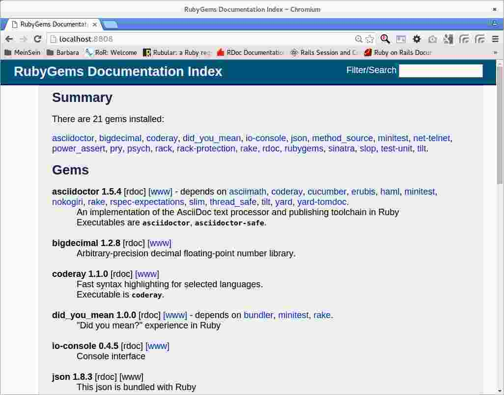

IiU -- Ruby 2.3.0
=================
Installation in Ubuntu — khkoether[at]kahweb[dot]de

:icons:
:Author Initials: khk
:creativecommons-url:   http://creativecommons.org/licenses/by/4.0/deed.de
:mit-url:               http://opensource.org/licenses/mit-license.php  
:ubuntu-url:            http://www.ubuntu.com/
:asciidoctor-url:       http://asciidoctor.org/
:asciidoctordocs-url:   http://asciidoctor.org/docs/
:git-url:               http://git-scm.com/
:git-download-url:      https://www.kernel.org/pub/software/scm/git/

:ruby-url:              https://www.ruby-lang.org/de/
:ruby-download-url:     https://www.ruby-lang.org/de/downloads/
:rubyonrails-url:       http://www.rubyonrails.org

:ruby-version:          2.3.0
:ruby_on_rails42-url:   link:ruby_on_rails42.html

Version 4.0.0, Januar 2016

Abstract
--------
Dieser Artikel ist eine Schritt-für-Schritt Anleitung zur Installation 
von {ruby-url}[Ruby 2.3.0] aus dem QuellCode.
 
Die Programmiersprache {ruby-url}[Ruby] ist die Grundlage für das 
Framework {rubyonrails-url}[Ruby on Rails].

Der Artikel ist in {asciidoctordocs-url}[Asciidoctor] geschrieben 
und mit _Asciidoctor {asciidoctor-version}_ erstellt worden.

[CAUTION]
====
Zu beachten ist, dass so ein Dokument zum Einen nie abschliessend 
sein kann, und zum Anderen bestimmte Konfigurationen anders, oder 
auf einem anderem Weg durchgeführt werden können. 
Gerne nehme ich Verbesserungsvorschläge entgegen.

Es gilt wie immer: Verwendung der Anleitung auf eigene Gefahr.
====

Vorraussetzung
--------------
Die Installation wird für {ubuntu-url}[Ubuntu 14.04 LTS (Trusty Tahr)] 
beschrieben. +
Gleichwohl sind die einzelnen Schritte auch für 
andere Debian-basierte GNU/Linux Distributionen übertragbar.

[TIP]
====
Ubuntu 14.04 LTS (Trusty Tahr) enthält kein Paket zu _Ruby 2.3_!
====

Download
--------
* {ruby-download-url}[Ruby 2.3.0] +    
  `ruby-2.3.0.tar.gz`  (ca. 17M) +
  2015-12-25 (Release date)

[NOTE] 
====
Das Kompilieren der Programmiersprache Ruby wird vom Benutzer 'sid' durchgeführt. +
Die eigentliche Installation von Ruby und Ruby on Rails wird vom 
Benutzer 'root' für das System durchgeführt.
----
$ ls -lh 
-rw-rw-r-- 1 sid sid   17M Jan  3 19:22 ruby-2.3.0.tar.gz
----
====

[NOTE] 
====
Vor der eigentlichen Installation müssen die fehlenden 
Programm-Pakete installiert sind.
----
$ sudo apt-get install ...
               build-essential libc6-dev  g++  make  dpkg-dev  
               libssl-dev libmysqlclient-dev libsqlite3-dev    
               libreadline-dev libyaml-dev zlib1g-dev
               libltdl-dev libtool
----
====

Installation: Ruby {ruby-version}
---------------------------------
Zusätzliche Software-Pakete  
sollten im Verzeichnis `/opt` &nbsp; (Optional) installiert werden. 

[IMPORTANT]
====
Ohne die Angabe eines Verzeichnisses wird `/usr/local/...` &nbsp; automatisch verwendet. +
Eine bereits vorhandene Ruby-Installation wird überschrieben.   

Beispiel für die Änderung des Installations-Verzeichnisses: +
#./configure --prefix=/opt/wo_auch_immer#
====

*Step 1:* Auspacken des Source-Code
----
$ tar xvzf ruby-2.3.0.tar.gz
$ cd ruby-2.3.0
----

*Step 2:* Ziel-Verzeichnis anlegen, Konfiguration erstellen und kompilieren
----
$ sudo mkdir -p /opt/Ruby/ruby-2.3.0
----

----
$ ./configure --prefix=/opt/Ruby/ruby-2.3.0 | tee ../log.ruby_configure
checking for ruby... /usr/bin/ruby
config.guess already exists
config.sub already exists
checking build system type... x86_64-pc-linux-gnu
checking host system type... x86_64-pc-linux-gnu
checking target system type... x86_64-pc-linux-gnu
checking for gcc... gcc
...
.ext/include/x86_64-linux/ruby/config.h updated
ruby library version = 2.3.0          <1>
configure: creating ./config.status
config.status: creating GNUmakefile
config.status: creating Makefile
config.status: creating ruby-2.3.pc
----
<1> Endlich stimmig.

[options="nowrap"]
----
$ make all | tee ../log.ruby_make-all
	CC = gcc
	LD = ld
	LDSHARED = gcc -shared
	CFLAGS = -O3 -fno-fast-math -ggdb3 -Wall -Wextra -Wno-unused-parameter -Wno-parentheses 
	                                   -Wno-long-long -Wno-missing-field-initializers 
	                                   -Wunused-variable -Wpointer-arith -Wwrite-strings 
	                                   -Wdeclaration-after-statement -Wimplicit-function-declaration 
	                                   -Wdeprecated-declarations -Wno-packed-bitfield-compat 
	                                   -std=iso9899:1999 
	XCFLAGS = -D_FORTIFY_SOURCE=2 -fstack-protector -fno-strict-overflow -fvisibility=hidden -DRUBY_EXPORT -fPIE
	CPPFLAGS =   -I. -I.ext/include/x86_64-linux -I./include -I.
	DLDFLAGS = -fstack-protector -pie  
	SOLIBS = 
Using built-in specs.
COLLECT_GCC=gcc
COLLECT_LTO_WRAPPER=/usr/lib/gcc/x86_64-linux-gnu/4.8/lto-wrapper
Target: x86_64-linux-gnu
Configured with: ../src/configure -v --with-pkgversion='Ubuntu 4.8.4-2ubuntu1~14.04' 
                                     --with-bugurl=file:///usr/share/doc/gcc-4.8/README.Bugs 
                                     --enable-languages=c,c++,java,go,d,fortran,objc,obj-c++ 
                                     --prefix=/usr --program-suffix=-4.8 
                                     --enable-shared --enable-linker-build-id 
                                     --libexecdir=/usr/lib --without-included-gettext 
                                     --enable-threads=posix --with-gxx-include-dir=/usr/include/c++/4.8 
                                     --libdir=/usr/lib --enable-nls --with-sysroot=/ 
                                     --enable-clocale=gnu --enable-libstdcxx-debug 
                                     --enable-libstdcxx-time=yes --enable-gnu-unique-object 
                                     --disable-libmudflap --enable-plugin --with-system-zlib 
                                     --disable-browser-plugin --enable-java-awt=gtk --enable-gtk-cairo 
                                     --with-java-home=/usr/lib/jvm/java-1.5.0-gcj-4.8-amd64/jre 
                                     --enable-java-home --with-jvm-root-dir=/usr/lib/jvm/java-1.5.0-gcj-4.8-amd64 
                                     --with-jvm-jar-dir=/usr/lib/jvm-exports/java-1.5.0-gcj-4.8-amd64 
                                     --with-arch-directory=amd64 --with-ecj-jar=/usr/share/java/eclipse-ecj.jar 
                                     --enable-objc-gc --enable-multiarch --disable-werror 
                                     --with-arch-32=i686 --with-abi=m64 --with-multilib-list=m32,m64,mx32 
                                     --with-tune=generic --enable-checking=release --build=x86_64-linux-gnu 
                                     --host=x86_64-linux-gnu 
                                     --target=x86_64-linux-gnu
Thread model: posix
gcc version 4.8.4 (Ubuntu 4.8.4-2ubuntu1~14.04) 
compiling main.c
...
compiling iseq.c   <1>
iseq.c: In function ‘rb_iseq_compile_with_option’:
iseq.c:636:8: warning: ‘ln’ may be used uninitialized in this function [-Wmaybe-uninitialized]
  NODE *node = (*parse)(rb_parser_new(), file, src, ln);
        ^
iseq.c:636:8: warning: ‘parse’ may be used uninitialized in this function [-Wmaybe-uninitialized]
iseq.c:638:11: warning: ‘type’ may be used uninitialized in this function [-Wmaybe-uninitialized]
      iseq = rb_iseq_new_with_opt(node, label, file, absolute_path, line,
           ^
iseq.c:638:11: warning: ‘label’ may be used uninitialized in this function [-Wmaybe-uninitialized]...
Generating RI format into /opt/TrustyTahr/Ruby23/ruby-2.3.0/.ext/rdoc...
...
check libraries....
Use ActiveTcl libraries (if available).   <1>
Search tclConfig.sh and tkConfig.sh...............................
Fail to find [tclConfig.sh, tkConfig.sh]
Use X11 libraries (or use TK_XINCLUDES/TK_XLIBSW information on tkConfig.sh).

Search tcl.h..
Search tk.h..Search Tcl library...........
Search Tcl library...........
Warning:: cannot find Tcl library. tcltklib will not be compiled (tcltklib is disabled on your Ruby. That is, Ruby/Tk will not work). Please check configure options.

Can't find proper Tcl/Tk libraries. So, can't make tcltklib.so which is required by Ruby/Tk.
If you have Tcl/Tk libraries on your environment, you may be able to use them with configure options (see ext/tk/README.tcltklib).
At present, Tcl/Tk8.6 is not supported. Although you can try to use Tcl/Tk8.6 with configure options, it will not work correctly. I recommend you to use Tcl/Tk8.5 or 8.4.
Failed to configure tk. It will not be installed.
Failed to configure tk/tkutil. It will not be installed.
...
Generating RDoc documentation
Parsing sources...
  0% [ 1/945]  /opt/TrustyTahr/Ruby23/ruby-2.3.0/doc/ChangeLog-0.06_to_0.52
  ...
100% [945/945]  vsnprintf.c

Generating RI format into /opt/TrustyTahr/Ruby23/ruby-2.3.0/.ext/rdoc...

  Files:        945

  Classes:     1401 ( 576 undocumented)
  Modules:      280 ( 110 undocumented)
  Constants:   2172 ( 604 undocumented)
  Attributes:  1144 ( 255 undocumented)
  Methods:    10511 (2230 undocumented)

  Total:      15508 (3775 undocumented)
   75.66% documented

  Elapsed: 131.3s  
----
<1> Beim Kompilieren des Sourcecode werden Warnungen angezeigt.

----
$ make test | tee ../log.ruby_make-test
	CC = gcc
	LD = ld
	LDSHARED = gcc -shared
  CFLAGS = ...
...  
Thread model: posix
gcc version 4.8.4 (Ubuntu 4.8.4-2ubuntu1~14.04)
sample/test.rb:assignment ...................[...viele...]...OK 372   <1>
sample/test.rb:condition ..OK 2
sample/test.rb:if/unless ...OK 3
...
sample/test.rb:path .......................OK 23
sample/test.rb:gc ....OK 4

test succeeded
PASS all 1010 tests             
exec ./miniruby -I./lib -I. -I.ext/common  ./tool/runruby.rb --extout=.ext  -- --disable-gems "./bootstraptest/runner.rb" --ruby="ruby --disable-gems"   ./KNOWNBUGS.rb
2016-01-06 10:18:36 +0100
Driver is ruby 2.3.0p0 (2015-12-25 revision 53290) [x86_64-linux]
Target is ruby 2.3.0p0 (2015-12-25 revision 53290) [x86_64-linux]

KNOWNBUGS.rb  PASS 0   <2>
No tests, no problem   
----
<1> Jeder ausgegebene _._ (Punkt) ist ein ausgeführter Test.
<2> Wortwörtlich: Das sind _known_bugs_ ;-) -- aktuell, keiner.

[NOTE]
====
Auf die folgenden Teile des Ruby-Interpreters verzichte ich in meiner
Installation. Sollten Sie sie benötigen, +
müssen die entsprechenden
Entwickler-Bibliotheken (`libNAME-dev`) zusätzlich installiert werden. 
 
Führen Sie anschließend die obigen Befehle (#make ...#) erneut aus.
----
$ grep Failed ../log.ruby_make-all
Failed to configure dbm. It will not be installed.
Failed to configure gdbm. It will not be installed.
Failed to configure tk. It will not be installed.
Failed to configure tk/tkutil. It will not be installed.
----
====

*Step 3:* Installation (als Benutzer 'root') + 
(Dokumentation wird mitinstalliert: install-doc entfällt)
[options="nowrap"]
----
$ sudo make install | tee ../log.ruby_make-install
[sudo] password for sid: 
	CC = gcc
	LD = ld
	LDSHARED = gcc -shared
	CFLAGS = ...
...
Generating RDoc documentation

No newer files.

  Files:      0

  Classes:    0 (0 undocumented)
  Modules:    0 (0 undocumented)
  Constants:  0 (0 undocumented)
  Attributes: 0 (0 undocumented)
  Methods:    0 (0 undocumented)

  Total:      0 (0 undocumented)
    0.00% documented

  Elapsed: 0.0s

generating x86_64-linux-fake.rb
x86_64-linux-fake.rb updated
./miniruby -I./lib -I. -I.ext/common  ./tool/runruby.rb --extout=.ext  -- 
           --disable-gems -r./x86_64-linux-fake ./tool/rbinstall.rb --make="make" 
           --dest-dir="" --extout=".ext" --mflags="" --make-flags="" --data-mode=0644 
           --prog-mode=0755 --installed-list .installed.list --mantype="doc" 
           --install=all --rdoc-output=".ext/rdoc"
installing binary commands:   /opt/Ruby/ruby-2.3.0/bin
installing base libraries:    /opt/Ruby/ruby-2.3.0/lib
installing arch files:        /opt/Ruby/ruby-2.3.0/lib/ruby/2.3.0/x86_64-linux
installing pkgconfig data:    /opt/Ruby/ruby-2.3.0/lib/pkgconfig
installing command scripts:   /opt/Ruby/ruby-2.3.0/bin
installing library scripts:   /opt/Ruby/ruby-2.3.0/lib/ruby/2.3.0
installing common headers:    /opt/Ruby/ruby-2.3.0/include/ruby-2.3.0
installing manpages:          /opt/Ruby/ruby-2.3.0/share/man/man1
installing extension objects: /opt/Ruby/ruby-2.3.0/lib/ruby/2.3.0/x86_64-linux
installing extension objects: /opt/Ruby/ruby-2.3.0/lib/ruby/site_ruby/2.3.0/x86_64-linux
installing extension objects: /opt/Ruby/ruby-2.3.0/lib/ruby/vendor_ruby/2.3.0/x86_64-linux
installing extension headers: /opt/Ruby/ruby-2.3.0/include/ruby-2.3.0/x86_64-linux
installing extension scripts: /opt/Ruby/ruby-2.3.0/lib/ruby/2.3.0
installing extension scripts: /opt/Ruby/ruby-2.3.0/lib/ruby/site_ruby/2.3.0
installing extension scripts: /opt/Ruby/ruby-2.3.0/lib/ruby/vendor_ruby/2.3.0
installing extension headers: /opt/Ruby/ruby-2.3.0/include/ruby-2.3.0/ruby
installing default gems:      /opt/Ruby/ruby-2.3.0/lib/ruby/gems/2.3.0 (build_info, cache, doc, extensions, gems, specifications)
                              bigdecimal 1.2.8
                              io-console 0.4.5
                              json 1.8.3
                              psych 2.0.17
                              rdoc 4.2.1
installing bundle gems:       /opt/Ruby/ruby-2.3.0/lib/ruby/gems/2.3.0 (build_info, cache, doc, extensions, gems, specifications)
                              rake 10.4.2
                              power_assert 0.2.6
                              minitest 5.8.3
                              net-telnet 0.1.1     <1>
                              did_you_mean 1.0.0   <1>
                              test-unit 3.1.5
installing rdoc:              /opt/Ruby/ruby-2.3.0/share/ri/2.3.0/system
installing capi-docs:         /opt/Ruby/ruby-2.3.0/share/doc/ruby
----
<1> Neu hinzugekommen gegenüber Ruby *2.2.x*.

*Step 4:* Installation verifizieren
----
$ cd /opt/Ruby/ruby-2.3.0
$ ls -l
drwxr-xr-x 2 root root 4096 Jan  6 10:23 bin
drwxr-xr-x 3 root root 4096 Jan  6 10:23 include
drwxr-xr-x 4 root root 4096 Jan  6 10:23 lib
drwxr-xr-x 5 root root 4096 Jan  6 10:23 share
----

----
$ ls -l bin
-rwxr-xr-x 1 root root     4854 Jan  6 10:23 erb
-rwxr-xr-x 1 root root      558 Jan  6 10:23 gem
-rwxr-xr-x 1 root root      202 Jan  6 10:23 irb
-rwxr-xr-x 1 root root      499 Jan  6 10:23 rake
-rwxr-xr-x 1 root root      950 Jan  6 10:23 rdoc
-rwxr-xr-x 1 root root      200 Jan  6 10:23 ri
-rwxr-xr-x 1 root root 15203908 Jan  6 10:12 ruby
----

*Step 5:* Der Pfad zum Verzeichnis `/opt/Ruby/ruby-2.3.0/bin` muß gesetzt werden. 
----
$ cd /opt/Ruby/
$ sudo ln -s ruby-2.3.0 current23

$ ls -l
lrwxrwxrwx 1 root root       15 Dez  3  2014 current19 -> ruby-1.9.3-p551
lrwxrwxrwx 1 root root       15 Mär  3  2014 current20 -> ruby-2.0.0-p451
lrwxrwxrwx 1 root root       10 Dez  5  2014 current21 -> ruby-2.1.5
lrwxrwxrwx 1 root root       10 Jan  4 19:29 current22 -> ruby-2.2.4
lrwxrwxrwx 1 root root       10 Jan  6 10:29 current23 -> ruby-2.3.0   <1>
drwxr-xr-x 7 root root     4096 Dez 22  2014 ruby-1.9.3-p551
-rw-r--r-- 1 root root       47 Mär  3  2014 ruby19.path.sh
drwxr-xr-x 7 root root     4096 Mär  3  2014 ruby-2.0.0-p451
-rw-r--r-- 1 root root       47 Mär  3  2014 ruby20.path.sh
drwxr-xr-x 7 root root     4096 Dez 22  2014 ruby-2.1.5
-rw-r--r-- 1 root root       47 Dez  5  2014 ruby21.path.sh
drwxr-xr-x 7 root root     4096 Jan  4 19:34 ruby-2.2.4
-rw-r--r-- 1 root root       47 Jan  4 19:29 ruby22.path.sh
drwxr-xr-x 6 root root     4096 Jan  6 10:23 ruby-2.3.0                <1>
-rw-r--r-- 1 root root       47 Jan  6 10:29 ruby23.path.sh
----
<1> Symbolischer _Link_ auf das Installations-Verzeichnis.

.Lokal in der aktuellen Shell (1)
Erstellen Sie eine Datei `ruby23.path.sh`  
----
$ sudo vim ruby23.path.sh
PATH=/opt/Ruby/current23/bin:$PATH
export PATH
----

[NOTE] 
=========================================================
Achtung: Ausführen der Datei mit dem Punkt-Operator!
----
$ . ruby23.path.sh   <1>
---- 
<1> Oder mit dem Bash-Builtin Kommando: &nbsp; #source ruby23.path.sh#
=========================================================

.Systemweit in der Datei +/etc/environment+ (2)
----
$ sudo vim /etc/environment
PATH="/opt/Ruby/current23/bin:/usr/local/sbin:/usr/local/bin:/usr/sbin:/usr/bin:/sbin:/bin"
----

*Step 6:* Check

.Die Ruby-Version ...
----
$ which ruby
/opt/Ruby/current23/bin/ruby   <1>

$ sudo which ruby              <2>
/opt/Ruby/current23/bin/ruby

$ ruby -v                      <3>
ruby 2.3.0p0 (2015-12-25 revision 53290) [x86_64-linux]
----
<1> Das Kommando 'which' wertet den gesetzten +PATH+ für den Benutzer 'sid' aus +
<2> Das Kommando 'which' wertet den gesetzten +PATH+ für den Benuzter 'root' aus
<3> Ausgabe der Version des installierten Ruby

.Vollständigkeit ...
----
$ ruby -ropenssl -rzlib -rreadline -e "puts 'Happy new Ruby'"
Happy new Ruby
----

.Ruby 2.3: #irb#
----
$ irb
irb(main):001:0> RUBY_VERSION
=> "2.3.0"
irb(main):002:0> RUBY_PATCHLEVEL
=> 0
irb(main):003:0> Time.now.to_s
=> "2016-01-06 10:33:57 +0100"
irb(main):004:0> Time.now.sunday?
=> false
irb(main):005:0> Time.now.wednesday?
=> true
irb(main):006:0> exit
----

.ri - Ruby Interactive (Test der installierten Dokumentation)
----
$ ri Array#each
----

----
= Array#each

(from ruby core)
 -----------------------------------------------------------------------------
  ary.each {|item| block }   -> ary
  ary.each                   -> an_enumerator
   

 -----------------------------------------------------------------------------

Calls block once for each element in self, passing that element as a
parameter.

If no block is given, an enumerator is returned instead.

  a = [ "a", "b", "c" ]
  a.each {|x| print x, " -- " }

produces:

  a -- b -- c --
----

Rubygems
--------
_RubyGems_ (oder kurz Gems) ist das offizielle Paketsystem für die 
Programmiersprache Ruby. Mit ihm hat der Anwender die Möglichkeit, 
mehrere (zum Beispiel ältere oder jüngere) Versionen eines Programmes, 
Programmteiles oder einer Bibliothek gesteuert nach Bedarf einzurichten, 
zu verwalten oder auch wieder zu entfernen. +
&rarr; http://de.wikipedia.org/wiki/RubyGems[Wikipedia: RubyGems]

[NOTE]
====
Die Aktualisierung der Ruby2.3-Installation wird mit dem 
Benutzer 'root' durchgeführt.
====

*Step 1:* Vorraussetzung für die nächsten Befehle ist ein 
funktionierender +PATH+-Eintrag für alle Benutzer (einschliesslich 'root') 
auf die Ruby2.3-Installation:
----
$ which gem
/opt/Ruby/current23/bin/gem

$ sudo su -
# . /opt/Ruby/ruby23.path.sh

# which gem
/opt/Ruby/current23/bin/gem
----

Dann gehen auch die folgenden Befehle
----
$ gem -v
2.5.1

$ gem list --local

*** LOCAL GEMS ***

bigdecimal (1.2.8)
did_you_mean (1.0.0)   <1>
io-console (0.4.5)
json (1.8.3)
minitest (5.8.3)
net-telnet (0.1.1)     <2>
power_assert (0.2.6)
psych (2.0.17)
rake (10.4.2)
rdoc (4.2.1)
test-unit (3.1.5)
----
<1> _"did you mean?"_ experience in Ruby: +
    the error message will tell you the right one when you misspelled something.
<2> Provides telnet client functionality.

update
~~~~~~
*Step 1:* Das Programm #gem# aktualisieren ...
----
$ sudo su -
# . /opt/Ruby/ruby23.path.sh

# gem update --system 
Latest version currently installed. Aborting.
----

[TIP]
.gem command reference
====
*GEM UPDATE*

Usage
----
gem update REGEXP [REGEXP ...] [options]
----

_Options_: +

* -​-system [VERSION] - Update the RubyGems system software
* -​-platform PLATFORM - Specify the platform of gem to update
* -​-[no-]prerelease - Allow prerelease versions of a gem as update targets

-> http://guides.rubygems.org/command-reference/[RubyGems Guides: COMMAND REFERENCE]
====

---- 
# gem -v
2.5.1
---- 

*Step 2:* Installierte RubyGems aktualisieren
----
# gem update
Updating installed gems
Nothing to update
----

*Step 3*: Dokumentation _lokal_ erstellen
----
# cd /opt/Ruby/current23   <1>  
# rdoc .
Parsing sources...
Couldn't find file to include 'README.rdoc' from lib/ruby/gems/2.3.0/gems/minitest-5.8.3/lib/minitest.rb              
100% [1235/1235]  share/man/man1/ruby.1                                                                              

Generating Darkfish format into /opt/Ruby/ruby-2.3.0/doc...
(eval):2: warning: regular expression has ']' without escape: /var>] [--output-file=<var>filename</
(eval):2: warning: character class has '-' without escape: /var>] [--output-file=<var>filename</
(eval):3: warning: regular expression has ']' without escape: /var>] [--embedded=<var>rubypath</
(eval):3: warning: character class has '-' without escape: /var>] [--embedded=<var>rubypath</
(eval):5: warning: regular expression has ']' without escape: /var>] [--log-file=<var>filename</
(eval):5: warning: character class has '-' without escape: /var>] [--log-file=<var>filename</

  Files:       1235

  Classes:     1552 ( 835 undocumented)
  Modules:      337 ( 181 undocumented)
  Constants:   1016 ( 656 undocumented)
  Attributes:  1238 ( 348 undocumented)
  Methods:     8723 (3502 undocumented)

  Total:      12866 (5522 undocumented)
   57.08% documented

  Elapsed: 152.9s   <2>
----
<1> Entspricht: _/opt/Ruby/ruby-2.3.0_
<2> _Generating Darkfish_ dauert lange...

----
# ls -l
drwxr-xr-x  2 root root  4096 Jan  6 10:23 bin
drwxr-xr-x 99 root root 20480 Jan  6 10:43 doc       <1>
drwxr-xr-x  3 root root  4096 Jan  6 10:23 include
drwxr-xr-x  4 root root  4096 Jan  6 10:23 lib
drwxr-xr-x  5 root root  4096 Jan  6 10:23 share
----
<1> Das Dokumentations-Verzeichnis enthält die Datei _index.html_. +
    Das neue Verzeichnis belegt ca. 39M Speicherplatz.

----
Browser> file:///opt/Ruby/current23/doc/index.html
----

[NOTE]
====
Auf den Zugriff mit _ri_ auf die Dokumentation von zusätzlichen _RubyGems_ 
wird von _mir_ bewußt verzichtet. 
====

asciidoctor
~~~~~~~~~~~ 
----
# gem install asciidoctor coderay --no-rdoc --no-ri   <1> <2>
Fetching: asciidoctor-1.5.4.gem (100%)     
Successfully installed asciidoctor-1.5.4
Fetching: coderay-1.1.0.gem (100%)     
Successfully installed coderay-1.1.0
2 gems installed
----
<1> *Asciidoctor* is an open source Ruby processor for converting _AsciiDoc_ markup +
    into HTML 5, DocBook 4.5 and other formats.
<2> *CodeRay* is a fast and easy syntax highlighting for selected languages, written in Ruby. +
    Comes with RedCloth integration and LOC counter.    

pry
~~~~
----
# gem install pry --no-rdoc --no-ri   <1>
Fetching: slop-3.6.0.gem (100%)
Successfully installed slop-3.6.0
Fetching: method_source-0.8.2.gem (100%)
Successfully installed method_source-0.8.2
Fetching: pry-0.10.3.gem (100%)
Successfully installed pry-0.10.3
3 gems installed
----
<1> An IRB alternative and runtime developer console.

sinatra
~~~~~~~ 
----
# gem install sinatra --no-rdoc --no-ri   <1>
Fetching: tilt-2.0.2.gem (100%)
Successfully installed tilt-2.0.2
Fetching: rack-1.6.4.gem (100%)
Successfully installed rack-1.6.4
Fetching: rack-protection-1.5.3.gem (100%)
Successfully installed rack-protection-1.5.3
Fetching: sinatra-1.4.6.gem (100%)
Successfully installed sinatra-1.4.6
4 gems installed
----
<1> *Sinatra* ist eine _freie_ und _open source Webapplikationsbibliothek_ und + 
    eine in Ruby geschriebene _domänenspezifische_ Sprache. +
    *Sinatra* setzt das Rack Webserver-Interface voraus. +
    &rarr; http://de.wikipedia.org/wiki/Sinatra_%28Software%29[Wikipedia: Sinatra (Software)]
    
    
list
~~~~
----
$ gem list --local
 
*** LOCAL GEMS ***

asciidoctor (1.5.4)
bigdecimal (1.2.8)
coderay (1.1.0)
did_you_mean (1.0.0)
io-console (0.4.5)
json (1.8.3)
method_source (0.8.2)
minitest (5.8.3)
net-telnet (0.1.1)
power_assert (0.2.6)
pry (0.10.3)
psych (2.0.17)
rack (1.6.4)
rack-protection (1.5.3)
rake (10.4.2)
rdoc (4.2.1)
sinatra (1.4.6)
slop (3.6.0)
test-unit (3.1.5)
tilt (2.0.2)
----

----
$ cd /opt/Ruby/current23
$ ls -lrt bin   
-rwxr-xr-x 1 root root 15203908 Jan  6 10:12 ruby
-rwxr-xr-x 1 root root      200 Jan  6 10:23 ri
-rwxr-xr-x 1 root root      950 Jan  6 10:23 rdoc
-rwxr-xr-x 1 root root      202 Jan  6 10:23 irb
-rwxr-xr-x 1 root root      558 Jan  6 10:23 gem
-rwxr-xr-x 1 root root     4854 Jan  6 10:23 erb
-rwxr-xr-x 1 root root      499 Jan  6 10:23 rake
-rwxr-xr-x 1 root root      532 Jan  6 10:45 asciidoctor-safe   <1>
-rwxr-xr-x 1 root root      527 Jan  6 10:45 asciidoctor
-rwxr-xr-x 1 root root      511 Jan  6 10:45 coderay
-rwxr-xr-x 1 root root      495 Jan  6 10:46 pry
-rwxr-xr-x 1 root root      499 Jan  6 10:46 tilt
-rwxr-xr-x 1 root root      501 Jan  6 10:46 rackup           
----
<1> Die Kommandos #asciidoctor-safe, ..., rackup# wurden durch 
    die zusätzlich installierten _RubyGems_ eingerichtet.

RubyGems Documentation Index
----------------------------
Auf die installierte Dokumentation zugreifen.
----
# gem server
Server started at http://0.0.0.0:8808
----

----
Browser> http://localhost:8808/
         RubyGems Documentation Index   
----

Anhang
------
Script zum Installieren von Ruby {ruby-version} (ohne weitere Erläuterung).

.Datei: `ruby23-install.sh` 
----
#!/bin/bash
#
ME=make_ruby_2.3.0
NAME=ruby-2.3.0
TARGET=/opt/Ruby/${NAME}

if [ ! -e $TARGET ] 
then
  echo "Ziel-Verzeichnis '$TARGET' existiert nicht."
  echo "Abbruch."
  exit 1
fi
echo "Ziel-Verzeichnis:"
ls -l $TARGET

echo "Ruby 2.3.0-Installation fortsetzen (j/n)"
read dummy
case $dummy in
  j|J|y|Y) echo "Installation wird fortgesetzt."
           ;;
  *) echo "Installation wird abgebrochen."
     exit 1
     ;;
esac

echo 
echo "Source auspacken ..."
tar xvzf ${NAME}.tar.gz
cd ${NAME}

echo 
echo "Source übersetzen ..."
./configure --prefix=$TARGET --enable-shared | tee ../log.ruby_configure
make all  | tee ../log.ruby_make-all 
make test | tee ../log.ruby_make-test

echo
echo "Ruby 2.3.0 installieren"
sudo make install | tee ../log.ruby_make-install

echo
ls -l $TARGET

echo 
echo "$ME: Ende."
----

'''
 
+++
<a href="#top" title="zum Seitenanfang">
  &#8679; 
</a>
+++
[small]#&middot; Document generated with Asciidoctor {asciidoctor-version}.#

